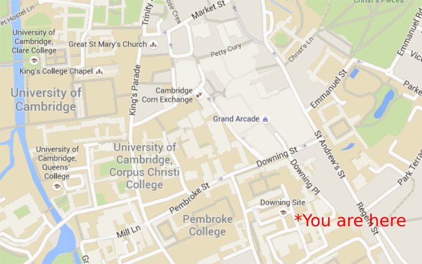

# Welcome!



We're based at [Cancer Research Uk Cambridge Institute](http://www.cruk.cam.ac.uk/) and [MRC Cancer Unit](https://www.mrc-cu.cam.ac.uk/) on the [Cambridge Biomedical campus](http://cambridge-biomedical.com/) about 2 miles south of here


# Who's who 


- [Mark Fernandes (CRUK CI)](http://www.cruk.cam.ac.uk/core-facilities/bioinformatics-core)
- [Shamith Samarajiwa (MRC CU)](http://www.mrc-cu.cam.ac.uk/research/Shamith-Samarajiwa-folder)
- [Dora Bihary (MRC CU)](http://www.mrc-cu.cam.ac.uk/research/Shamith-Samarajiwa-folder)
- [Ashley Sawle (CRUK CI)](http://www.cruk.cam.ac.uk/core-facilities/bioinformatics-core)
- [Alistair Martin (CRUK CI)](http://www.cruk.cam.ac.uk/research-groups/caldas-group)
- [Michael Morgan (CRUK CI)](http://www.cruk.cam.ac.uk/research-groups/caldas-group)
- [Abigail Edwards (CRUK CI)](http://www.cruk.cam.ac.uk/core-facilities/bioinformatics-core)
- [Stephane Ballereau (CRUK CI)](http://www.cruk.cam.ac.uk/core-facilities/bioinformatics-core)


Huge thanks too to Kelly O'Reilly (CRUK) for admin support, and Gabriella, Paul and Cathy for support in Genetics

# Who are you?

```{r echo=FALSE, message=FALSE,fig.width=12,fig.height=8}
library(dplyr)
library(ggplot2)
library(gridExtra)
ppl <- tbl_df(read.csv("../all_applicants.csv",header=TRUE)) %>% filter(Accept == "Y")
p1 <- ggplot(ppl, aes(x = Institute)) + geom_bar(fill=rgb(29,0,150,maxColorValue=255))+ coord_flip() 
p2 <- ggplot(ppl, aes(x=Position)) + geom_bar(fill=rgb(236,0,140,maxColorValue=255)) + coord_flip()
p3 <- ggplot(ppl, aes(x=Gender,fill=Gender)) + geom_bar() + scale_fill_manual(values=c(rgb(29,0,150,maxColorValue=255),rgb(236,0,140,maxColorValue=255))) + coord_flip()
p1
p2
p3

```


# Admin

- Course runs 09:30 ~ 17:00 each day (Friday is a half-day)
    + Room open from 09:00 each day
- Lunch provided 12:30 - 13:30 each day
    + different room on the same campus, we'll take you there
- No fixed coffee and tea breaks
    + but you'll probably have noticed the coffee machine at the back
- Please refrain from using the coffee machine when someone is lecturing
    + you'll discover why when you use the machine!
- Workshop dinner on Thursday night at Downing College
    + We assume you're coming unless you've told us otherwise
    + Please let us know ***a.s.a.p*** if you won't be coming!
    


# About the Course - "Functional Genomics"

- You will (probably) not come away being an expert
- We cannot teach you everything about NGS data
    + plus, it is a fast-moving field
    + will cover a selection of tools / methods
- However, we hope that you will
    + Understand how your data are processed
    + Be able to explore your data - no programming required
    + Understand the issues and compromises involved in current methods
    + Communicate more effectively with the Bioinformaticians dealing with your data
    + Increase confidence with R and Bioconductor
    + Know where to get help
    + Be able to explore new technologies, methods, tools as they come out
    + Meet your colleagues from other CRUK institutes
    + Have fun!
- All materials will be online after the course
    + tell your colleagues, friends!
    
  

# Live note-taking and documentation

- We have an "etherpad" at https://public.etherpad-mozilla.org/p/2017-09-18-functional-genomics
- Use this to ask questions during the talks
- We can post code snippets, links and corrections here too

