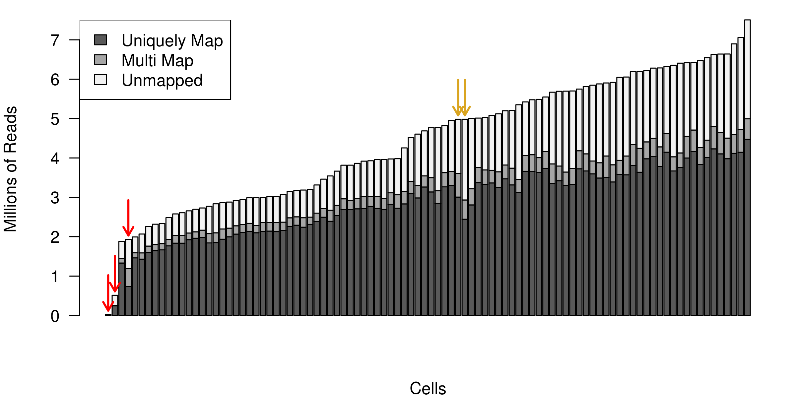

# Construction of expression matrix

```{r, echo=FALSE}
library(knitr)
opts_chunk$set(fig.align = "center", echo=FALSE)
```

Many analyses of scRNA-seq data take as their starting point an __expression matrix__. By convention, the each row of the expression matrix represents a gene and each column represents a cell (although some authors use the transpose). Each entry represents the expression level of a particular gene in a given cell. The units by which the expression is meassured depends on the protocol and the normalization strategy used.

## Reads QC

The output from a scRNA-seq experiment is a large collection of cDNA reads. The first step is to ensure that the reads are of high quality. The quality control can be performed by using standard tools, such as [FastQC](http://www.bioinformatics.babraham.ac.uk/projects/fastqc/) or [Kraken](http://www.ebi.ac.uk/research/enright/software/kraken). 

Assuming that our reads are in experiment.bam, we run FastQC as
```
$<path_to_fastQC>/fastQC experiment.bam
```

Below is an example of the output from FastQC for a dataset of 125 bp reads. The plot reveals a technical error which resulted in a couple of bases failing to be read correctly in the centre of the read. However, since the rest of the read was of high quality this error will most likely have a negligible effect on mapping efficiency.

```{r exprs-constr-fastqc, out.width = '90%', fig.cap="Example of FastQC output"}
knitr::include_graphics("figures/per_base_quality.png")
```

Additionally, it is often helpful to visualize the data using the [Integrative Genomics Browser (IGV)](https://www.broadinstitute.org/igv/) or [SeqMonk](http://www.bioinformatics.babraham.ac.uk/projects/seqmonk/).

## Reads alignment

After trimming low quality bases from the reads, the remaining sequences can
be mapped to a reference genome. Again, there is no need for a special purpose
method for this, so we can use the
[STAR](https://github.com/alexdobin/STAR) or the [TopHat](https://ccb.jhu.edu/software/tophat/index.shtml) aligner. For large full-transcript datasets from well annotated organisms (e.g. mouse, human) pseudo-alignment methods (e.g. [Kallisto](https://pachterlab.github.io/kallisto/), [Salmon](http://salmon.readthedocs.io/en/latest/salmon.html)) may out-perform conventional alignment. For drop-seq based datasets with tens- or hundreds of thousands of reads pseudoaligners become more appealing since their run-time can be several orders of magnitude less than traditional aligners.

An example of how to map reads.bam to using STAR is

```
$<path_to_STAR>/STAR --runThreadN 1 --runMode alignReads
--readFilesIn reads1.fq.gz reads2.fq.gz --readFilesCommand zcat --genomeDir <path>
--parametersFiles FileOfMoreParameters.txt --outFileNamePrefix <outpath>/output
```

__Note__, if the _spike-ins_ are used, the reference sequence should be augmented with the DNA sequence of the _spike-in_ molecules prior to mapping.

__Note__, when UMIs are used, their barcodes should be removed from the read sequence. A common practice is to add the barcode to the read name.

Once the reads for each cell have been mapped to the reference genome,
we need to make sure that a sufficient number of reads from each cell
could be mapped to the reference genome. In our experience, the
fraction of mappable reads for mouse or human cells is 60-70%. However, 
this result may vary depending on protocol, read length and settings for 
the read alignment. As a general rule, we expect all cells to have a similar
fraction of mapped reads, so any outliers should be inspected and
possibly removed. A low proportion of mappable reads usually indicates contamination.

An example of how to quantify expression using Salmon is
```
$<path_to_Salmon>/salmon quant -i salmon_transcript_index -1 reads1.fq.gz -2 reads2.fq.gz -p #threads -l A -g genome.gtf --seqBias --gcBias --posBias
```
__Note__ Salmon produces estimated read counts and estimated transcripts per million (tpm) in our experience the latter over corrects the expression of long genes for scRNASeq, thus we recommend using read counts. 

## Alignment example

The histogram below shows the total number of reads mapped to each
cell for an scRNA-seq experiment. Each bar represents one cell, and
they have been sorted in ascending order by the total number of reads
per cell. The three red arrows indicate cells that are outliers in
terms of their coverage and they should be removed from further
analysis. The two yellow arrows point to cells with a surprisingly
large number of unmapped reads. In this example we kept the cells during the alignment QC step, but they were later removed during 
cell QC due to a high proportion of ribosomal RNA reads. 

```{r exprs-constr-total-num-cells, out.width = '90%', fig.cap="Example of the total number of reads mapped to each cell."}

```

## Mapping QC

After mapping the raw sequencing to the genome we need to evaluate the quality of the mapping. There are many ways to measure the mapping quality, including: amount of reads mapping to rRNA/tRNAs, proportion of uniquely mapping reads, reads mapping across splice junctions, read depth along the transcripts. Methods developed for bulk RNA-seq, such as [RSeQC](http://rseqc.sourceforge.net/), are applicable to single-cell data:

```
python <RSeQCpath>/geneBody_coverage.py -i input.bam -r genome.bed -o output.txt
python <RSeQCpath>/bam_stat.py -i input.bam -r genome.bed -o output.txt
python <RSeQCpath>/split_bam.py -i input.bam -r rRNAmask.bed -o output.txt
```

However the expected results will depend on the experimental protocol, e.g. many scRNA-seq methods use poly-A selection to avoid sequencing rRNAs which results in a 3' bias in the read coverage across the genes (aka gene body coverage). The figure below shows this 3' bias as well as three cells which were outliers and removed from the dataset:

```{r exprs-constr-3-bias, out.width = '90%', fig.cap="Example of the 3' bias in the read coverage."}
knitr::include_graphics("figures/Exp1_RSEQC_geneBodyCoverage_plot_Combined.png")
```

## Reads quantification

The next step is to quantify the expression level of each gene for
each cell. For mRNA data, we can use one of the tools which has been
developed for bulk RNA-seq data, e.g. [HT-seq](http://www-huber.embl.de/users/anders/HTSeq/) or [FeatureCounts](http://subread.sourceforge.net/)

```
# include multimapping
<featureCounts_path>/featureCounts -O -M -Q 30 -p -a genome.gtf -o outputfile input.bam
# exclude multimapping
<featureCounts_path>/featureCounts -Q 30 -p -a genome.gtf -o outputfile input.bam
```

[Unique molecular identifiers (UMIs)](http://www.nature.com/nmeth/journal/v9/n1/full/nmeth.1778.html) make it possible to count the absolute number of molecules and they have proven popular for [scRNA-seq](http://www.nature.com/nmeth/journal/v11/n2/full/nmeth.2772.html). We will discuss how UMIs can be processed in the next chapter.
