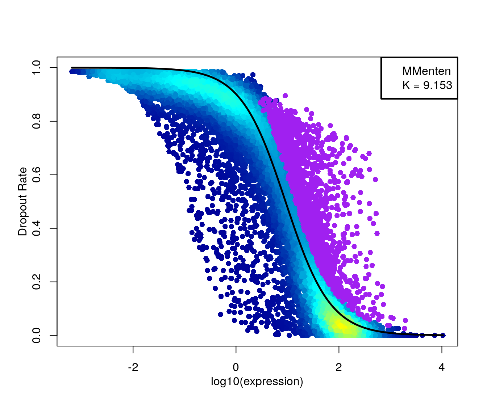
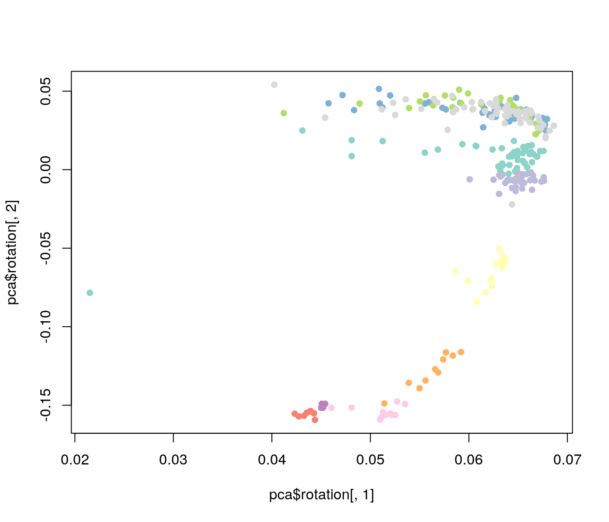
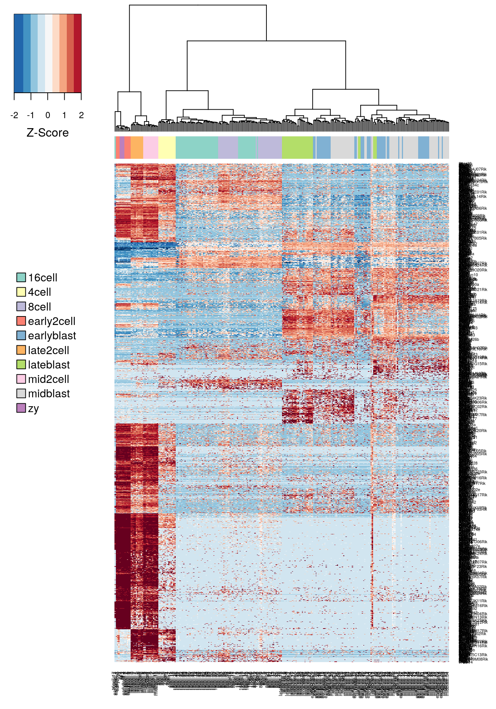

## Feature Selection


```r
library(scRNA.seq.funcs)
library(matrixStats)
library(M3Drop)
library(RColorBrewer)
library(SingleCellExperiment)
set.seed(1)
```

Single-cell RNASeq is capable of measuring the expression of many
thousands of genes in every cell. However, in most situations only a
portion of those will show a response to the biological condition of
interest, e.g. differences in cell-type, drivers of differentiation,
respond to an environmental stimulus. Most genes detected in a scRNASeq
experiment will only be detected at different levels due to technical
noise. One consequence of this is that technical noise and batch
effects can obscure the biological signal of interest.

Thus, it is often advantageous to perform feature selection to remove
those genes which only exhibit technical noise from downstream analysis.
Not only does this generally increase the signal:noise ratio in the data;
it also reduces the computational complexity of analyses, by reducing
the total amount of data to be processed.

For scRNASeq data, we will be focusing on unsupervised methods of feature
selection which don't require any a priori information, such as cell-type
labels or biological group, since they are not available, or may be unreliable,
for many experiments. In contrast, differential expression (chapter \@ref(dechapter))
can be considered a form of supervised feature selection since it uses the
known biological label of each sample to identify features (i.e. genes) which
are expressed at different levels across groups.

For this section we will continue working with the Deng data. 


```r
deng <- readRDS("deng/deng-reads.rds")
cellLabels <- colData(deng)$cell_type2
```

This data can be QCed and normalized for library size using M3Drop,
which removes cells with few detected genes, removes
undetected genes, and converts raw counts to CPM.


```r
deng_list <- M3DropCleanData(
    counts(deng),
    labels = cellLabels,
    min_detected_genes = 100,
    is.counts = TRUE
)
expr_matrix <- deng_list$data # Normalized & filtered expression matrix
celltype_labs <- factor(deng_list$labels) # filtered cell-type labels
cell_colors <- brewer.pal(max(3,length(unique(celltype_labs))), "Set3")
```

__Exercise 1__: How many cells & genes have been removed by this filtering? 


### Identifying Genes vs a Null Model

There are two main approaches to unsupervised feature selection. The
first is to identify genes which behave differently from a null model
describing just the technical noise expected in the dataset.

If the dataset contains spike-in RNAs they can be used to directly model
technical noise. However, measurements of spike-ins may not experience
the same technical noise as endogenous transcripts [(Svensson et al., 2017)](https://www.nature.com/nmeth/journal/v14/n4/full/nmeth.4220.html).
In addition, scRNASeq experiments often contain only a small number of
spike-ins which reduces our confidence in fitted model parameters.

#### Highly Variable Genes

The first method proposed to identify features in scRNASeq datasets
was to identify highly variable genes (HVG). HVG assumes that if genes
have large differences in expression across cells some of those differences
are due to biological difference between the cells rather than technical noise.
However, because of the nature of count data, there is a positive relationship
between the mean expression of a gene and the variance in the read counts across
cells. This relationship must be corrected for to properly identify HVGs.

__Exercise 2__
Using the functions rowMeans and rowVars to plot the relationship between mean expression
and variance for all genes in this dataset. (Hint: use log="xy" to plot on a log-scale).


A popular method to correct for the relationship between variance and mean expression
was proposed by [Brennecke et al.](http://www.nature.com/nmeth/journal/v10/n11/full/nmeth.2645.html).
To use the Brennecke method, we first normalize for library size then calculate
the mean and the square coefficient of variation (variation divided by
the squared mean expression). A quadratic curve is fit to the relationship
between these two variables for the ERCC spike-in, and then a chi-square test is used to find genes
significantly above the curve. This method is included in the M3Drop package as the
Brennecke_getVariableGenes(counts, spikes) function. However, this dataset does not contain spike-ins
so we will use the entire dataset to estimate the technical noise.

In the figure below the red curve
is the fitted technical noise model and the dashed line is the 95%
CI. Pink dots are the genes with significant biological variability
after multiple-testing correction.


```r
Brennecke_HVG <- BrenneckeGetVariableGenes(
    expr_matrix,
    fdr = 0.01,
    minBiolDisp = 0.5
)
```


```r
HVG_genes <- Brennecke_HVG$Gene
```
#### High Dropout Genes

An alternative to finding HVGs is to identify genes with unexpectedly high numbers of zeros.
The frequency of zeros, know as the "dropout rate", is very closely related to expression level
in scRNASeq data. Zeros are the dominant feature of single-cell RNASeq data, typically accounting
for over half of the entries in the final expression matrix. These zeros predominantly result
from the failure of mRNAs failing to be reversed transcribed [(Andrews and Hemberg, 2016)](http://www.biorxiv.org/content/early/2017/05/25/065094). Reverse transcription
is an enzyme reaction thus can be modelled using the Michaelis-Menten equation:

$$P_{dropout} = 1 - S/(K + S)$$

where $S$ is the mRNA concentration in the cell (we will estimate this as average expression)
and $K$ is the Michaelis-Menten constant.

Because the Michaelis-Menten equation is a convex non-linear function, genes which are
differentially expression across two or more populations of cells in our dataset will
be shifted up/right of the Michaelis-Menten model (see Figure below).


```r
K <- 49
S_sim <- 10^seq(from = -3, to = 4, by = 0.05) # range of expression values
MM <- 1 - S_sim / (K + S_sim)
plot(
    S_sim, 
    MM, 
    type = "l", 
    lwd = 3, 
    xlab = "Expression", 
    ylab = "Dropout Rate", 
    xlim = c(1,1000)
)
S1 <- 10
P1 <- 1 - S1 / (K + S1) # Expression & dropouts for cells in condition 1
S2 <- 750
P2 <- 1 - S2 / (K + S2) # Expression & dropouts for cells in condition 2
points(
    c(S1, S2),
    c(P1, P2), 
    pch = 16, 
    col = "grey85", 
    cex = 3
)
mix <- 0.5 # proportion of cells in condition 1
points(
    S1 * mix + S2 * (1 - mix), 
    P1 * mix + P2 * (1 - mix), 
    pch = 16, 
    col = "grey35", 
    cex = 3
)
```


__Note__: add `log="x"` to the `plot` call above to see how this looks on the log scale, which is used in M3Drop figures.

__Exercise 3__: Produce the same plot as above with different expression levels (S1 & S2) and/or mixtures (mix).


We use M3Drop to identify significant outliers to the right of the MM
curve. We also apply 1% FDR multiple testing correction:


```r
M3Drop_genes <- M3DropFeatureSelection(
    expr_matrix,
    mt_method = "fdr",
    mt_threshold = 0.01
)
```



```r
M3Drop_genes <- M3Drop_genes$Gene
```

An alternative method is contained in the M3Drop package that is tailored specifically for
UMI-tagged data which generally contains many zeros resulting from low sequencing coverage
in addition to those resulting from insufficient reverse-transcription. This model is the
Depth-Adjusted Negative Binomial (DANB). This method describes each expression observation
as a negative binomial model with a mean related to both the mean expression of the
respective gene and the sequencing depth of the respective cell, and a variance related to
the mean-expression of the gene.

Unlike the Michaelis-Menten and HVG methods there isn't a reliable statistical test for features
selected by this model, so we will consider the top 1500 genes instead.


```r
deng_int <- NBumiConvertToInteger(counts(deng))
DANB_fit <- NBumiFitModel(deng_int) # DANB is fit to the raw count matrix
# Perform DANB feature selection
DropFS <- NBumiFeatureSelectionCombinedDrop(DANB_fit)
DANB_genes <- names(DropFS[1:1500])
```

### Correlated Expression

A completely different approach to feature selection is to use gene-gene correlations. This method
is based on the idea that multiple genes will be differentially expressed between different cell-types
or cell-states. Genes which are expressed in the same cell-population will be positively correlated
with each other where as genes expressed in different cell-populations will be negatively correated with
each other. Thus important genes can be identified by the magnitude of their correlation
with other genes.

The limitation of this method is that it assumes technical noise is random and independent for each cell,
thus shouldn't produce gene-gene correlations, but this assumption is violated by batch effects which are
generally systematic between different experimental batches and will produce gene-gene correlations. As a
result it is more appropriate to take the top few thousand genes as ranked by gene-gene correlation than
consider the significance of the correlations.


```r
cor_mat <- cor(t(expr_matrix), method = "spearman") # Gene-gene correlations
diag(cor_mat) <- rep(0, times = nrow(expr_matrix))
score <- apply(cor_mat, 1, function(x) {max(abs(x))}) #Correlation of highest magnitude
names(score) <- rownames(expr_matrix);
score <- score[order(-score)]
Cor_genes <- names(score[1:1500])
```
Lastly, another common method for feature selection in scRNASeq data is to use PCA loadings. Genes with
high PCA loadings are likely to be highly variable and correlated with many other variable genes, thus
may be relevant to the underlying biology. However, as with gene-gene correlations PCA loadings tend to
be susceptible to detecting systematic variation due to batch effects; thus it is recommended to plot the PCA
results to determine those components corresponding to the biological variation rather than batch effects.


```r
# PCA is typically performed on log-transformed expression data
pca <- prcomp(log(expr_matrix + 1) / log(2))

# plot projection
plot(
    pca$rotation[,1], 
    pca$rotation[,2], 
    pch = 16, 
    col = cell_colors[as.factor(celltype_labs)]
) 
```



```r
# calculate loadings for components 1 and 2
score <- rowSums(abs(pca$x[,c(1,2)])) 
names(score) <- rownames(expr_matrix)
score <- score[order(-score)]
PCA_genes <- names(score[1:1500])
```
__Exercise 4__
Consider the top 5 principal components. Which appear to be most biologically relevant? How does the top 1,500
features change if you consider the loadings for those components?

### Comparing Methods

We can check whether the identified features really do represent genes differentially expressed between
cell-types in this dataset.


```r
M3DropExpressionHeatmap(
    M3Drop_genes,
    expr_matrix,
    cell_labels = celltype_labs
)
```



We can also consider how consistent each feature selection method is with the others using the Jaccard Index:

```r
J <- sum(M3Drop_genes %in% HVG_genes)/length(unique(c(M3Drop_genes, HVG_genes)))
```

__Exercise 5__

Plot the expression of the features for each of the other methods. Which appear to be differentially expressed? How consistent are the different methods for this dataset?


### sessionInfo()


```
## R version 3.4.3 (2017-11-30)
## Platform: x86_64-pc-linux-gnu (64-bit)
## Running under: Debian GNU/Linux 9 (stretch)
## 
## Matrix products: default
## BLAS: /usr/lib/openblas-base/libblas.so.3
## LAPACK: /usr/lib/libopenblasp-r0.2.19.so
## 
## locale:
##  [1] LC_CTYPE=en_US.UTF-8       LC_NUMERIC=C              
##  [3] LC_TIME=en_US.UTF-8        LC_COLLATE=en_US.UTF-8    
##  [5] LC_MONETARY=en_US.UTF-8    LC_MESSAGES=C             
##  [7] LC_PAPER=en_US.UTF-8       LC_NAME=C                 
##  [9] LC_ADDRESS=C               LC_TELEPHONE=C            
## [11] LC_MEASUREMENT=en_US.UTF-8 LC_IDENTIFICATION=C       
## 
## attached base packages:
## [1] parallel  stats4    methods   stats     graphics  grDevices utils    
## [8] datasets  base     
## 
## other attached packages:
##  [1] SingleCellExperiment_1.0.0 SummarizedExperiment_1.8.1
##  [3] DelayedArray_0.4.1         Biobase_2.38.0            
##  [5] GenomicRanges_1.30.3       GenomeInfoDb_1.14.0       
##  [7] IRanges_2.12.0             S4Vectors_0.16.0          
##  [9] BiocGenerics_0.24.0        RColorBrewer_1.1-2        
## [11] M3Drop_3.05.00             numDeriv_2016.8-1         
## [13] matrixStats_0.53.1         scRNA.seq.funcs_0.1.0     
## [15] knitr_1.20                
## 
## loaded via a namespace (and not attached):
##  [1] splines_3.4.3          elliptic_1.3-7         gtools_3.5.0          
##  [4] Formula_1.2-2          moments_0.14           statmod_1.4.30        
##  [7] latticeExtra_0.6-28    GenomeInfoDbData_1.0.0 yaml_2.1.17           
## [10] pillar_1.2.1           backports_1.1.2        lattice_0.20-34       
## [13] bbmle_1.0.20           digest_0.6.15          XVector_0.18.0        
## [16] checkmate_1.8.5        colorspace_1.3-2       htmltools_0.3.6       
## [19] Matrix_1.2-7.1         plyr_1.8.4             bookdown_0.7          
## [22] zlibbioc_1.24.0        scales_0.5.0           gdata_2.18.0          
## [25] Rtsne_0.13             htmlTable_1.11.2       tibble_1.4.2          
## [28] mgcv_1.8-23            ggplot2_2.2.1          nnet_7.3-12           
## [31] lazyeval_0.2.1         survival_2.40-1        magrittr_1.5          
## [34] evaluate_0.10.1        nlme_3.1-129           MASS_7.3-45           
## [37] gplots_3.0.1           foreign_0.8-67         reldist_1.6-6         
## [40] tools_3.4.3            data.table_1.10.4-3    stringr_1.3.0         
## [43] munsell_0.4.3          cluster_2.0.6          irlba_2.3.2           
## [46] orthopolynom_1.0-5     compiler_3.4.3         caTools_1.17.1        
## [49] contfrac_1.1-11        rlang_0.2.0            grid_3.4.3            
## [52] RCurl_1.95-4.10        rstudioapi_0.7         htmlwidgets_1.0       
## [55] bitops_1.0-6           base64enc_0.1-3        rmarkdown_1.8         
## [58] hypergeo_1.2-13        gtable_0.2.0           deSolve_1.20          
## [61] gridExtra_2.3          Hmisc_4.1-1            rprojroot_1.3-2       
## [64] KernSmooth_2.23-15     stringi_1.1.6          Rcpp_0.12.15          
## [67] rpart_4.1-10           acepack_1.4.1          xfun_0.1
```
