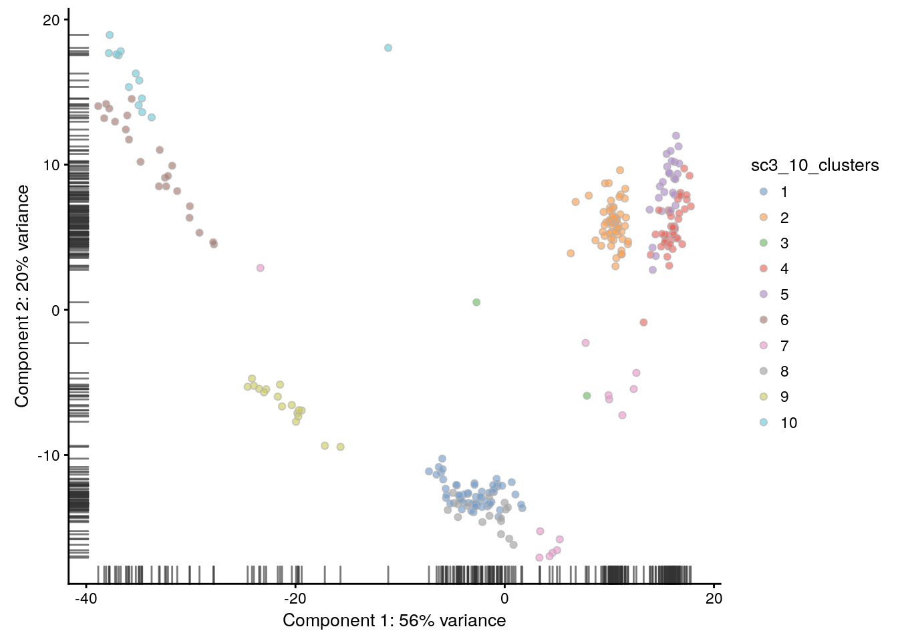
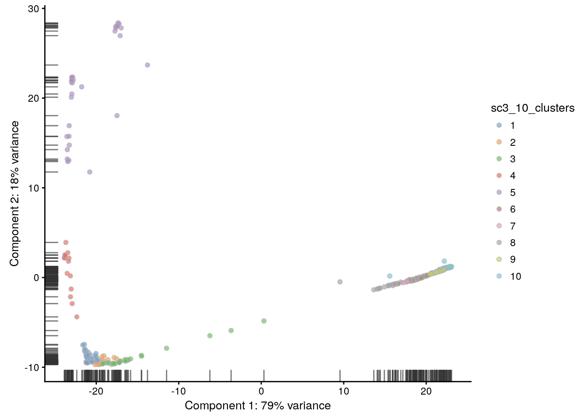

## Imputation


```r
library(scImpute)
library(SC3)
library(scater)
library(SingleCellExperiment)
library(mclust)
set.seed(1234567)
```


As discussed previously, one of the main challenges when analyzing scRNA-seq data is the presence of zeros, or dropouts. The dropouts are assumed to have arisen for three possible reasons:

* The gene was not expressed in the cell and hence there are no transcripts to sequence
* The gene was expressed, but for some reason the transcripts were lost somewhere prior to sequencing
* The gene was expressed and transcripts were captured and turned into cDNA, but the sequencing depth was not sufficient to produce any reads.

Thus, dropouts could be result of experimental shortcomings, and if this is the case then we would like to provide computational corrections. One possible solution is to impute the dropouts in the expression matrix. To be able to impute gene expression values, one must have an underlying model. However, since we do not know which dropout events are technical artefacts and which correspond to the transcript being truly absent, imputation is a difficult challenge.

To the best of our knowledge, there are currently two different imputation methods available: [MAGIC](https://github.com/pkathail/magic) [@Van_Dijk2017-bh] and [scImpute](https://github.com/Vivianstats/scImpute) [@Li2017-tz]. MAGIC is only available for Python or Matlab, but we will run it from within R.

### scImpute

To test `scImpute`, we use the default parameters and we apply it to the Deng dataset that we have worked with before. scImpute takes a .csv or .txt file as an input:


```r
deng <- readRDS("deng/deng-reads.rds")
write.csv(counts(deng), "deng.csv")
scimpute(
    count_path = "deng.csv",
    infile = "csv",
    outfile = "txt", 
    out_dir = "./",
    Kcluster = 10,
    ncores = 2
)
```

```
## [1] "reading in raw count matrix ..."
## [1] "number of genes in raw count matrix 22431"
## [1] "number of cells in raw count matrix 268"
## [1] "inferring cell similarities ..."
## [1] "cluster sizes:"
##  [1] 12  9 26  5  9 57 58 43 17 22
## [1] "estimating dropout probability for type 1 ..."
## [1] "imputing dropout values for type 1 ..."
## [1] "estimating dropout probability for type 2 ..."
## [1] "imputing dropout values for type 2 ..."
## [1] "estimating dropout probability for type 3 ..."
## [1] "imputing dropout values for type 3 ..."
## [1] "estimating dropout probability for type 4 ..."
## [1] "imputing dropout values for type 4 ..."
## [1] "estimating dropout probability for type 5 ..."
## [1] "imputing dropout values for type 5 ..."
## [1] "estimating dropout probability for type 6 ..."
## [1] "imputing dropout values for type 6 ..."
## [1] "estimating dropout probability for type 7 ..."
## [1] "imputing dropout values for type 7 ..."
## [1] "estimating dropout probability for type 8 ..."
## [1] "imputing dropout values for type 8 ..."
## [1] "estimating dropout probability for type 9 ..."
## [1] "imputing dropout values for type 9 ..."
## [1] "estimating dropout probability for type 10 ..."
## [1] "imputing dropout values for type 10 ..."
## [1] "writing imputed count matrix ..."
```

```
##  [1]  17  18  88 111 126 177 186 229 244 247
```

Now we can compare the results with original data by considering a PCA plot


```r
res <- read.table("scimpute_count.txt")
colnames(res) <- NULL
res <- SingleCellExperiment(
    assays = list(logcounts = log2(as.matrix(res) + 1)), 
    colData = colData(deng)
)
rowData(res)$feature_symbol <- rowData(deng)$feature_symbol
plotPCA(
    res, 
    colour_by = "cell_type2"
)
```


Compare this result to the original data in Chapter \@ref(clust-methods). What are the most significant differences?

To evaluate the impact of the imputation, we use `SC3` to cluster the imputed matrix

```r
res <- sc3_estimate_k(res)
metadata(res)$sc3$k_estimation
```

```
## [1] 6
```

```r
res <- sc3(res, ks = 10, gene_filter = FALSE)
```

```r
adjustedRandIndex(colData(deng)$cell_type2, colData(res)$sc3_10_clusters)
```

```
## [1] 0.4687332
```

```r
plotPCA(
    res, 
    colour_by = "sc3_10_clusters"
)
```



__Exercise:__ Based on the PCA and the clustering results, do you think that imputation using `scImpute` is a good idea for the Deng dataset?

### MAGIC


```r
system("python3 utils/MAGIC.py -d deng.csv -o MAGIC_count.csv --cell-axis columns -l 1 --pca-non-random csv")
```


```r
res <- read.csv("MAGIC_count.csv", header = TRUE)
rownames(res) <- res[,1]
res <- res[,-1]
res <- t(res)
res <- SingleCellExperiment(
    assays = list(logcounts = res), 
    colData = colData(deng)
)
rowData(res)$feature_symbol <- rownames(res)
plotPCA(
    res, 
    colour_by = "cell_type2"
)
```


Compare this result to the original data in Chapter \@ref(clust-methods). What are the most significant differences?

To evaluate the impact of the imputation, we use `SC3` to cluster the imputed matrix

```r
res <- sc3_estimate_k(res)
metadata(res)$sc3$k_estimation
```

```
## [1] 4
```

```r
res <- sc3(res, ks = 10, gene_filter = FALSE)
```

```r
adjustedRandIndex(colData(deng)$cell_type2, colData(res)$sc3_10_clusters)
```

```
## [1] 0.3752866
```

```r
plotPCA(
    res, 
    colour_by = "sc3_10_clusters"
)
```


__Exercise:__ What is the difference between `scImpute` and `MAGIC` based on the PCA and clustering analysis? Which one do you think is best to use?


### sessionInfo()


```
## R version 3.4.3 (2017-11-30)
## Platform: x86_64-pc-linux-gnu (64-bit)
## Running under: Debian GNU/Linux 9 (stretch)
## 
## Matrix products: default
## BLAS: /usr/lib/openblas-base/libblas.so.3
## LAPACK: /usr/lib/libopenblasp-r0.2.19.so
## 
## locale:
##  [1] LC_CTYPE=en_US.UTF-8       LC_NUMERIC=C              
##  [3] LC_TIME=en_US.UTF-8        LC_COLLATE=en_US.UTF-8    
##  [5] LC_MONETARY=en_US.UTF-8    LC_MESSAGES=C             
##  [7] LC_PAPER=en_US.UTF-8       LC_NAME=C                 
##  [9] LC_ADDRESS=C               LC_TELEPHONE=C            
## [11] LC_MEASUREMENT=en_US.UTF-8 LC_IDENTIFICATION=C       
## 
## attached base packages:
## [1] stats4    methods   parallel  stats     graphics  grDevices utils    
## [8] datasets  base     
## 
## other attached packages:
##  [1] mclust_5.4                 scater_1.6.3              
##  [3] SingleCellExperiment_1.0.0 SummarizedExperiment_1.8.1
##  [5] DelayedArray_0.4.1         matrixStats_0.53.1        
##  [7] GenomicRanges_1.30.3       GenomeInfoDb_1.14.0       
##  [9] IRanges_2.12.0             S4Vectors_0.16.0          
## [11] ggplot2_2.2.1              Biobase_2.38.0            
## [13] BiocGenerics_0.24.0        SC3_1.7.7                 
## [15] scImpute_0.0.5             doParallel_1.0.11         
## [17] iterators_1.0.9            foreach_1.4.4             
## [19] penalized_0.9-50           survival_2.40-1           
## [21] kernlab_0.9-25             knitr_1.20                
## 
## loaded via a namespace (and not attached):
##  [1] ggbeeswarm_0.6.0       colorspace_1.3-2       rjson_0.2.15          
##  [4] class_7.3-14           rprojroot_1.3-2        XVector_0.18.0        
##  [7] bit64_0.9-7            AnnotationDbi_1.40.0   mvtnorm_1.0-7         
## [10] codetools_0.2-15       splines_3.4.3          tximport_1.6.0        
## [13] robustbase_0.92-8      cluster_2.0.6          pheatmap_1.0.8        
## [16] shinydashboard_0.6.1   shiny_1.0.5            rrcov_1.4-3           
## [19] compiler_3.4.3         httr_1.3.1             backports_1.1.2       
## [22] assertthat_0.2.0       Matrix_1.2-7.1         lazyeval_0.2.1        
## [25] limma_3.34.9           htmltools_0.3.6        prettyunits_1.0.2     
## [28] tools_3.4.3            bindrcpp_0.2           gtable_0.2.0          
## [31] glue_1.2.0             GenomeInfoDbData_1.0.0 reshape2_1.4.3        
## [34] dplyr_0.7.4            doRNG_1.6.6            Rcpp_0.12.15          
## [37] gdata_2.18.0           xfun_0.1               stringr_1.3.0         
## [40] mime_0.5               rngtools_1.2.4         gtools_3.5.0          
## [43] WriteXLS_4.0.0         XML_3.98-1.10          edgeR_3.20.9          
## [46] DEoptimR_1.0-8         zlibbioc_1.24.0        scales_0.5.0          
## [49] rhdf5_2.22.0           RColorBrewer_1.1-2     yaml_2.1.17           
## [52] memoise_1.1.0          gridExtra_2.3          pkgmaker_0.22         
## [55] biomaRt_2.34.2         stringi_1.1.6          RSQLite_2.0           
## [58] pcaPP_1.9-73           e1071_1.6-8            caTools_1.17.1        
## [61] rlang_0.2.0            pkgconfig_2.0.1        bitops_1.0-6          
## [64] evaluate_0.10.1        lattice_0.20-34        ROCR_1.0-7            
## [67] bindr_0.1              labeling_0.3           cowplot_0.9.2         
## [70] bit_1.1-12             plyr_1.8.4             magrittr_1.5          
## [73] bookdown_0.7           R6_2.2.2               gplots_3.0.1          
## [76] DBI_0.7                pillar_1.2.1           RCurl_1.95-4.10       
## [79] tibble_1.4.2           KernSmooth_2.23-15     rmarkdown_1.8         
## [82] viridis_0.5.0          progress_1.1.2         locfit_1.5-9.1        
## [85] grid_3.4.3             data.table_1.10.4-3    blob_1.1.0            
## [88] digest_0.6.15          xtable_1.8-2           httpuv_1.3.6.1        
## [91] munsell_0.4.3          registry_0.5           beeswarm_0.2.3        
## [94] viridisLite_0.3.0      vipor_0.4.5
```
