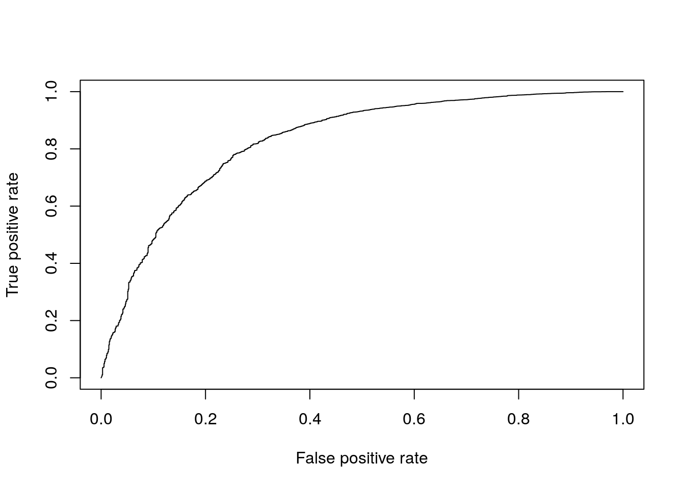

## DE in a real dataset


```r
library(scRNA.seq.funcs)
library(edgeR)
library(monocle)
library(MAST)
library(ROCR)
set.seed(1)
```

### Introduction

To test different single-cell differential expression methods we will be using the Blischak dataset from Chapters 7-17.
For this experiment bulk RNA-seq data for each cell-line was generated in addition to single-cell data. We will use the
differentially expressed genes identified using standard methods on the respective bulk data as the ground truth for evaluating the
accuracy of each single-cell method. To save time we have pre-computed these for you. You can run the commands below to load these data.


```r
DE <- read.table("tung/TPs.txt")
notDE <- read.table("tung/TNs.txt")
GroundTruth <- list(
    DE = as.character(unlist(DE)), 
    notDE = as.character(unlist(notDE))
)
```

This ground truth has been produce for the comparison of individual NA19101 to NA19239. Now load the respective single-cell data:


```r
molecules <- read.table("tung/molecules.txt", sep = "\t")
anno <- read.table("tung/annotation.txt", sep = "\t", header = TRUE)
keep <- anno[,1] == "NA19101" | anno[,1] == "NA19239"
data <- molecules[,keep]
group <- anno[keep,1]
batch <- anno[keep,4]
# remove genes that aren't expressed in at least 6 cells
gkeep <- rowSums(data > 0) > 5;
counts <- data[gkeep,]
# Library size normalization
lib_size = colSums(counts)
norm <- t(t(counts)/lib_size * median(lib_size)) 
# Variant of CPM for datasets with library sizes of fewer than 1 mil molecules
```

Now we will compare various single-cell DE methods. Note that we will only be running methods which are available as R-packages and run relatively quickly.

### Kolmogorov-Smirnov test

The types of test that are easiest to work with are non-parametric
ones. The most commonly used non-parametric test is the
[Kolmogorov-Smirnov test](https://en.wikipedia.org/wiki/Kolmogorov%E2%80%93Smirnov_test) (KS-test) and we can use it to compare the distributions for each gene in the two individuals.

The KS-test quantifies the distance between the empirical cummulative distributions of the expression of each gene in each of the two populations. It is sensitive to changes in mean experession and changes in variability. However it assumes data is continuous and may perform poorly when data contains a large number of identical values (eg. zeros). Another issue with the KS-test is that it can be very sensitive for large sample sizes and thus it may end up as significant even though the magnitude of the difference is very small.

<div class="figure" style="text-align: center">

<p class="caption">(\#fig:ks-statistic)Illustration of the two-sample Kolmogorov–Smirnov statistic. Red and blue lines each correspond to an empirical distribution function, and the black arrow is the two-sample KS statistic. (taken from [here](https://en.wikipedia.org/wiki/Kolmogorov%E2%80%93Smirnov_test))</p>
</div>

Now run the test:


```r
pVals <- apply(
    norm, 1, function(x) {
        ks.test(
            x[group == "NA19101"], 
            x[group == "NA19239"]
        )$p.value
    }
)
# multiple testing correction
pVals <- p.adjust(pVals, method = "fdr")
```
This code "applies" the function to each row (specified by 1) of the expression matrix, data. In the function we are returning just the p.value from the ks.test output. We can now consider how many of the ground truth positive and negative DE genes are detected by the KS-test:

#### Evaluating Accuracy


```r
sigDE <- names(pVals)[pVals < 0.05]
length(sigDE) 
```

```
## [1] 5095
```

```r
# Number of KS-DE genes
sum(GroundTruth$DE %in% sigDE) 
```

```
## [1] 792
```

```r
# Number of KS-DE genes that are true DE genes
sum(GroundTruth$notDE %in% sigDE)
```

```
## [1] 3190
```

```r
# Number of KS-DE genes that are truly not-DE
```

As you can see many more of our ground truth negative genes were identified as DE by the KS-test (false positives) than ground truth positive genes (true positives), however this may be due to the larger number of notDE genes thus we typically normalize these counts as the True positive rate (TPR), TP/(TP + FN), and False positive rate (FPR), FP/(FP+TP).


```r
tp <- sum(GroundTruth$DE %in% sigDE)
fp <- sum(GroundTruth$notDE %in% sigDE)
tn <- sum(GroundTruth$notDE %in% names(pVals)[pVals >= 0.05])
fn <- sum(GroundTruth$DE %in% names(pVals)[pVals >= 0.05])
tpr <- tp/(tp + fn)
fpr <- fp/(fp + tn)
cat(c(tpr, fpr))
```

```
## 0.7346939 0.2944706
```
Now we can see the TPR is much higher than the FPR indicating the KS test is identifying DE genes.

So far we've only evaluated the performance at a single significance threshold. Often it is informative to vary the threshold and evaluate performance across a range of values. This is then plotted as a receiver-operating-characteristic curve (ROC) and a general accuracy statistic can be calculated as the area under this curve (AUC). We will use the ROCR package to facilitate this plotting.


```r
# Only consider genes for which we know the ground truth
pVals <- pVals[names(pVals) %in% GroundTruth$DE | 
               names(pVals) %in% GroundTruth$notDE] 
truth <- rep(1, times = length(pVals));
truth[names(pVals) %in% GroundTruth$DE] = 0;
pred <- ROCR::prediction(pVals, truth)
perf <- ROCR::performance(pred, "tpr", "fpr")
ROCR::plot(perf)
```

<div class="figure" style="text-align: center">

<p class="caption">(\#fig:ks-roc-plot)ROC curve for KS-test.</p>
</div>

```r
aucObj <- ROCR::performance(pred, "auc")
aucObj@y.values[[1]] # AUC
```

```
## [1] 0.7954796
```
Finally to facilitate the comparisons of other DE methods let's put this code into a function so we don't need to repeat it:


```r
DE_Quality_AUC <- function(pVals) {
    pVals <- pVals[names(pVals) %in% GroundTruth$DE | 
                   names(pVals) %in% GroundTruth$notDE]
    truth <- rep(1, times = length(pVals));
    truth[names(pVals) %in% GroundTruth$DE] = 0;
    pred <- ROCR::prediction(pVals, truth)
    perf <- ROCR::performance(pred, "tpr", "fpr")
    ROCR::plot(perf)
    aucObj <- ROCR::performance(pred, "auc")
    return(aucObj@y.values[[1]])
}
```
### Wilcox/Mann-Whitney-U Test

The Wilcox-rank-sum test is another non-parametric test, but tests specifically if values in one group are greater/less than the values in the other group. Thus it is often considered a test for difference in median expression between two groups; whereas the KS-test is sensitive to any change in distribution of expression values.


```r
pVals <- apply(
    norm, 1, function(x) {
        wilcox.test(
            x[group == "NA19101"], 
            x[group == "NA19239"]
        )$p.value
    }
)
# multiple testing correction
pVals <- p.adjust(pVals, method = "fdr")
DE_Quality_AUC(pVals)
```

<div class="figure" style="text-align: center">

<p class="caption">(\#fig:wilcox-plot)ROC curve for Wilcox test.</p>
</div>

```
## [1] 0.8320326
```

### edgeR

We've already used edgeR for differential expression in Chapter \@ref(dealing-with-confounders). edgeR is based on a negative binomial model of gene expression and uses a generalized linear model (GLM) framework, the enables us to include other factors such as batch to the model.


```r
dge <- DGEList(
    counts = counts, 
    norm.factors = rep(1, length(counts[1,])), 
    group = group
)
group_edgeR <- factor(group)
design <- model.matrix(~ group_edgeR)
dge <- estimateDisp(dge, design = design, trend.method = "none")
fit <- glmFit(dge, design)
res <- glmLRT(fit)
pVals <- res$table[,4]
names(pVals) <- rownames(res$table)

pVals <- p.adjust(pVals, method = "fdr")
DE_Quality_AUC(pVals)
```

<div class="figure" style="text-align: center">

<p class="caption">(\#fig:edger-plot)ROC curve for edgeR.</p>
</div>

```
## [1] 0.8466764
```

### Monocle

[Monocle](https://bioconductor.org/packages/release/bioc/html/monocle.html) can use several different models for DE. For count data it recommends the Negative Binomial model (negbinomial.size). For normalized data it recommends log-transforming it then using a normal distribution (gaussianff). Similar to edgeR this method uses a GLM framework so in theory can account for batches, however in practice the model fails for this dataset if batches are included.


```r
pd <- data.frame(group = group, batch = batch)
rownames(pd) <- colnames(counts)
pd <- new("AnnotatedDataFrame", data = pd)

Obj <- newCellDataSet(
    as.matrix(counts), 
    phenoData = pd, 
    expressionFamily = negbinomial.size()
)
Obj <- estimateSizeFactors(Obj)
Obj <- estimateDispersions(Obj)
res <- differentialGeneTest(Obj, fullModelFormulaStr = "~group")

pVals <- res[,3]
names(pVals) <- rownames(res)
pVals <- p.adjust(pVals, method = "fdr")
DE_Quality_AUC(pVals)
```

<div class="figure" style="text-align: center">

<p class="caption">(\#fig:Monocle-plot)ROC curve for Monocle.</p>
</div>

```
## [1] 0.8252662
```
__Exercise__: Compare the results using the negative binomial model on counts and those from using the normal/gaussian model (`gaussianff()`) on log-transformed normalized counts.

__Answer__:
<div class="figure" style="text-align: center">

<p class="caption">(\#fig:Monocle-plot2)ROC curve for Monocle-gaussian.</p>
</div>

```
## [1] 0.7357829
```

### MAST

[MAST](https://bioconductor.org/packages/release/bioc/html/MAST.html) is based on a zero-inflated negative binomial model. It tests for differential expression using a hurdle model to combine tests of discrete (0 vs not zero) and continuous (non-zero values) aspects of gene expression. Again this uses a linear modelling framework to enable complex models to be considered.


```r
log_counts <- log(counts + 1) / log(2)
fData <- data.frame(names = rownames(log_counts))
rownames(fData) <- rownames(log_counts);
cData <- data.frame(cond = group)
rownames(cData) <- colnames(log_counts)

obj <- FromMatrix(as.matrix(log_counts), cData, fData)
colData(obj)$cngeneson <- scale(colSums(assay(obj) > 0))
cond <- factor(colData(obj)$cond)

# Model expression as function of condition & number of detected genes
zlmCond <- zlm.SingleCellAssay(~ cond + cngeneson, obj) 
```

```
## Warning: 'zlm.SingleCellAssay' is deprecated.
## Use 'zlm' instead.
## See help("Deprecated")
```

```
## Warning in .nextMethod(object = object, value = value): Coefficients
## condNA19239 are never estimible and will be dropped.
```

```r
summaryCond <- summary(zlmCond, doLRT = "condNA19101")
summaryDt <- summaryCond$datatable

summaryDt <- as.data.frame(summaryDt)
pVals <- unlist(summaryDt[summaryDt$component == "H",4]) # H = hurdle model
names(pVals) <- unlist(summaryDt[summaryDt$component == "H",1])
pVals <- p.adjust(pVals, method = "fdr")
DE_Quality_AUC(pVals)
```

<div class="figure" style="text-align: center">

<p class="caption">(\#fig:MAST-plot)ROC curve for MAST.</p>
</div>

```
## [1] 0.8284046
```

### Slow Methods (>1h to run) 

These methods are too slow to run today but we encourage you to try them out on your own:

### BPSC

[BPSC](https://academic.oup.com/bioinformatics/article/32/14/2128/2288270/Beta-Poisson-model-for-single-cell-RNA-seq-data) uses the Poisson-Beta model of single-cell gene expression, which we discussed in the previous chapter, and combines it with generalized linear models which we've already encountered when using edgeR. BPSC performs comparisons of one or more groups to a reference group ("control") and can include other factors such as batches in the model.


```r
library(BPSC)
bpsc_data <- norm[,batch=="NA19101.r1" | batch=="NA19239.r1"]
bpsc_group = group[batch=="NA19101.r1" | batch=="NA19239.r1"]

control_cells <- which(bpsc_group == "NA19101")
design <- model.matrix(~bpsc_group)
coef=2 # group label
res=BPglm(data=bpsc_data, controlIds=control_cells, design=design, coef=coef, 
                estIntPar=FALSE, useParallel = FALSE)
pVals = res$PVAL
pVals <- p.adjust(pVals, method = "fdr")
DE_Quality_AUC(pVals)
```

### SCDE
[SCDE](http://hms-dbmi.github.io/scde/) is the first single-cell specific DE method. It fits a zero-inflated negative binomial model to expression data using Bayesian statistics. The usage below tests for differences in mean expression of individual genes across groups but recent versions include methods to test for differences in mean expression or dispersion of groups of genes, usually representing a pathway.


```r
library(scde)
cnts <- apply(
    counts,
    2,
    function(x) {
        storage.mode(x) <- 'integer'
        return(x)
    }
)
names(group) <- 1:length(group)
colnames(cnts) <- 1:length(group)
o.ifm <- scde::scde.error.models(
    counts = cnts,
    groups = group,
    n.cores = 1,
    threshold.segmentation = TRUE,
    save.crossfit.plots = FALSE,
    save.model.plots = FALSE,
    verbose = 0,
    min.size.entries = 2
)
priors <- scde::scde.expression.prior(
    models = o.ifm,
    counts = cnts,
    length.out = 400,
    show.plot = FALSE
)
resSCDE <- scde::scde.expression.difference(
    o.ifm,
    cnts,
    priors,
    groups = group,
    n.randomizations = 100,
    n.cores = 1,
    verbose = 0
)
# Convert Z-scores into 2-tailed p-values
pVals <- pnorm(abs(resSCDE$cZ), lower.tail = FALSE) * 2
DE_Quality_AUC(pVals)
```

### sessionInfo()


```
## R version 3.4.3 (2017-11-30)
## Platform: x86_64-pc-linux-gnu (64-bit)
## Running under: Debian GNU/Linux 9 (stretch)
## 
## Matrix products: default
## BLAS: /usr/lib/openblas-base/libblas.so.3
## LAPACK: /usr/lib/libopenblasp-r0.2.19.so
## 
## locale:
##  [1] LC_CTYPE=en_US.UTF-8       LC_NUMERIC=C              
##  [3] LC_TIME=en_US.UTF-8        LC_COLLATE=en_US.UTF-8    
##  [5] LC_MONETARY=en_US.UTF-8    LC_MESSAGES=C             
##  [7] LC_PAPER=en_US.UTF-8       LC_NAME=C                 
##  [9] LC_ADDRESS=C               LC_TELEPHONE=C            
## [11] LC_MEASUREMENT=en_US.UTF-8 LC_IDENTIFICATION=C       
## 
## attached base packages:
##  [1] splines   stats4    parallel  methods   stats     graphics  grDevices
##  [8] utils     datasets  base     
## 
## other attached packages:
##  [1] ROCR_1.0-7                 gplots_3.0.1              
##  [3] MAST_1.4.1                 SummarizedExperiment_1.8.1
##  [5] DelayedArray_0.4.1         matrixStats_0.53.1        
##  [7] GenomicRanges_1.30.3       GenomeInfoDb_1.14.0       
##  [9] IRanges_2.12.0             S4Vectors_0.16.0          
## [11] monocle_2.6.3              DDRTree_0.1.5             
## [13] irlba_2.3.2                VGAM_1.0-5                
## [15] ggplot2_2.2.1              Biobase_2.38.0            
## [17] BiocGenerics_0.24.0        Matrix_1.2-7.1            
## [19] edgeR_3.20.9               limma_3.34.9              
## [21] scRNA.seq.funcs_0.1.0      knitr_1.20                
## 
## loaded via a namespace (and not attached):
##  [1] bitops_1.0-6           RColorBrewer_1.1-2     rprojroot_1.3-2       
##  [4] tools_3.4.3            backports_1.1.2        R6_2.2.2              
##  [7] KernSmooth_2.23-15     hypergeo_1.2-13        lazyeval_0.2.1        
## [10] colorspace_1.3-2       gridExtra_2.3          moments_0.14          
## [13] compiler_3.4.3         orthopolynom_1.0-5     bookdown_0.7          
## [16] slam_0.1-42            caTools_1.17.1         scales_0.5.0          
## [19] stringr_1.3.0          digest_0.6.15          rmarkdown_1.8         
## [22] XVector_0.18.0         pkgconfig_2.0.1        htmltools_0.3.6       
## [25] highr_0.6              rlang_0.2.0            FNN_1.1               
## [28] bindr_0.1              combinat_0.0-8         gtools_3.5.0          
## [31] dplyr_0.7.4            RCurl_1.95-4.10        magrittr_1.5          
## [34] GenomeInfoDbData_1.0.0 Rcpp_0.12.15           munsell_0.4.3         
## [37] abind_1.4-5            viridis_0.5.0          stringi_1.1.6         
## [40] yaml_2.1.17            MASS_7.3-45            zlibbioc_1.24.0       
## [43] Rtsne_0.13             plyr_1.8.4             grid_3.4.3            
## [46] gdata_2.18.0           ggrepel_0.7.0          contfrac_1.1-11       
## [49] lattice_0.20-34        locfit_1.5-9.1         pillar_1.2.1          
## [52] igraph_1.1.2           reshape2_1.4.3         glue_1.2.0            
## [55] evaluate_0.10.1        data.table_1.10.4-3    deSolve_1.20          
## [58] gtable_0.2.0           RANN_2.5.1             assertthat_0.2.0      
## [61] xfun_0.1               qlcMatrix_0.9.5        HSMMSingleCell_0.112.0
## [64] viridisLite_0.3.0      tibble_1.4.2           pheatmap_1.0.8        
## [67] elliptic_1.3-7         bindrcpp_0.2           cluster_2.0.6         
## [70] fastICA_1.2-1          densityClust_0.3       statmod_1.4.30
```
