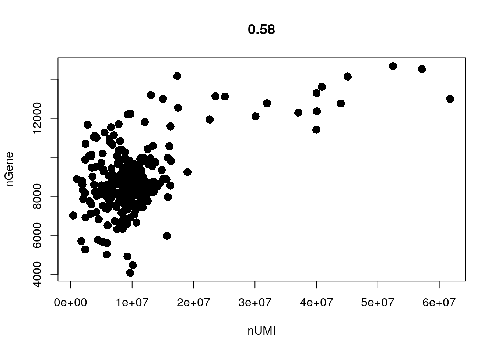
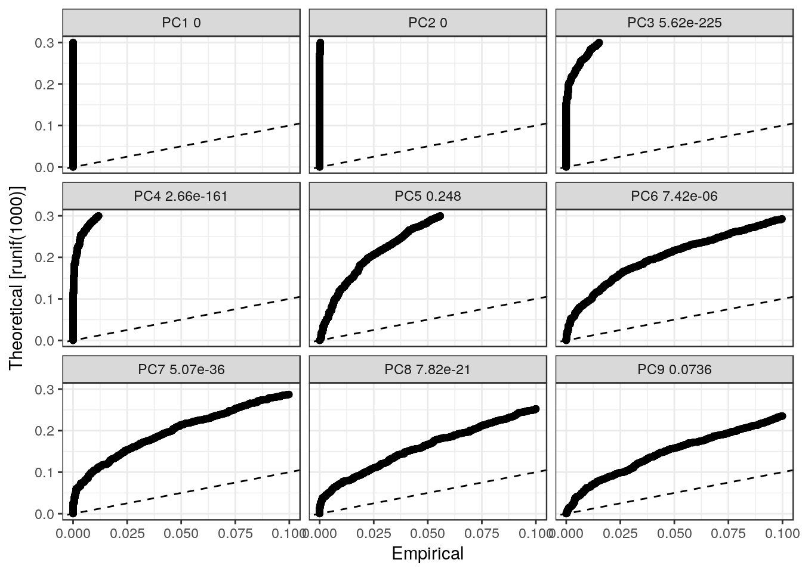
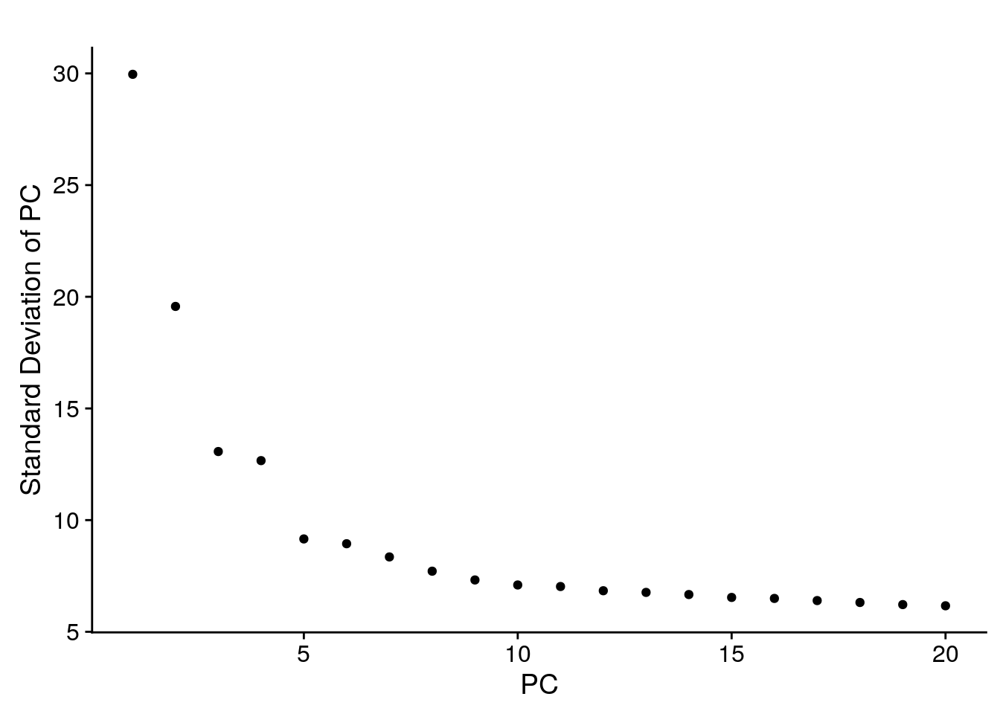
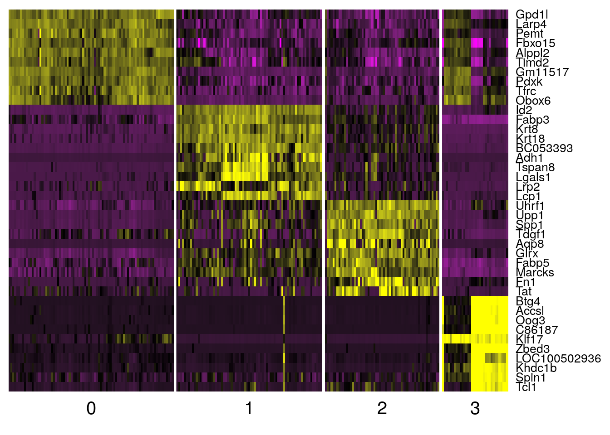

```r
set.seed(1234567)
```

# Seurat {#seurat-chapter}

[Seurat](http://satijalab.org/seurat/) was originally developed as a clustering tool for scRNA-seq data, however in the last few years the focus of the package has become less specific and at the moment `Seurat` is a popular R package that can perform QC, analysis, and exploration of scRNA-seq data, i.e. many of the tasks covered in this course. Although the authors provide several [tutorials](http://satijalab.org/seurat/get_started.html), here we provide a brief overview by following an [example](http://satijalab.org/seurat/pbmc3k_tutorial.html) created by the authors of `Seurat` (2,800 Peripheral Blood Mononuclear Cells). We mostly use default values in various function calls, for more details please consult the documentation and the authors. For course purpose will use a small `Deng` dataset described in the previous chapters:

```r
deng <- readRDS("deng/deng-reads.rds")
```

__Note__ Thanks to _community detection_ approach used in `Seurat` clustering, it allows one to work on datasets containing up to $10^5$ cells. We recommend using `Seurat` for datasets with more than $5000$ cells. For smaller dataset a good alternative will be `SC3`.

## `Seurat` object class

`Seurat` does not integrate `SingleCellExperiment` Bioconductor class described above, but instead introduces its own object class - `seurat`. All calculations in this chapter are performed on an object of this class. To begin the analysis we first need to initialize the object with the raw (non-normalized) data. We will keep all genes expressed in $>= 3$ cells and all cells with at least 200 detected genes:

```r
library(SingleCellExperiment)
library(Seurat)
library(mclust)
library(dplyr)
seuset <- CreateSeuratObject(
    raw.data = counts(deng),
    min.cells = 3, 
    min.genes = 200
)
```

## Expression QC

`Seurat` allows you to easily explore QC metrics and filter cells based on any user-defined criteria. We can visualize gene and molecule counts and plot their relationship:

```r
VlnPlot(
    object = seuset, 
    features.plot = c("nGene", "nUMI"), 
    nCol = 2
)
```


```r
GenePlot(
    object = seuset, 
    gene1 = "nUMI", 
    gene2 = "nGene"
)
```



Now we will exclude cells with a clear outlier number of read counts:

```r
seuset <- FilterCells(
    object = seuset, 
    subset.names = c("nUMI"), 
    high.thresholds = c(2e7)
)
```

## Normalization

After removing unwanted cells from the dataset, the next step is to normalize the data. By default, we employ a global-scaling normalization method `LogNormalize` that normalizes the gene expression measurements for each cell by the total expression, multiplies this by a scale factor (10,000 by default), and log-transforms the result:

```r
seuset <- NormalizeData(
    object = seuset, 
    normalization.method = "LogNormalize", 
    scale.factor = 10000
)
```

## Highly variable genes

Seurat calculates highly variable genes and focuses on these for downstream analysis. `FindVariableGenes` calculates the average expression and dispersion for each gene, places these genes into bins, and then calculates a z-score for dispersion within each bin. This helps control for the relationship between variability and average expression:

```r
seuset <- FindVariableGenes(
    object = seuset,
    mean.function = ExpMean, 
    dispersion.function = LogVMR, 
    x.low.cutoff = 0.0125, 
    x.high.cutoff = 3, 
    y.cutoff = 0.5
)
```


```r
length(x = seuset@var.genes)
```

```
## [1] 6127
```
We are not entirely sure what is going on in the lower left hand corner of the plot above. A similar feature can be found in the Satija lab tutorial, so we do not believe that it is due to an error in how we used the method.


## Dealing with confounders

To mitigate the effect of confounding factors, `Seurat` constructs linear models to predict gene expression based on user-defined variables. The scaled z-scored residuals of these models are stored in the `scale.data` slot, and are used for dimensionality reduction and clustering.

`Seurat` can regress out cell-cell variation in gene expression driven by batch, cell alignment rate (as provided by Drop-seq tools for Drop-seq data), the number of detected molecules, mitochondrial gene expression and cell cycle. Here we regress on the number of detected molecules per cell.

```r
seuset <- ScaleData(
    object = seuset, 
    vars.to.regress = c("nUMI")
)
```

```
## [1] "Regressing out nUMI"
## 
  |                                                                       
  |                                                                 |   0%
  |                                                                       
  |=                                                                |   1%
  |                                                                       
  |=                                                                |   2%
  |                                                                       
  |==                                                               |   2%
  |                                                                       
  |==                                                               |   3%
  |                                                                       
  |==                                                               |   4%
  |                                                                       
  |===                                                              |   4%
  |                                                                       
  |===                                                              |   5%
  |                                                                       
  |====                                                             |   6%
  |                                                                       
  |=====                                                            |   7%
  |                                                                       
  |=====                                                            |   8%
  |                                                                       
  |======                                                           |   8%
  |                                                                       
  |======                                                           |   9%
  |                                                                       
  |======                                                           |  10%
  |                                                                       
  |=======                                                          |  10%
  |                                                                       
  |=======                                                          |  11%
  |                                                                       
  |=======                                                          |  12%
  |                                                                       
  |========                                                         |  12%
  |                                                                       
  |========                                                         |  13%
  |                                                                       
  |=========                                                        |  14%
  |                                                                       
  |==========                                                       |  15%
  |                                                                       
  |==========                                                       |  16%
  |                                                                       
  |===========                                                      |  16%
  |                                                                       
  |===========                                                      |  17%
  |                                                                       
  |===========                                                      |  18%
  |                                                                       
  |============                                                     |  18%
  |                                                                       
  |============                                                     |  19%
  |                                                                       
  |=============                                                    |  20%
  |                                                                       
  |==============                                                   |  21%
  |                                                                       
  |==============                                                   |  22%
  |                                                                       
  |===============                                                  |  22%
  |                                                                       
  |===============                                                  |  23%
  |                                                                       
  |===============                                                  |  24%
  |                                                                       
  |================                                                 |  24%
  |                                                                       
  |================                                                 |  25%
  |                                                                       
  |=================                                                |  26%
  |                                                                       
  |==================                                               |  27%
  |                                                                       
  |==================                                               |  28%
  |                                                                       
  |===================                                              |  28%
  |                                                                       
  |===================                                              |  29%
  |                                                                       
  |===================                                              |  30%
  |                                                                       
  |====================                                             |  30%
  |                                                                       
  |====================                                             |  31%
  |                                                                       
  |====================                                             |  32%
  |                                                                       
  |=====================                                            |  32%
  |                                                                       
  |=====================                                            |  33%
  |                                                                       
  |======================                                           |  34%
  |                                                                       
  |=======================                                          |  35%
  |                                                                       
  |=======================                                          |  36%
  |                                                                       
  |========================                                         |  36%
  |                                                                       
  |========================                                         |  37%
  |                                                                       
  |========================                                         |  38%
  |                                                                       
  |=========================                                        |  38%
  |                                                                       
  |=========================                                        |  39%
  |                                                                       
  |==========================                                       |  40%
  |                                                                       
  |===========================                                      |  41%
  |                                                                       
  |===========================                                      |  42%
  |                                                                       
  |============================                                     |  42%
  |                                                                       
  |============================                                     |  43%
  |                                                                       
  |============================                                     |  44%
  |                                                                       
  |=============================                                    |  44%
  |                                                                       
  |=============================                                    |  45%
  |                                                                       
  |==============================                                   |  46%
  |                                                                       
  |===============================                                  |  47%
  |                                                                       
  |===============================                                  |  48%
  |                                                                       
  |================================                                 |  48%
  |                                                                       
  |================================                                 |  49%
  |                                                                       
  |================================                                 |  50%
  |                                                                       
  |=================================                                |  50%
  |                                                                       
  |=================================                                |  51%
  |                                                                       
  |=================================                                |  52%
  |                                                                       
  |==================================                               |  52%
  |                                                                       
  |==================================                               |  53%
  |                                                                       
  |===================================                              |  54%
  |                                                                       
  |====================================                             |  55%
  |                                                                       
  |====================================                             |  56%
  |                                                                       
  |=====================================                            |  56%
  |                                                                       
  |=====================================                            |  57%
  |                                                                       
  |=====================================                            |  58%
  |                                                                       
  |======================================                           |  58%
  |                                                                       
  |======================================                           |  59%
  |                                                                       
  |=======================================                          |  60%
  |                                                                       
  |========================================                         |  61%
  |                                                                       
  |========================================                         |  62%
  |                                                                       
  |=========================================                        |  62%
  |                                                                       
  |=========================================                        |  63%
  |                                                                       
  |=========================================                        |  64%
  |                                                                       
  |==========================================                       |  64%
  |                                                                       
  |==========================================                       |  65%
  |                                                                       
  |===========================================                      |  66%
  |                                                                       
  |============================================                     |  67%
  |                                                                       
  |============================================                     |  68%
  |                                                                       
  |=============================================                    |  68%
  |                                                                       
  |=============================================                    |  69%
  |                                                                       
  |=============================================                    |  70%
  |                                                                       
  |==============================================                   |  70%
  |                                                                       
  |==============================================                   |  71%
  |                                                                       
  |==============================================                   |  72%
  |                                                                       
  |===============================================                  |  72%
  |                                                                       
  |===============================================                  |  73%
  |                                                                       
  |================================================                 |  74%
  |                                                                       
  |=================================================                |  75%
  |                                                                       
  |=================================================                |  76%
  |                                                                       
  |==================================================               |  76%
  |                                                                       
  |==================================================               |  77%
  |                                                                       
  |==================================================               |  78%
  |                                                                       
  |===================================================              |  78%
  |                                                                       
  |===================================================              |  79%
  |                                                                       
  |====================================================             |  80%
  |                                                                       
  |=====================================================            |  81%
  |                                                                       
  |=====================================================            |  82%
  |                                                                       
  |======================================================           |  82%
  |                                                                       
  |======================================================           |  83%
  |                                                                       
  |======================================================           |  84%
  |                                                                       
  |=======================================================          |  84%
  |                                                                       
  |=======================================================          |  85%
  |                                                                       
  |========================================================         |  86%
  |                                                                       
  |=========================================================        |  87%
  |                                                                       
  |=========================================================        |  88%
  |                                                                       
  |==========================================================       |  88%
  |                                                                       
  |==========================================================       |  89%
  |                                                                       
  |==========================================================       |  90%
  |                                                                       
  |===========================================================      |  90%
  |                                                                       
  |===========================================================      |  91%
  |                                                                       
  |===========================================================      |  92%
  |                                                                       
  |============================================================     |  92%
  |                                                                       
  |============================================================     |  93%
  |                                                                       
  |=============================================================    |  94%
  |                                                                       
  |==============================================================   |  95%
  |                                                                       
  |==============================================================   |  96%
  |                                                                       
  |===============================================================  |  96%
  |                                                                       
  |===============================================================  |  97%
  |                                                                       
  |===============================================================  |  98%
  |                                                                       
  |================================================================ |  98%
  |                                                                       
  |================================================================ |  99%
  |                                                                       
  |=================================================================| 100%
## [1] "Scaling data matrix"
## 
  |                                                                       
  |                                                                 |   0%
  |                                                                       
  |=================================================================| 100%
```

## Linear dimensionality reduction

Next we perform `PCA` on the scaled data. By default, the genes in `object@var.genes` are used as input, but can be alternatively defined using `pc.genes`. Running dimensionality reduction on highly variable genes can improve performance. However, with some types of data (UMI) - particularly after regressing out technical variables, `PCA` returns similar (albeit slower) results when run on much larger subsets of genes, including the whole transcriptome.

```r
seuset <- RunPCA(
    object = seuset, 
    pc.genes = seuset@var.genes, 
    do.print = TRUE, 
    pcs.print = 1:5, 
    genes.print = 5
)
```

```
## [1] "PC1"
## [1] "Gm10436" "Zbed3"   "Gm13023" "Oog1"    "C86187" 
## [1] ""
## [1] "Fbp2"   "Fam96a" "Cstb"   "Lrpap1" "Ctsd"  
## [1] ""
## [1] ""
## [1] "PC2"
## [1] "Gsta4"    "Id2"      "Ptgr1"    "AA467197" "Myh9"    
## [1] ""
## [1] "Gm11517"  "Obox6"    "Pdxk"     "Map1lc3a" "Cited1"  
## [1] ""
## [1] ""
## [1] "PC3"
## [1] "Psrc1"  "Ninj2"  "Gja4"   "Tdrd12" "Wdr76" 
## [1] ""
## [1] "Efnb2"         "Gm9125"        "Pabpn1"        "Mad2l1bp"     
## [5] "1600025M17Rik"
## [1] ""
## [1] ""
## [1] "PC4"
## [1] "Upp1"   "Tdgf1"  "Baz2b"  "Rnd3"   "Col4a1"
## [1] ""
## [1] "Rragd"   "Ppfibp2" "Smpdl3a" "Cldn4"   "Amotl2" 
## [1] ""
## [1] ""
## [1] "PC5"
## [1] "Snhg8"   "Trappc2" "Acsm2"   "Angptl2" "Nlgn1"  
## [1] ""
## [1] "Akap1"  "Stub1"  "Apoe"   "Scand1" "Hjurp" 
## [1] ""
## [1] ""
```

`Seurat` provides several useful ways of visualizing both cells and genes that define the `PCA`:

```r
PrintPCA(object = seuset, pcs.print = 1:5, genes.print = 5, use.full = FALSE)
```

```
## [1] "PC1"
## [1] "Gm10436" "Zbed3"   "Gm13023" "Oog1"    "C86187" 
## [1] ""
## [1] "Fbp2"   "Fam96a" "Cstb"   "Lrpap1" "Ctsd"  
## [1] ""
## [1] ""
## [1] "PC2"
## [1] "Gsta4"    "Id2"      "Ptgr1"    "AA467197" "Myh9"    
## [1] ""
## [1] "Gm11517"  "Obox6"    "Pdxk"     "Map1lc3a" "Cited1"  
## [1] ""
## [1] ""
## [1] "PC3"
## [1] "Psrc1"  "Ninj2"  "Gja4"   "Tdrd12" "Wdr76" 
## [1] ""
## [1] "Efnb2"         "Gm9125"        "Pabpn1"        "Mad2l1bp"     
## [5] "1600025M17Rik"
## [1] ""
## [1] ""
## [1] "PC4"
## [1] "Upp1"   "Tdgf1"  "Baz2b"  "Rnd3"   "Col4a1"
## [1] ""
## [1] "Rragd"   "Ppfibp2" "Smpdl3a" "Cldn4"   "Amotl2" 
## [1] ""
## [1] ""
## [1] "PC5"
## [1] "Snhg8"   "Trappc2" "Acsm2"   "Angptl2" "Nlgn1"  
## [1] ""
## [1] "Akap1"  "Stub1"  "Apoe"   "Scand1" "Hjurp" 
## [1] ""
## [1] ""
```

```r
VizPCA(object = seuset, pcs.use = 1:2)
```


```r
PCAPlot(object = seuset, dim.1 = 1, dim.2 = 2)
```


In particular, `PCHeatmap` allows for easy exploration of the primary sources of heterogeneity in a dataset, and can be useful when trying to decide which PCs to include for further downstream analyses. Both cells and genes are ordered according to their `PCA` scores. Setting `cells.use` to a number plots the _extreme_ cells on both ends of the spectrum, which dramatically speeds plotting for large datasets:

```r
PCHeatmap(
    object = seuset, 
    pc.use = 1:6, 
    cells.use = 500, 
    do.balanced = TRUE, 
    label.columns = FALSE,
    use.full = FALSE
)
```


## Significant PCs

To overcome the extensive technical noise in any single gene for scRNA-seq data, `Seurat` clusters cells based on their `PCA` scores, with each PC essentially representing a _metagene_ that combines information across a correlated gene set. Determining how many PCs to include downstream is therefore an important step. `Seurat` randomly permutes a subset of the data (1% by default) and reruns `PCA`, constructing a _null distribution_ of gene scores by repeating this procedure. We identify _significant_ PCs as those who have a strong enrichment of low p-value genes:

```r
seuset <- JackStraw(
    object = seuset, 
    num.replicate = 100, 
    do.print = FALSE
)
```

The `JackStrawPlot` function provides a visualization tool for comparing the distribution of p-values for each PC with a uniform distribution (dashed line). _Significant_ PCs will show a strong enrichment of genes with low p-values (solid curve above the dashed line). In this case it appears that PCs 1-8 are significant.

```r
JackStrawPlot(object = seuset, PCs = 1:9)
```

```
## Warning: Removed 39410 rows containing missing values (geom_point).
```



A more ad hoc method for determining which PCs to use is to look at a plot of the standard deviations of the principle components and draw your cutoff where there is a clear elbow in the graph. This can be done with `PCElbowPlot`. In this example, it looks like the elbow would fall around PC 5.

```r
PCElbowPlot(object = seuset)
```



## Clustering cells

`Seurat` implements an graph-based clustering approach. Distances between the cells are calculated based on previously identified PCs. `Seurat` approach was heavily inspired by recent manuscripts which applied graph-based clustering approaches to scRNA-seq data - SNN-Cliq ([@Xu2015-vf]) and CyTOF data - PhenoGraph ([@Levine2015-fk]). Briefly, these methods embed cells in a graph structure - for example a K-nearest neighbor (_KNN_) graph, with edges drawn between cells with similar gene expression patterns, and then attempt to partition this graph into highly interconnected _quasi-cliques_ or _communities_. As in PhenoGraph, we first construct a _KNN_ graph based on the euclidean distance in PCA space, and refine the edge weights between any two cells based on the shared overlap in their local neighborhoods (Jaccard distance). To cluster the cells, we apply modularity optimization techniques - SLM ([@Blondel2008-px]), to iteratively group cells together, with the goal of optimizing the standard modularity function.

The `FindClusters` function implements the procedure, and contains a resolution parameter that sets the `granularity` of the downstream clustering, with increased values leading to a greater number of clusters. We find that setting this parameter between $0.6-1.2$ typically returns good results for single cell datasets of around $3,000$ cells. Optimal resolution often increases for larger datasets. The clusters are saved in the object@ident slot.

```r
seuset <- FindClusters(
    object = seuset, 
    reduction.type = "pca", 
    dims.use = 1:8, 
    resolution = 1.0, 
    print.output = 0, 
    save.SNN = TRUE
)
```

A useful feature in `Seurat` is the ability to recall the parameters that were used in the latest function calls for commonly used functions. For `FindClusters`, there is the function `PrintFindClustersParams` to print a nicely formatted summary of the parameters that were chosen:

```r
PrintFindClustersParams(object = seuset)
```

```
## Parameters used in latest FindClusters calculation run on: 2018-05-29 15:27:42
## =============================================================================
## Resolution: 1
## -----------------------------------------------------------------------------
## Modularity Function    Algorithm         n.start         n.iter
##      1                   1                 100             10
## -----------------------------------------------------------------------------
## Reduction used          k.param          k.scale          prune.SNN
##      pca                 30                25              0.0667
## -----------------------------------------------------------------------------
## Dims used in calculation
## =============================================================================
## 1 2 3 4 5 6 7 8
```

We can look at the clustering results and compare them to the original cell labels:

```r
table(seuset@ident)
```

```
## 
##  0  1  2  3 
## 85 75 59 34
```

```r
adjustedRandIndex(colData(deng)[seuset@cell.names, ]$cell_type2, seuset@ident)
```

```
## [1] 0.3981315
```

`Seurat` also utilises tSNE plot to visulise clustering results. As input to the tSNE, we suggest using the same PCs as input to the clustering analysis, although computing the tSNE based on scaled gene expression is also supported using the `genes.use` argument.

```r
seuset <- RunTSNE(
    object = seuset,
    dims.use = 1:8,
    do.fast = TRUE
)
TSNEPlot(object = seuset)
```


## Marker genes

Seurat can help you find markers that define clusters via differential expression. By default, it identifes positive and negative markers of a single cluster, compared to all other cells. You can test groups of clusters vs. each other, or against all cells. For example, to find marker genes for cluster 2 we can run:

```r
markers2 <- FindMarkers(seuset, 2)
```

Marker genes can then be visualised:

```r
VlnPlot(object = seuset, features.plot = rownames(markers2)[1:2])
```


```r
FeaturePlot(
    seuset, 
    head(rownames(markers2)), 
    cols.use = c("lightgrey", "blue"), 
    nCol = 3
)
```


`FindAllMarkers` automates this process and find markers for all clusters:

```r
markers <- FindAllMarkers(
    object = seuset, 
    only.pos = TRUE, 
    min.pct = 0.25, 
    thresh.use = 0.25
)
```

`DoHeatmap` generates an expression heatmap for given cells and genes. In this case, we are plotting the top 10 markers (or all markers if less than 20) for each cluster:

```r
top10 <- markers %>% group_by(cluster) %>% top_n(10, avg_logFC)
DoHeatmap(
    object = seuset, 
    genes.use = top10$gene, 
    slim.col.label = TRUE, 
    remove.key = TRUE
)
```



__Exercise__: Compare marker genes provided by `Seurat` and `SC3`.

## sessionInfo()


```
## R version 3.4.3 (2017-11-30)
## Platform: x86_64-pc-linux-gnu (64-bit)
## Running under: Debian GNU/Linux 9 (stretch)
## 
## Matrix products: default
## BLAS: /usr/lib/openblas-base/libblas.so.3
## LAPACK: /usr/lib/libopenblasp-r0.2.19.so
## 
## locale:
##  [1] LC_CTYPE=en_US.UTF-8       LC_NUMERIC=C              
##  [3] LC_TIME=en_US.UTF-8        LC_COLLATE=en_US.UTF-8    
##  [5] LC_MONETARY=en_US.UTF-8    LC_MESSAGES=C             
##  [7] LC_PAPER=en_US.UTF-8       LC_NAME=C                 
##  [9] LC_ADDRESS=C               LC_TELEPHONE=C            
## [11] LC_MEASUREMENT=en_US.UTF-8 LC_IDENTIFICATION=C       
## 
## attached base packages:
## [1] parallel  stats4    methods   stats     graphics  grDevices utils    
## [8] datasets  base     
## 
## other attached packages:
##  [1] bindrcpp_0.2               dplyr_0.7.4               
##  [3] mclust_5.4                 Seurat_2.2.1              
##  [5] Matrix_1.2-7.1             cowplot_0.9.2             
##  [7] ggplot2_2.2.1              SingleCellExperiment_1.0.0
##  [9] SummarizedExperiment_1.8.1 DelayedArray_0.4.1        
## [11] matrixStats_0.53.1         Biobase_2.38.0            
## [13] GenomicRanges_1.30.3       GenomeInfoDb_1.14.0       
## [15] IRanges_2.12.0             S4Vectors_0.16.0          
## [17] BiocGenerics_0.24.0        knitr_1.20                
## 
## loaded via a namespace (and not attached):
##   [1] backports_1.1.2        Hmisc_4.1-1            VGAM_1.0-5            
##   [4] sn_1.5-1               plyr_1.8.4             igraph_1.1.2          
##   [7] lazyeval_0.2.1         splines_3.4.3          digest_0.6.15         
##  [10] foreach_1.4.4          htmltools_0.3.6        lars_1.2              
##  [13] gdata_2.18.0           magrittr_1.5           checkmate_1.8.5       
##  [16] cluster_2.0.6          mixtools_1.1.0         ROCR_1.0-7            
##  [19] sfsmisc_1.1-1          recipes_0.1.2          gower_0.1.2           
##  [22] dimRed_0.1.0           R.utils_2.6.0          colorspace_1.3-2      
##  [25] xfun_0.1               RCurl_1.95-4.10        bindr_0.1             
##  [28] survival_2.40-1        iterators_1.0.9        ape_5.0               
##  [31] glue_1.2.0             DRR_0.0.3              gtable_0.2.0          
##  [34] ipred_0.9-6            zlibbioc_1.24.0        XVector_0.18.0        
##  [37] kernlab_0.9-25         ddalpha_1.3.1.1        prabclus_2.2-6        
##  [40] DEoptimR_1.0-8         scales_0.5.0           mvtnorm_1.0-7         
##  [43] Rcpp_0.12.15           metap_0.8              dtw_1.18-1            
##  [46] htmlTable_1.11.2       tclust_1.3-1           foreign_0.8-67        
##  [49] proxy_0.4-21           SDMTools_1.1-221       Formula_1.2-2         
##  [52] tsne_0.1-3             lava_1.6               prodlim_1.6.1         
##  [55] htmlwidgets_1.0        FNN_1.1                gplots_3.0.1          
##  [58] RColorBrewer_1.1-2     fpc_2.1-11             acepack_1.4.1         
##  [61] modeltools_0.2-21      ica_1.0-1              pkgconfig_2.0.1       
##  [64] R.methodsS3_1.7.1      flexmix_2.3-14         nnet_7.3-12           
##  [67] caret_6.0-78           labeling_0.3           tidyselect_0.2.4      
##  [70] rlang_0.2.0            reshape2_1.4.3         munsell_0.4.3         
##  [73] tools_3.4.3            ranger_0.9.0           broom_0.4.3           
##  [76] ggridges_0.4.1         evaluate_0.10.1        stringr_1.3.0         
##  [79] yaml_2.1.17            ModelMetrics_1.1.0     robustbase_0.92-8     
##  [82] caTools_1.17.1         purrr_0.2.4            pbapply_1.3-4         
##  [85] nlme_3.1-129           R.oo_1.21.0            RcppRoll_0.2.2        
##  [88] compiler_3.4.3         rstudioapi_0.7         tibble_1.4.2          
##  [91] stringi_1.1.6          lattice_0.20-34        trimcluster_0.1-2     
##  [94] psych_1.7.8            diffusionMap_1.1-0     pillar_1.2.1          
##  [97] data.table_1.10.4-3    bitops_1.0-6           irlba_2.3.2           
## [100] R6_2.2.2               latticeExtra_0.6-28    bookdown_0.7          
## [103] KernSmooth_2.23-15     gridExtra_2.3          codetools_0.2-15      
## [106] MASS_7.3-45            gtools_3.5.0           assertthat_0.2.0      
## [109] CVST_0.2-1             rprojroot_1.3-2        withr_2.1.1           
## [112] mnormt_1.5-5           GenomeInfoDbData_1.0.0 diptest_0.75-7        
## [115] grid_3.4.3             rpart_4.1-10           timeDate_3043.102     
## [118] tidyr_0.8.0            class_7.3-14           rmarkdown_1.8         
## [121] segmented_0.5-3.0      Rtsne_0.13             numDeriv_2016.8-1     
## [124] scatterplot3d_0.3-40   lubridate_1.7.3        base64enc_0.1-3
```
