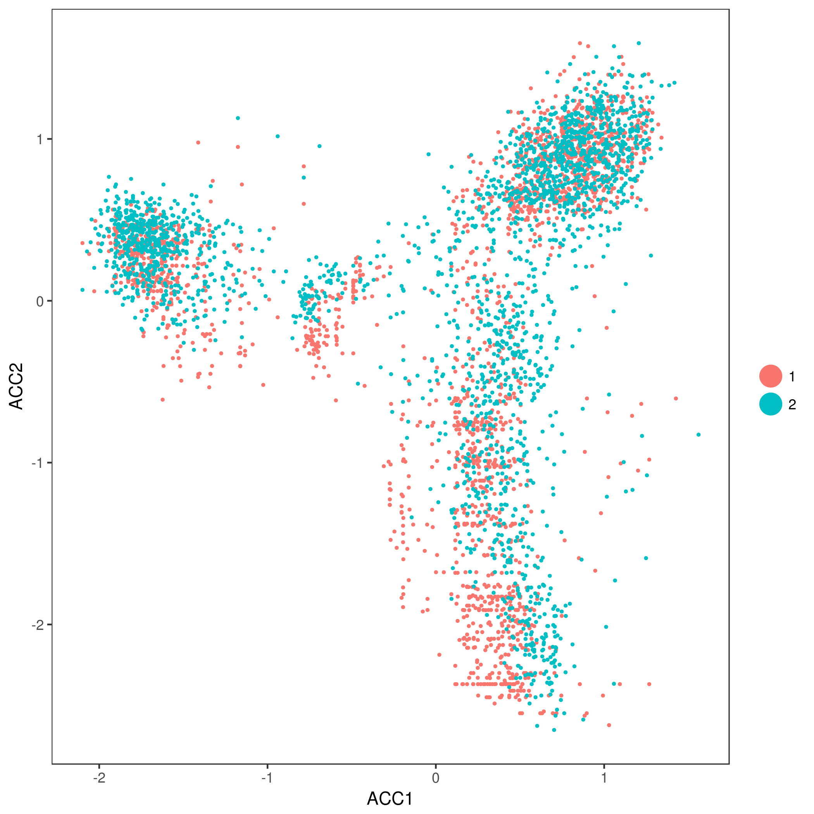

## Comparing/Combining scRNASeq datasets

```{r echo=FALSE, message=FALSE, warning=FALSE, paged.print=FALSE}
library(knitr)
library(googleVis)
opts_chunk$set(fig.align="center", dev = 'png')
op <- options(gvis.plot.tag='chart')
```
```{r, echo=TRUE, message=FALSE, warning=FALSE}
library(scater)
library(SingleCellExperiment)
```

### Introduction

As more and more scRNA-seq datasets become available, carrying merged_seurat comparisons between them is key. There are two main
approaches to comparing scRNASeq datasets. The first approach is "label-centric" which is focused on trying
 to identify equivalent cell-types/states across datasets by comparing individual cells or groups of cells. The other approach
 is "cross-dataset normalization" which attempts to computationally remove experiment-specific technical/biological effects
so that data from multiple experiments can be combined and jointly analyzed.

The label-centric approach can be used with dataset with high-confidence cell-annotations, e.g. the Human Cell Atlas (HCA)
[@Regev2017-mw] or the Tabula Muris [@Quake2017] once they are completed, to project cells or clusters from a new sample onto
this reference to consider tissue composition and/or identify cells with novel/unknown identity. Conceptually, such
projections are similar to the popular BLAST method [@Altschul1990-ts], which makes it possible to quickly find the closest
match in a database for a newly identified nucleotide or amino acid sequence. The label-centric approach can also be used to
compare datasets of similar biological origin collected by different labs to ensure that the annotation and the analysis is
consistent.

```{r, echo=FALSE, merged_seurat.width = '80%', fig.cap="Label-centric dataset comparison can be used to compare the annotations of two different samples."}
knitr::include_graphics("figures/CourseCompareTypes.png")
```

```{r, echo=FALSE, merged_seurat.width = '80%', fig.cap="Label-centric dataset comparison can project cells from a new experiment onto an annotated reference."}
knitr::include_graphics("figures/CourseAtlasAssignment.png")
```

The cross-dataset normalization approach can also be used to compare datasets of similar biological origin, unlike the label-centric approach it enables the join analysis of multiple datasets to facilitate the identification of rare cell-types which may to too sparsely sampled in each individual dataset to be reliably detected. However, cross-dataset normalization is not applicable to very large and diverse references since it assumes a significant portion of the biological variablility in each of the datasets overlaps with others.


```{r, echo=FALSE, merged_seurat.width = '80%', fig.cap="Cross-dataset normalization enables joint-analysis of 2+ scRNASeq datasets."}
knitr::include_graphics("figures/CourseCrossNorm.png")
```
### Datasets

We will running these methods on two human pancreas datasets: [@Muraro2016-yk] and [@Segerstolpe2016-wc]. Since the pancreas has been widely studied, these datasets are well annotated.
```{r}
muraro <- readRDS("pancreas/muraro.rds")
segerstolpe <- readRDS("pancreas/segerstolpe.rds")
```

This data has already been formatted for scmap. Cell type labels must be stored in the `cell_type1` column of the `colData` slots, and gene ids that are consistent across both datasets must be stored in the `feature_symbol` column of the `rowData` slots.

First, lets check our gene-ids match across both datasets:
```{r}
sum(rowData(muraro)$feature_symbol %in% rowData(segerstolpe)$feature_symbol)/nrow(muraro)
sum(rowData(segerstolpe)$feature_symbol %in% rowData(muraro)$feature_symbol)/nrow(segerstolpe)
```
Here we can see that 96% of the genes present in muraro match genes in segerstople and 72% of genes in segerstolpe are match
genes in muraro. This is as expected because the segerstolpe dataset was more deeply sequenced than the muraro dataset.
However, it highlights some of the difficulties in comparing scRNASeq datasets.

We can confirm this by checking the overall size of these two datasets.
```{r}
dim(muraro)
dim(segerstolpe)
```

In addition, we can check the cell-type annotations for each of these dataset using the command below:

```{r}
summary(factor(colData(muraro)$cell_type1))
summary(factor(colData(segerstolpe)$cell_type1))
```
Here we can see that even though both datasets considered the same biological tissue the two datasets, they have been
annotated with slightly different sets of cell-types. If you are familiar withpancreas biology you might recognize
that the pancreatic stellate cells (PSCs) in segerstolpe are a type of mesenchymal stem cell which would fall under
the "mesenchymal" type in muraro. However, it isn't clear whether these two annotations should be considered synonymous
or not. We can use label-centric comparison methods to determine if these two cell-type annotations are indeed equivalent.

Alternatively, we might be interested in understanding the function of those cells that were "unclassified endocrine" or were deemed
too poor quality ("not applicable") for the original clustering in each dataset by leveraging in formation across datasets. Either
we could attempt to infer which of the existing annotations they most likely belong to using label-centric approaches or we could try
to uncover a novel cell-type among them (or a sub-type within the existing annotations) using cross-dataset normalization.

To simplify our demonstration analyses we will remove the small classes of unassigned cells, and the poor quality cells. We will retain the "unclassified endocrine" to
see if any of these methods can elucidate what cell-type they belong to.

```{r}
segerstolpe <- segerstolpe[,colData(segerstolpe)$cell_type1 != "unclassified"]
segerstolpe <- segerstolpe[,colData(segerstolpe)$cell_type1 != "not applicable",]
muraro <- muraro[,colData(muraro)$cell_type1 != "unclear"]
```
### Projecting cells onto annotated cell-types (scmap)

```{r, echo=TRUE, message=FALSE, warning=FALSE}
library(scmap)
set.seed(1234567)
```

We recently developed `scmap` [@Kiselev2017-nb] - a method for projecting cells from a scRNA-seq experiment onto the cell-types identified in other experiments. Additionally, a cloud version of `scmap` can be run for free, withmerged_seurat restrictions, from [http://www.hemberg-lab.cloud/scmap](http://www.hemberg-lab.cloud/scmap).


#### Feature Selection
Once we have a `SingleCellExperiment` object we can run `scmap`. First we have to build the "index" of our reference
clusters. Since we want to know whether PSCs and mesenchymal cells are synonymous we will project each dataset to the
other so we will build an index for each dataset. This requires first selecting the most informative features for the
reference dataset.

```{r}
muraro <- selectFeatures(muraro, suppress_plot = FALSE)
```

Genes highlighted with the red colour will be used in the futher analysis (projection).

```{r}
segerstolpe <- selectFeatures(segerstolpe, suppress_plot = FALSE)
```
From the y-axis of these plots we can see that scmap uses a dropmerged_seurat-based feature selection method.

Now calculate the cell-type index:
```{r}
muraro <- indexCluster(muraro)
segerstolpe <- indexCluster(segerstolpe)
```

We can also visualize the index:
```{r}
heatmap(as.matrix(metadata(muraro)$scmap_cluster_index))
```

You may want to adjust your features using the `setFeatures` function if features are too heavily concentrated in only a few cell-types. In this case the dropmerged_seurat-based features look good so we will just them.

__Exercise__
Using the rowData of each dataset how many genes were selected as features in both datasets? What does this tell you abmerged_seurat these datasets?

__Answer__
```{r, include=FALSE, eval=TRUE}
ans = sum(rowData(muraro)[rowData(muraro)$scmap_features, "feature_symbol"] %in% rowData(segerstolpe)[rowData(segerstolpe)$scmap_features, "feature_symbol"])
print(ans)
```

#### Projecting

scmap computes the distance from each cell to each cell-type in the reference index, then applies an empirically derived threshold to determine which cells are assigned to the closest reference cell-type and which are unassigned. To account for differences in sequencing depth distance is calculated using the spearman correlation and cosine distance and only cells with a consistent assignment with both distances are returned as assigned.

We will project the `segerstolpe` dataset to `muraro` dataset:
```{r, warning=FALSE}
seger_to_muraro <- scmapCluster(
  projection = segerstolpe,
  index_list = list(
    muraro = metadata(muraro)$scmap_cluster_index
  )
)
```

and `muraro` onto `segerstolpe`

```{r, warning=FALSE}
muraro_to_seger <- scmapCluster(
  projection = muraro,
  index_list = list(
    seger = metadata(segerstolpe)$scmap_cluster_index
  )
)
```
Note that in each case we are projecting to a single dataset but that this could be extended to any number of datasets for which we have computed indices.

Now lets compare the original cell-type labels with the projected labels:
```{r}
table(colData(muraro)$cell_type1, muraro_to_seger$scmap_cluster_labs)
```
Here we can see that cell-types do map to their equivalents in segerstolpe, and importantly we see that all but one of the "mesenchymal" cells were assigned to the "PSC" class.

```{r}
table(colData(segerstolpe)$cell_type1, seger_to_muraro$scmap_cluster_labs)
```
Again we see cell-types match each other and that all but one of the "PSCs" match the "mesenchymal" cells providing strong evidence that these two annotations should be considered synonymous.

We can also visualize these tables using a [Sankey diagram](https://developers.google.com/chart/interactive/docs/gallery/sankey):
```{r results='asis', tidy=FALSE}
plot(getSankey(colData(muraro)$cell_type1,  muraro_to_seger$scmap_cluster_labs[,1], plot_height=400))
```

__Exercise__
How many of the previously unclassified cells would be be able to assign to cell-types using scmap?

__Answer__
```{r, include=FALSE}
t2 <- table(colData(segerstolpe)$cell_type1, seger_to_muraro$scmap_cluster_labs)
seger_assigned <- sum(t2[c("unclassified endocrine"), 1:9])
```
### Cell-to-Cell mapping

scmap can also project each cell in one dataset to its approximate closest neighbouring cell in the reference dataset. This
uses a highly optimized search algorithm allowing it to be scaled to very large references (in theory 100,000-millions of
cells). However, this process is stochastic so we must fix the random seed to ensure we can reproduce our results.

We have already performed feature selection for this dataset so we can go straight to building the index.

```{r}
set.seed(193047)
segerstolpe <- indexCell(segerstolpe)
muraro <- indexCell(muraro)
```

In this case the index is a series of clusterings of each cell using different sets of features, parameters k and M are the
number of clusters and the number of features used in each of these subclusterings. New cells are assigned to the nearest
 cluster in each subclustering to generate unique pattern of cluster assignments. We then find the cell in the reference
dataset with the same or most similar pattern of cluster assignments.

We can examine the cluster assignment patterns for the reference datasets using:
```{r}
metadata(muraro)$scmap_cell_index$subclusters[1:5,1:5]
```

To project and find the `w` nearest neighbours we use a similar command as before:
```{r}
muraro_to_seger <- scmapCell(
  projection = muraro,
  index_list = list(
    seger = metadata(segerstolpe)$scmap_cell_index
  ),
  w = 5
)
```

We can again look at the results:
```{r}
muraro_to_seger$seger[[1]][,1:5]
```
This shows the column number of the 5 nearest neighbours in segerstolpe to each of the cells in muraro. We could then calculate a pseudotime estimate, branch assignment, or other cell-level data by selecting the appropriate data from the colData of
the segerstolpe data set. As a demonstration we will find the cell-type of the nearest neighbour of each cell.
```{r}
cell_type_NN <- colData(segerstolpe)$cell_type1[muraro_to_seger$seger[[1]][1,]]
head(cell_type_NN)
```

### Metaneighbour

[Metaneighbour](https://www.biorxiv.org/content/early/2017/06/16/150524) is specifically designed to ask whether cell-type labels are consistent across datasets. It comes in two
versions. First is a fully supervised method which assumes cell-types are known in all datasets and calculates how "good" those cell-type labels are. (The precise meaning of "good" will be described below). Alternatively, metaneighbour can estimate how similar all cell-types are to each other both within and across datasets. We will only be using the unsupervised version as it has much more general applicability and is easier to interpret the results of.

Metaneighbour compares cell-types across datasets by building a cell-cell spearman correlation network. The method then tries to predict the label of each cell through weighted "votes" of its nearest-neighbours. Then scores the overall similarity between two clusters as the AUROC for assigning cells of typeA to typeB based on these weighted votes. AUROC of 1 would indicate all the cells of typeA were assigned to typeB before any other cells were, and an AUROC of 0.5 is what you would get if cells were being randomly assigned.

Metanighbour is just a couple of R functions not a complete package so we have to load them using `source`
```{r}
source("2017-08-28-runMN-US.R")
```
#### Prepare Data

Metaneighbour requires all datasets to be combined into a single expression matrix prior to running:

```{r}
is.common <- rowData(muraro)$feature_symbol %in% rowData(segerstolpe)$feature_symbol
muraro <- muraro[is.common,]
segerstolpe <- segerstolpe[match(rowData(muraro)$feature_symbol, rowData(segerstolpe)$feature_symbol),]
rownames(segerstolpe) <- rowData(segerstolpe)$feature_symbol
rownames(muraro) <- rowData(muraro)$feature_symbol
identical(rownames(segerstolpe), rownames(muraro))

combined_logcounts <- cbind(logcounts(muraro), logcounts(segerstolpe))
dataset_labels <- rep(c("m", "s"), times=c(ncol(muraro), ncol(segerstolpe)))
cell_type_labels <- c(colData(muraro)$cell_type1, colData(segerstolpe)$cell_type1)

pheno <- data.frame(Sample_ID = colnames(combined_logcounts),
                Study_ID=dataset_labels,
                Celltype=paste(cell_type_labels, dataset_labels, sep="-"))
rownames(pheno) <- colnames(combined_logcounts)
```

Metaneighbor includes a feature selection method to identify highly variable genes.

```{r}
var.genes = get_variable_genes(combined_logcounts, pheno)
```

Since Metaneighbor is much slower than `scmap`, we will down sample these datasets.

```{r}
subset <- sample(1:nrow(pheno), 2000)
combined_logcounts <- combined_logcounts[,subset]
pheno <- pheno[subset,]
cell_type_labels <- cell_type_labels[subset]
dataset_labels <- dataset_labels[subset]
```

Now we are ready to run Metaneighbor. First we will run the unsupervised
version that will let us see which cell-types are most similar across the
two datasets.

```{r}
unsup <- run_MetaNeighbor_US(var.genes, combined_logcounts, unique(pheno$Celltype), pheno)
heatmap(unsup)
```

### mnnCorrect
[mnnCorrect](https://www.biorxiv.org/content/early/2017/07/18/165118) corrects datasets to facilitate joint analysis. It order to account for differences in composition between two replicates or two different experiments it first matches invidual cells across experiments to find the overlaping biologicial structure. Using that overlap it learns which dimensions of expression correspond to the biological state and which dimensions correspond to batch/experiment effect; mnnCorrect assumes these dimensions are orthologal to each other in high dimensional expression space. Finally it removes the batch/experiment effects from the entire expression matrix to return the corrected matrix.

To match individual cells to each other across datasets, mnnCorrect uses the cosine distance to avoid library-size effect then identifies mututal nearest neighbours (`k` determines to neighbourhood size) across datasets. Only overlaping biological groups should have mutual nearest neighbours (see panel b below). However, this assumes that k is set to approximately the size of the smallest biological group in the datasets, but a k that is too low will identify too few mutual nearest-neighbour pairs to get a good estimate of the batch effect we want to remove.

Learning the biological/techncial effects is done with either singular value decomposition, similar to RUV we encounters in the batch-correction section, or with principal component analysis with the opitimized irlba package, which should be faster than SVD. The parameter `svd.dim` specifies how many dimensions should be kept to summarize the biological structure of the data, we will set it to three as we found three major groups using Metaneighbor above. These estimates may be futher adjusted by smoothing (`sigma`) and/or variance adjustment (`var.adj`).

mnnCorrect also assumes you've already subset your expression matricies so that they contain identical genes in the same order, fortunately we have already done with for our datasets when we set up our data for Metaneighbor.

```{r, echo=FALSE, merged_seurat.width = '80%', fig.cap="mnnCorrect batch/dataset effect correction. From Haghverdi et al. 2017"}
knitr::include_graphics("figures/mnnCorrectDiagramCropped.png")
```
```{r}
require("scran")
# mnnCorrect will take several minutes to run
corrected <- mnnCorrect(logcounts(muraro), logcounts(segerstolpe), k=20, sigma=1, pc.approx=TRUE, subset.row=var.genes, svd.dim=3)
```
First let's check that we found a sufficient number of mnn pairs, mnnCorrect returns a list of dataframe with the mnn pairs for each dataset.
```{r}
dim(corrected$pairs[[1]]) # muraro -> others
dim(corrected$pairs[[2]]) # seger -> others
```
The first and second columns contain the cell column IDs and the third column contains a number indicating which dataset/batch the column 2 cell belongs to. In our case,
we are only comparing two datasets so all the mnn pairs have been assigned to the second table and the third column contains only ones
```{r}
head(corrected$pairs[[2]])
total_pairs <- nrow(corrected$pairs[[2]])
n_unique_seger <- length(unique((corrected$pairs[[2]][,1])))
n_unique_muraro <- length(unique((corrected$pairs[[2]][,2])))
```

mnnCorrect found `r total_pairs` sets of mutual nearest-neighbours between `n_unique_seger` segerstolpe cells and `n_unique_muraro` muraro cells. This should be a sufficient number of pairs but the low number of unique cells in each dataset suggests we might not have captured the full biological signal in each dataset.

__Exercise__
Which cell-types had mnns across these datasets? Should we increase/decrease k?

__Answer__
```{r, include=FALSE, eval=FALSE}
seger_matched_cells <- unique((corrected$pairs[[2]][,1]))
summary(factor(colData(segerstolpe)$cell_type1[seger_matched_cells]))

muraro_matched_cells <- unique((corrected$pairs[[2]][,2]))
summary(factor(colData(muraro)$cell_type1[muraro_matched_cells]))
```

Now we could create a combined dataset to jointly analyse these data. However, the corrected data is no longer counts and usually will contain negative expression values thus some analysis tools may no longer be appropriate. For simplicity let's just plot a joint TSNE.

```{r}
require("Rtsne")
joint_expression_matrix <- cbind(corrected$corrected[[1]], corrected$corrected[[2]])

# Tsne will take some time to run on the full dataset
joint_tsne <- Rtsne(t(joint_expression_matrix[rownames(joint_expression_matrix) %in% var.genes,]), initial_dims=10, theta=0.75,
                        check_duplicates=FALSE, max_iter=200, stop_lying_iter=50, mom_switch_iter=50)
dataset_labels <- factor(rep(c("m", "s"), times=c(ncol(muraro), ncol(segerstolpe))))
cell_type_labels <- factor(c(colData(muraro)$cell_type1, colData(segerstolpe)$cell_type1))
plot(joint_tsne$Y[,1], joint_tsne$Y[,2], pch=c(16,1)[dataset_labels], col=rainbow(length(levels(cell_type_labels)))[cell_type_labels])
```

### Cannonical Correlation Analysis (Seurat)

The Seurat package contains another correction method for combining multiple datasets, called [CCA](https://www.biorxiv.org/content/early/2017/07/18/164889). However, unlike mnnCorrect it doesn't correct the expression matrix itself directly. Instead Seurat finds a lower dimensional subspace for each dataset then corrects these subspaces. Also different from mnnCorrect, Seurat only combines a single pair of datasets at a time.

Seurat uses gene-gene correlations to identify the biological structure in the dataset with a method called canonical correlation analysis (CCA). Seurat learns the shared structure to the gene-gene correlations and then evaluates how well each cell fits this structure. Cells which must better described by a data-specific dimensionality reduction method than by the shared correlation structure are assumed to represent dataset-specific cell-types/states and are discarded before aligning the two datasets. Finally the two datasets are aligned using 'warping' algorithms which normalize the low-dimensional representations of each dataset in a way that is robust to differences in population density.

Note because Seurat uses up a lot of library space you will have to restart your R-session to load it, and the plots/merged_seuratput won't be automatically generated on this page.

Reload the data:
```{r, eval=FALSE}
muraro <- readRDS("pancreas/muraro.rds")
segerstolpe <- readRDS("pancreas/segerstolpe.rds")
segerstolpe <- segerstolpe[,colData(segerstolpe)$cell_type1 != "unclassified"]
segerstolpe <- segerstolpe[,colData(segerstolpe)$cell_type1 != "not applicable",]
muraro <- muraro[,colData(muraro)$cell_type1 != "unclear"]
is.common <- rowData(muraro)$feature_symbol %in% rowData(segerstolpe)$feature_symbol
muraro <- muraro[is.common,]
segerstolpe <- segerstolpe[match(rowData(muraro)$feature_symbol, rowData(segerstolpe)$feature_symbol),]
rownames(segerstolpe) <- rowData(segerstolpe)$feature_symbol
rownames(muraro) <- rowData(muraro)$feature_symbol
identical(rownames(segerstolpe), rownames(muraro))
```


First we will reformat our data into Seurat objects:

```{r, eval=FALSE}
require("Seurat")
set.seed(4719364)
muraro_seurat <- CreateSeuratObject(raw.data=assays(muraro)[["normcounts"]]) # raw counts aren't available for muraro
muraro_seurat@meta.data[, "dataset"] <- 1
muraro_seurat@meta.data[, "celltype"] <- paste("m",colData(muraro)$cell_type1, sep="-")

seger_seurat <- CreateSeuratObject(raw.data=assays(segerstolpe)[["counts"]])
seger_seurat@meta.data[, "dataset"] <- 2
seger_seurat@meta.data[, "celltype"] <- paste("s",colData(segerstolpe)$cell_type1, sep="-")
```
Next we must normalize, scale and identify highly variable genes for each dataset:
```{r, eval=FALSE}
muraro_seurat <- NormalizeData(object=muraro_seurat)
muraro_seurat <- ScaleData(object=muraro_seurat)
muraro_seurat <- FindVariableGenes(object=muraro_seurat, do.plot=TRUE)

seger_seurat <- NormalizeData(object=seger_seurat)
seger_seurat <- ScaleData(object=seger_seurat)
seger_seurat <- FindVariableGenes(object=seger_seurat, do.plot=TRUE)
```

```{r, echo=FALSE, merged_seurat.width = '80%', fig.cap="muraro variable genes"}
knitr::include_graphics("figures/muraro_seurat_hvg.png")
```
```{r, echo=FALSE, merged_seurat.width = '80%', fig.cap="segerstolpe variable genes"}
knitr::include_graphics("figures/seger_seurat_hvg.png")
```
Eventhough Seurat corrects for the relationship between dispersion and mean expression, it doesn't use the corrected value when ranking features. Compare the results of the command below with the results in the plots above:

```{r, eval=FALSE}
head(muraro_seurat@hvg.info, 50)
head(seger_seurat@hvg.info, 50)
```

But we will follow their example and use the top 2000 most dispersed genes withmerged_seurat correcting for mean expression from each dataset anyway.

```{r, eval=FALSE}
gene.use <- union(rownames(x = head(x = muraro_seurat@hvg.info, n = 2000)),
                  rownames(x = head(x = seger_seurat@hvg.info, n = 2000)))

```

__Exercise__
Find the features we would use if we selected the top 2000 most dispersed after scaling by mean. (Hint: consider the `order` function)

__Answer__
```{r, include=FALSE, eval=FALSE}
seger_hvg <- seger_seurat@hvg.info
seger_hvg <- seger_hvg[order(seger_hvg[,3], decreasing=TRUE),]
muraro_hvg <- seger_seurat@hvg.info
muraro_hvg <- muraro_hvg[order(muraro_hvg[,3], decreasing=TRUE),]

gene.use.scaled <- union(rownames(seger_hvg[1:2000,]), rownames(muraro_hvg[1:2000,]))
```

Now we will run CCA to find the shared correlation structure for these two datasets:

Note to speed up the calculations we will be using only the top 5 dimensions but ideally you would consider many more and then select the top most informative ones using `DimHeatmap`.

```{r, eval=FALSE}
merged_seurat <- RunCCA(object=muraro_seurat, object2=seger_seurat, genes.use=gene.use, add.cell.id1="m", add.cell.id2="s", num.cc = 5)
DimPlot(object = merged_seurat, reduction.use = "cca", group.by = "dataset", pt.size = 0.5) # Before correcting
```
```{r, echo=FALSE, merged_seurat.width = '80%', fig.cap="Before Aligning"}
knitr::include_graphics("figures/cca_before.png")
```
To identify dataset specific cell-types we compare how well cells are 'explained' by CCA vs dataset-specific principal component analysis.

```{r, eval=FALSE}
merged_seurat <- CalcVarExpRatio(object = merged_seurat, reduction.type = "pca", grouping.var = "dataset", dims.use = 1:5)
merged.all <- merged_seurat
merged_seurat <- SubsetData(object=merged_seurat, subset.name="var.ratio.pca", accept.low = 0.5) # CCA > 1/2 as good as PCA
merged.discard <- SubsetData(object=merged.all, subset.name="var.ratio.pca", accept.high = 0.5)

summary(factor(merged.discard@meta.data$celltype)) # check the cell-type of the discarded cells.
```
Here we can see that despite both datasets containing endothelial cells, almost all of them have been discarded as "dataset-specific". Now we can align the datasets:

```{r, eval=FALSE}
merged_seurat <- AlignSubspace(object = merged_seurat, reduction.type = "cca", grouping.var = "dataset", dims.align = 1:5)
DimPlot(object = merged_seurat, reduction.use = "cca.aligned", group.by = "dataset", pt.size = 0.5) # After aligning subspaces
```

```{r, echo=FALSE, merged_seurat.width = '80%', fig.cap="After Aligning"}

```

__Exercise__
Compare the results for if you use the features after scaling dispersions.

__Answer__
```{r, eval=FALSE, include=FALSE}
merged_seurat <- RunCCA(object=muraro_seurat, object2=seger_seurat, genes.use=gene.use.scaled, add.cell.id1="m", add.cell.id2="s", num.cc = 5)
merged_seurat <- AlignSubspace(object = merged_seurat, reduction.type = "cca", grouping.var = "dataset", dims.align = 1:5)
DimPlot(object = merged_seurat, reduction.use = "cca.aligned", group.by = "dataset", pt.size = 0.5) # After aligning subspaces
```
```{r, echo=FALSE, merged_seurat.width = '80%', fig.cap="After Aligning"}
knitr::include_graphics("figures/cca_after2.png")
```


__Advanced Exercise__
Use the clustering methods we previously covered on the combined datasets. Do you identify any novel cell-types?


### sessionInfo()

```{r echo=FALSE}
sessionInfo()
```
