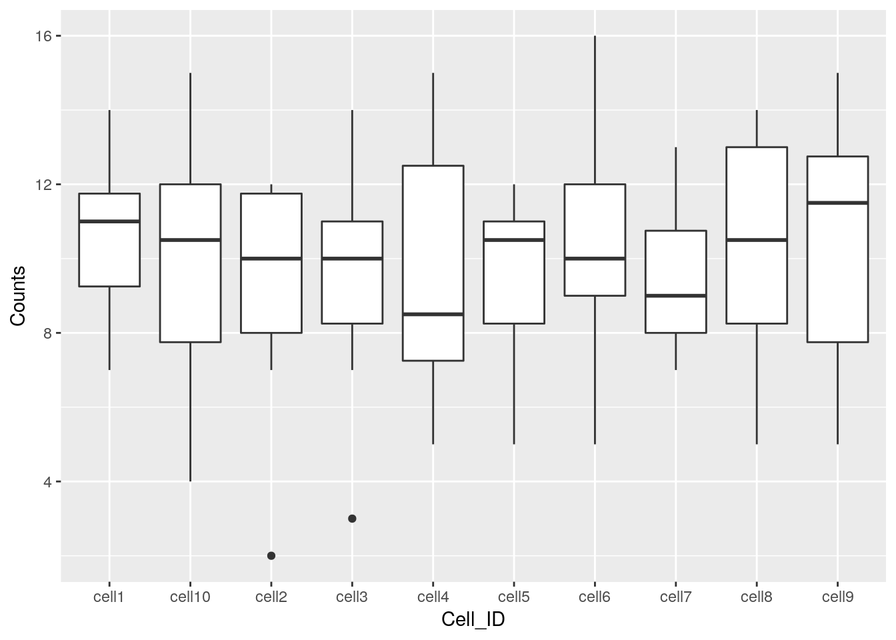
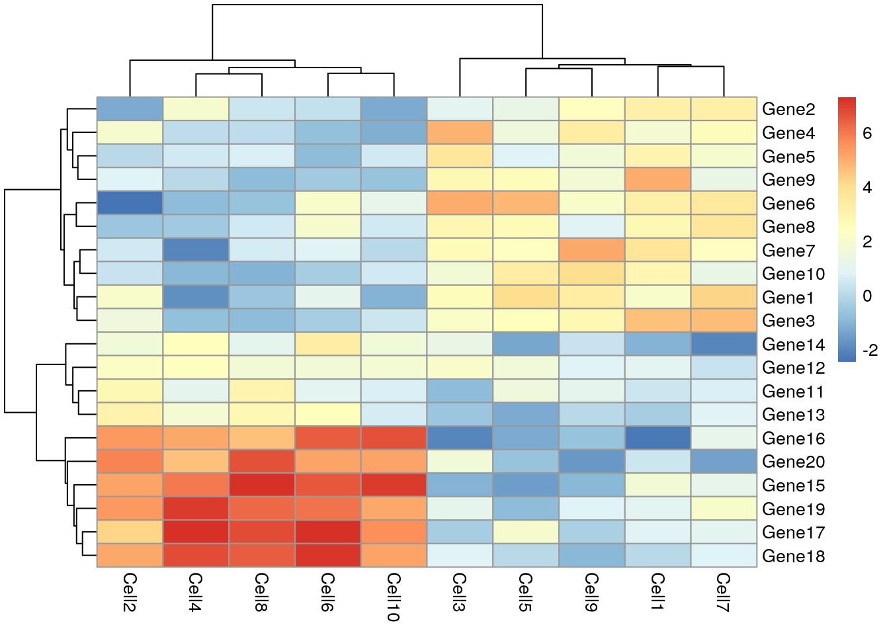

## An Introduction to ggplot2

### What is ggplot2?

ggplot2 is an R package designed by Hadley Wickham which facilitates data plotting. In this lab, we will touch briefly on some of the features of the package. If you would like to learn more about how to use ggplot2, we would recommend reading "ggplot2 Elegant graphics for data analysis", by Hadley Wickham.


### Principles of ggplot2

* Your data must be a dataframe if you want to plot it using ggplot2. 
* Use the `aes` mapping function to specify how variables in the dataframe map to features on your plot
* Use geoms to specify how your data should be represented on your graph eg. as a scatterplot, a barplot, a boxplot etc.

### Using the `aes` mapping function

The `aes` function specifies how variables in your dataframe map to features on your plot. To understand how this works, let's look at an example:


```r
library(ggplot2)
library(tidyverse)
set.seed(1)
counts <- as.data.frame(matrix(rpois(100, lambda = 10), ncol=10, nrow=10))
Gene_ids <- paste("gene", 1:10, sep = "")
colnames(counts) <- paste("cell", 1:10, sep = "")
counts<-data.frame(Gene_ids, counts)
counts
```

```
##    Gene_ids cell1 cell2 cell3 cell4 cell5 cell6 cell7 cell8 cell9 cell10
## 1     gene1     8     8     3     5     5     9    11     9    13      6
## 2     gene2    10     2    11    13    12    12     7    13    12     15
## 3     gene3     7     8    13     8     9     9     9     5    15     12
## 4     gene4    11    10     7    13    12    12    12     8    11     12
## 5     gene5    14     7     8     9    11    10    13    13     5     11
## 6     gene6    12    12    11    15     8     7    10     9    10     15
## 7     gene7    11    11    14    11    11     5     9    13    13      7
## 8     gene8     9    12     9     8     6    14     7    12    12     10
## 9     gene9    14    12    11     7    10    10     8    14     7     10
## 10   gene10    11    10     9     7    11    16     8     7     7      4
```

```r
ggplot(data = counts, mapping = aes(x = cell1, y = cell2))
```


Let's take a closer look at the final command, `ggplot(data = counts, mapping = aes(x = cell1, y = cell2))`. `ggplot()` initialises a ggplot object and takes the arguments `data` and `mapping`. We pass our dataframe of counts to `data` and use the `aes()` function to specify that we would like to use the variable cell1 as our x variable and the variable cell2 as our y variable.

Task 1: Modify the command above to initialise a ggplot object where cell10 is the x variable and cell8 is the y variable.

Clearly, the plots we have just created are not very informative because no data is displayed on them. To display data, we will need to use geoms.

### Geoms

We can use geoms to specify how we would like data to be displayed on our graphs. For example, our choice of geom could specify that we would like our data to be displayed as a scatterplot, a barplot or a boxplot.

Let's see how our graph would look as a scatterplot.


```r
ggplot(data = counts, mapping = aes(x = cell1, y = cell2)) + geom_point()
```


Now we can see that there doesn't seem to be any correlation between gene expression in cell1 and cell2. Given we generated `counts` randomly, this isn't too surprising.

Task 2: Modify the command above to create a line plot. Hint: execute `?ggplot` and scroll down the help page. At the bottom is a link to the ggplot package index. Scroll through the index until you find the geom options.

### Plotting data from more than 2 cells

So far we've been considering the gene counts from 2 of the cells in our dataframe. But there are actually 10 cells in our dataframe and it would be nice to compare all of them. What if we wanted to plot data from all 10 cells at the same time?

At the moment we can't do this because we are treating each individual cell as a variable and assigning that variable to either the x or the y axis. We could create a 10 dimensional graph to plot data from all 10 cells on, but this is a) not possible to do with ggplot and b) not very easy to interpret. What we could do instead is to tidy our data so that we had one variable representing cell ID and another variable representing gene counts, and plot those against each other. In code, this would look like:


```r
counts<-gather(counts, colnames(counts)[2:11], key = 'Cell_ID', value='Counts')
head(counts)
```

```
##   Gene_ids Cell_ID Counts
## 1    gene1   cell1      8
## 2    gene2   cell1     10
## 3    gene3   cell1      7
## 4    gene4   cell1     11
## 5    gene5   cell1     14
## 6    gene6   cell1     12
```

Essentially, the problem before was that our data was not tidy because one variable (Cell_ID) was spread over multiple columns. Now that we've fixed this problem, it is much easier for us to plot data from all 10 cells on one graph.


```r
ggplot(counts,aes(x=Cell_ID, y=Counts)) + geom_boxplot()
```



Task 3: Use the updated `counts` dataframe to plot a barplot with Cell_ID as the x variable and Counts as the y variable. Hint: you may find it helpful to read `?geom_bar`.

Task 4: Use the updated `counts` dataframe to plot a scatterplot with Gene_ids as the x variable and Counts as the y variable.

### Plotting heatmaps

A common method for visualising gene expression data is with a heatmap. Here we will use the R package `pheatmap` to perform this analysis with some gene expression data we will name `test`.


```r
library(pheatmap)
set.seed(2)
test = matrix(rnorm(200), 20, 10)
test[1:10, seq(1, 10, 2)] = test[1:10, seq(1, 10, 2)] + 3
test[11:20, seq(2, 10, 2)] = test[11:20, seq(2, 10, 2)] + 2
test[15:20, seq(2, 10, 2)] = test[15:20, seq(2, 10, 2)] + 4
colnames(test) = paste("Cell", 1:10, sep = "")
rownames(test) = paste("Gene", 1:20, sep = "")
pheatmap(test)
```



Let's take a moment to work out what this graphic is showing us. Each row represents a gene and each column represents a cell. How highly expressed each gene is in each cell is represented by the colour of the corresponding box. For example, we can tell from this plot that gene18 is highly expressed in cell10 but lowly expressed in cell1.

This plot also gives us information on the results of a clustering algorithm. In general, clustering algorithms aim to split datapoints (eg.cells) into groups whose members are more alike one another than they are alike the rest of the datapoints. The trees drawn on the top and left hand sides of the graph are the results of clustering algorithms and enable us to see, for example, that cells 4,8,2,6 and 10 are more alike one another than they are alike cells 7,3,5,1 and 9. The tree on the left hand side of the graph represents the results of a clustering algorithm applied to the genes in our dataset.

If we look closely at the trees, we can see that eventually they have the same number of branches as there are cells and genes. In other words, the total number of cell clusters is the same as the total number of cells, and the total number of gene clusters is the same as the total number of genes. Clearly, this is not very informative, and will become impractical when we are looking at more than 10 cells and 20 genes. Fortunately, we can set the number of clusters we see on the plot. Let's try setting the number of gene clusters to 2:


```r
pheatmap(test, kmeans_k = 2)
```


Now we can see that the genes fall into two clusters - a cluster of 8 genes which are upregulated in cells 2, 10, 6, 4 and 8 relative to the other cells and a cluster of 12 genes which are downregulated in cells 2, 10, 6, 4 and 8 relative to the other cells.

Task 5: Try setting the number of clusters to 3. Which number of clusters do you think is more informative?

### Principle Component Analysis

Principal component analysis (PCA) is a statistical procedure that uses a transformation to convert a set of observations into a set of values of linearly uncorrelated variables called principal components. The transformation is carried out so that the first principle component accounts for as much of the variability in the data as possible, and each following principle component accounts for the greatest amount of variance possible under the contraint that it must be orthogonal to the previous components.

PCA plots are a good way to get an overview of your data, and can sometimes help identify confounders which explain a high amount of the variability in your data. We will investigate how we can use PCA plots in single-cell RNA-seq analysis in more depth in a future lab, here the aim is to give you an overview of what PCA plots are and how they are generated.

Let's make a PCA plot for our `test` data. We can use the  `ggfortify` package to let ggplot know how to interpret principle components.


```r
library(ggfortify)
Principle_Components<-prcomp(test)
autoplot(Principle_Components, label=TRUE)
```


Task 6: Compare your clusters to the pheatmap clusters. Are they related? (Hint: have a look at the gene tree for the first pheatmap we plotted)

Task 7: Produce a heatmap and PCA plot for `counts` (below):


```r
set.seed(1)
counts <- as.data.frame(matrix(rpois(100, lambda = 10), ncol=10, nrow=10))
rownames(counts) <- paste("gene", 1:10, sep = "")
colnames(counts) <- paste("cell", 1:10, sep = "")
```
