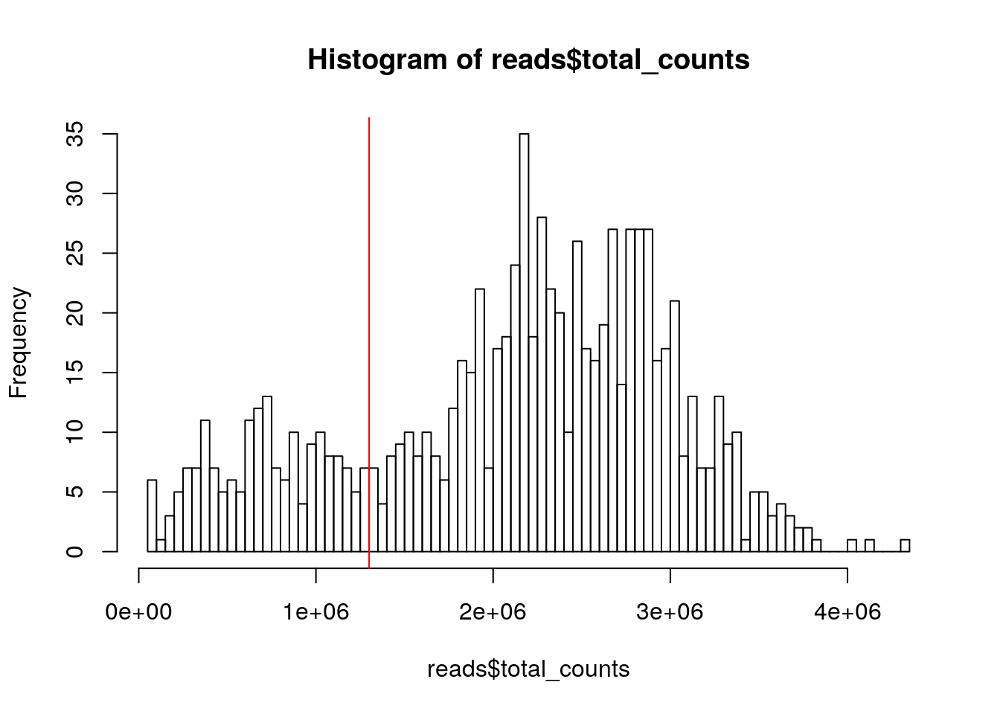
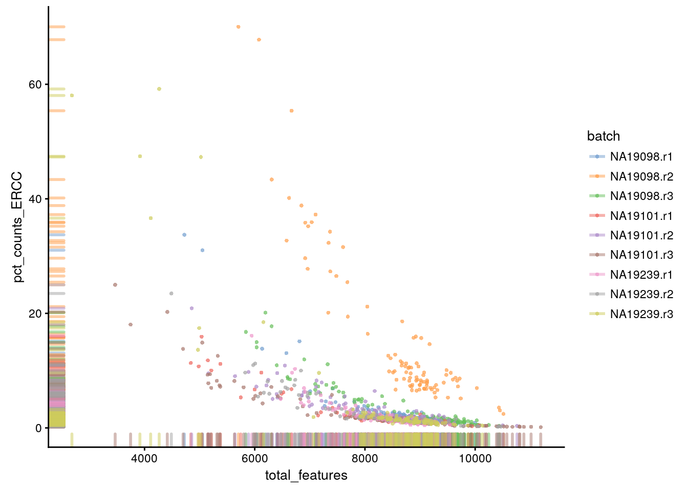
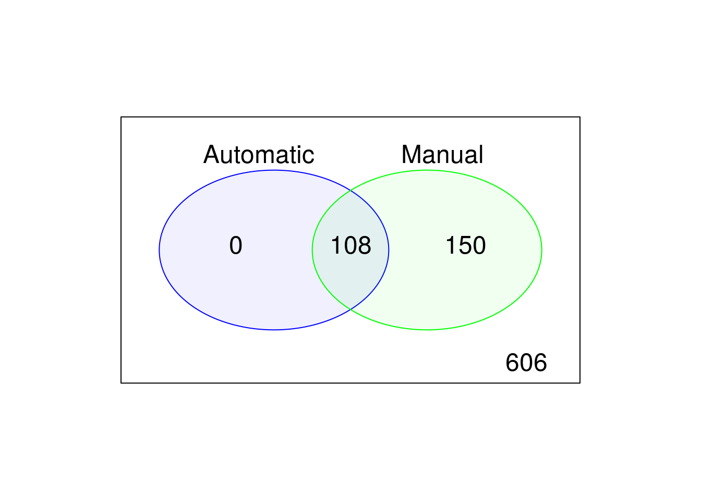
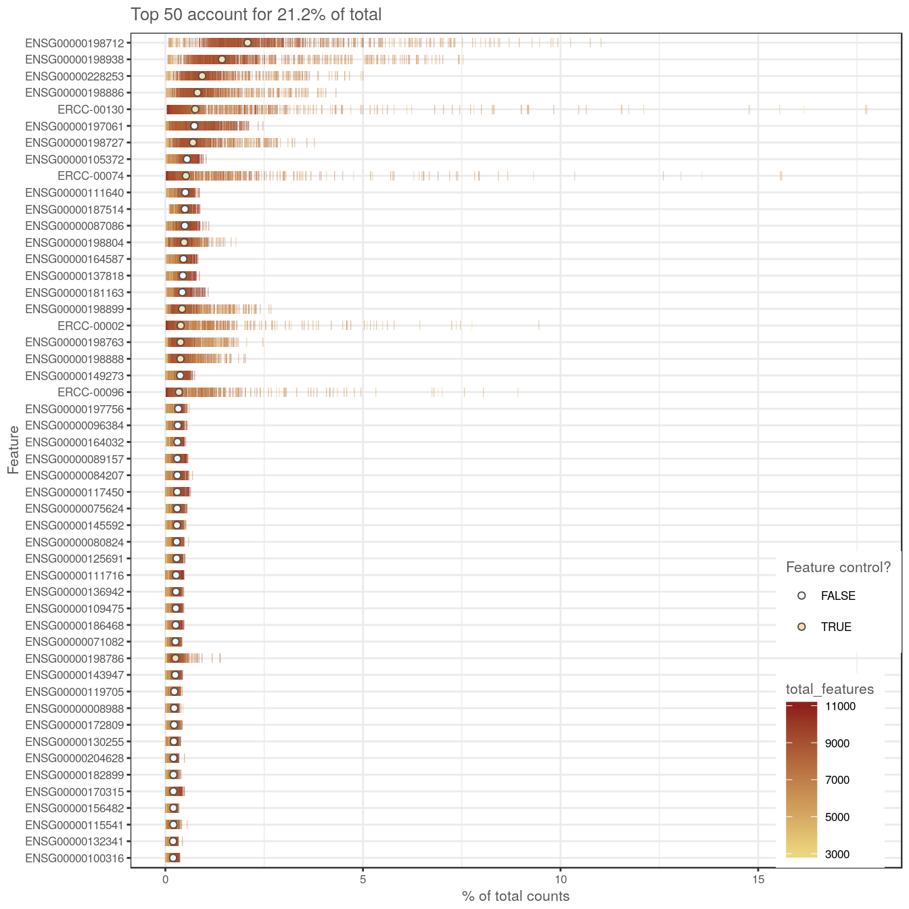

## Expression QC (Reads)


```r
library(SingleCellExperiment)
library(scater)
options(stringsAsFactors = FALSE)
```


```r
reads <- read.table("tung/reads.txt", sep = "\t")
anno <- read.table("tung/annotation.txt", sep = "\t", header = TRUE)
```


```r
head(reads[ , 1:3])
```

```
##                 NA19098.r1.A01 NA19098.r1.A02 NA19098.r1.A03
## ENSG00000237683              0              0              0
## ENSG00000187634              0              0              0
## ENSG00000188976             57            140              1
## ENSG00000187961              0              0              0
## ENSG00000187583              0              0              0
## ENSG00000187642              0              0              0
```

```r
head(anno)
```

```
##   individual replicate well      batch      sample_id
## 1    NA19098        r1  A01 NA19098.r1 NA19098.r1.A01
## 2    NA19098        r1  A02 NA19098.r1 NA19098.r1.A02
## 3    NA19098        r1  A03 NA19098.r1 NA19098.r1.A03
## 4    NA19098        r1  A04 NA19098.r1 NA19098.r1.A04
## 5    NA19098        r1  A05 NA19098.r1 NA19098.r1.A05
## 6    NA19098        r1  A06 NA19098.r1 NA19098.r1.A06
```


```r
reads <- SingleCellExperiment(
    assays = list(counts = as.matrix(reads)), 
    colData = anno
)
```


```r
keep_feature <- rowSums(counts(reads) > 0) > 0
reads <- reads[keep_feature, ]
```


```r
isSpike(reads, "ERCC") <- grepl("^ERCC-", rownames(reads))
isSpike(reads, "MT") <- rownames(reads) %in% 
    c("ENSG00000198899", "ENSG00000198727", "ENSG00000198888",
    "ENSG00000198886", "ENSG00000212907", "ENSG00000198786",
    "ENSG00000198695", "ENSG00000198712", "ENSG00000198804",
    "ENSG00000198763", "ENSG00000228253", "ENSG00000198938",
    "ENSG00000198840")
```


```r
reads <- calculateQCMetrics(
    reads,
    feature_controls = list(
        ERCC = isSpike(reads, "ERCC"), 
        MT = isSpike(reads, "MT")
    )
)
```


```r
hist(
    reads$total_counts,
    breaks = 100
)
abline(v = 1.3e6, col = "red")
```

<div class="figure" style="text-align: center">

<p class="caption">(\#fig:total-counts-hist-reads)Histogram of library sizes for all cells</p>
</div>


```r
filter_by_total_counts <- (reads$total_counts > 1.3e6)
```


```r
table(filter_by_total_counts)
```

```
## filter_by_total_counts
## FALSE  TRUE 
##   180   684
```


```r
hist(
    reads$total_features,
    breaks = 100
)
abline(v = 7000, col = "red")
```

<div class="figure" style="text-align: center">

<p class="caption">(\#fig:total-features-hist-reads)Histogram of the number of detected genes in all cells</p>
</div>


```r
filter_by_expr_features <- (reads$total_features > 7000)
```


```r
table(filter_by_expr_features)
```

```
## filter_by_expr_features
## FALSE  TRUE 
##   116   748
```


```r
plotPhenoData(
    reads,
    aes_string(
        x = "total_features",
        y = "pct_counts_MT",
        colour = "batch"
    )
)
```

<div class="figure" style="text-align: center">

<p class="caption">(\#fig:mt-vs-counts-reads)Percentage of counts in MT genes</p>
</div>


```r
plotPhenoData(
    reads,
    aes_string(
        x = "total_features",
        y = "pct_counts_ERCC",
        colour = "batch"
    )
)
```

<div class="figure" style="text-align: center">

<p class="caption">(\#fig:ercc-vs-counts-reads)Percentage of counts in ERCCs</p>
</div>


```r
filter_by_ERCC <- 
    reads$batch != "NA19098.r2" & reads$pct_counts_ERCC < 25
table(filter_by_ERCC)
```

```
## filter_by_ERCC
## FALSE  TRUE 
##   103   761
```

```r
filter_by_MT <- reads$pct_counts_MT < 30
table(filter_by_MT)
```

```
## filter_by_MT
## FALSE  TRUE 
##    18   846
```


```r
reads$use <- (
    # sufficient features (genes)
    filter_by_expr_features &
    # sufficient molecules counted
    filter_by_total_counts &
    # sufficient endogenous RNA
    filter_by_ERCC &
    # remove cells with unusual number of reads in MT genes
    filter_by_MT
)
```


```r
table(reads$use)
```

```
## 
## FALSE  TRUE 
##   258   606
```


```r
reads <- plotPCA(
    reads,
    size_by = "total_features", 
    shape_by = "use",
    pca_data_input = "pdata",
    detect_outliers = TRUE,
    return_SCE = TRUE
)
```

<div class="figure" style="text-align: center">

<p class="caption">(\#fig:auto-cell-filt-reads)PCA plot used for automatic detection of cell outliers</p>
</div>


```r
table(reads$outlier)
```

```
## 
## FALSE  TRUE 
##   756   108
```


```r
library(limma)
```

```
## 
## Attaching package: 'limma'
```

```
## The following object is masked from 'package:scater':
## 
##     plotMDS
```

```
## The following object is masked from 'package:BiocGenerics':
## 
##     plotMA
```

```r
auto <- colnames(reads)[reads$outlier]
man <- colnames(reads)[!reads$use]
venn.diag <- vennCounts(
    cbind(colnames(reads) %in% auto,
    colnames(reads) %in% man)
)
vennDiagram(
    venn.diag,
    names = c("Automatic", "Manual"),
    circle.col = c("blue", "green")
)
```

<div class="figure" style="text-align: center">

<p class="caption">(\#fig:cell-filt-comp-reads)Comparison of the default, automatic and manual cell filters</p>
</div>


```r
plotQC(reads, type = "highest-expression")
```

<div class="figure" style="text-align: center">

<p class="caption">(\#fig:top50-gene-expr-reads)Number of total counts consumed by the top 50 expressed genes</p>
</div>


```r
filter_genes <- apply(
    counts(reads[, colData(reads)$use]), 
    1, 
    function(x) length(x[x > 1]) >= 2
)
rowData(reads)$use <- filter_genes
```


```r
table(filter_genes)
```

```
## filter_genes
## FALSE  TRUE 
##  2664 16062
```


```r
dim(reads[rowData(reads)$use, colData(reads)$use])
```

```
## [1] 16062   606
```


```r
assay(reads, "logcounts_raw") <- log2(counts(reads) + 1)
reducedDim(reads) <- NULL
```


```r
saveRDS(reads, file = "tung/reads.rds")
```

By comparing Figure \@ref(fig:cell-filt-comp) and Figure \@ref(fig:cell-filt-comp-reads), it is clear that the reads based filtering removed more cells than the UMI based analysis. If you go back and compare the results you should be able to conclude that the ERCC and MT filters are more strict for the reads-based analysis.


```r
sessionInfo()
```

```
## R version 3.4.3 (2017-11-30)
## Platform: x86_64-pc-linux-gnu (64-bit)
## Running under: Debian GNU/Linux 9 (stretch)
## 
## Matrix products: default
## BLAS: /usr/lib/openblas-base/libblas.so.3
## LAPACK: /usr/lib/libopenblasp-r0.2.19.so
## 
## locale:
##  [1] LC_CTYPE=en_US.UTF-8       LC_NUMERIC=C              
##  [3] LC_TIME=en_US.UTF-8        LC_COLLATE=en_US.UTF-8    
##  [5] LC_MONETARY=en_US.UTF-8    LC_MESSAGES=C             
##  [7] LC_PAPER=en_US.UTF-8       LC_NAME=C                 
##  [9] LC_ADDRESS=C               LC_TELEPHONE=C            
## [11] LC_MEASUREMENT=en_US.UTF-8 LC_IDENTIFICATION=C       
## 
## attached base packages:
## [1] parallel  stats4    methods   stats     graphics  grDevices utils    
## [8] datasets  base     
## 
## other attached packages:
##  [1] limma_3.34.9               scater_1.6.3              
##  [3] ggplot2_2.2.1              SingleCellExperiment_1.0.0
##  [5] SummarizedExperiment_1.8.1 DelayedArray_0.4.1        
##  [7] matrixStats_0.53.1         Biobase_2.38.0            
##  [9] GenomicRanges_1.30.3       GenomeInfoDb_1.14.0       
## [11] IRanges_2.12.0             S4Vectors_0.16.0          
## [13] BiocGenerics_0.24.0        knitr_1.20                
## 
## loaded via a namespace (and not attached):
##   [1] backports_1.1.2        plyr_1.8.4             lazyeval_0.2.1        
##   [4] sp_1.2-7               shinydashboard_0.6.1   splines_3.4.3         
##   [7] digest_0.6.15          htmltools_0.3.6        viridis_0.5.0         
##  [10] magrittr_1.5           memoise_1.1.0          cluster_2.0.6         
##  [13] prettyunits_1.0.2      colorspace_1.3-2       blob_1.1.0            
##  [16] rrcov_1.4-3            xfun_0.1               dplyr_0.7.4           
##  [19] RCurl_1.95-4.10        tximport_1.6.0         lme4_1.1-15           
##  [22] bindr_0.1              zoo_1.8-1              glue_1.2.0            
##  [25] gtable_0.2.0           zlibbioc_1.24.0        XVector_0.18.0        
##  [28] MatrixModels_0.4-1     car_2.1-6              kernlab_0.9-25        
##  [31] prabclus_2.2-6         DEoptimR_1.0-8         SparseM_1.77          
##  [34] VIM_4.7.0              scales_0.5.0           sgeostat_1.0-27       
##  [37] mvtnorm_1.0-7          DBI_0.7                GGally_1.3.2          
##  [40] edgeR_3.20.9           Rcpp_0.12.15           sROC_0.1-2            
##  [43] viridisLite_0.3.0      xtable_1.8-2           progress_1.1.2        
##  [46] laeken_0.4.6           bit_1.1-12             mclust_5.4            
##  [49] vcd_1.4-4              httr_1.3.1             RColorBrewer_1.1-2    
##  [52] fpc_2.1-11             modeltools_0.2-21      pkgconfig_2.0.1       
##  [55] reshape_0.8.7          XML_3.98-1.10          flexmix_2.3-14        
##  [58] nnet_7.3-12            locfit_1.5-9.1         labeling_0.3          
##  [61] rlang_0.2.0            reshape2_1.4.3         AnnotationDbi_1.40.0  
##  [64] munsell_0.4.3          tools_3.4.3            RSQLite_2.0           
##  [67] pls_2.6-0              evaluate_0.10.1        stringr_1.3.0         
##  [70] cvTools_0.3.2          yaml_2.1.17            bit64_0.9-7           
##  [73] robustbase_0.92-8      bindrcpp_0.2           nlme_3.1-129          
##  [76] mime_0.5               quantreg_5.35          biomaRt_2.34.2        
##  [79] compiler_3.4.3         pbkrtest_0.4-7         beeswarm_0.2.3        
##  [82] e1071_1.6-8            tibble_1.4.2           robCompositions_2.0.6 
##  [85] pcaPP_1.9-73           stringi_1.1.6          highr_0.6             
##  [88] lattice_0.20-34        trimcluster_0.1-2      Matrix_1.2-7.1        
##  [91] nloptr_1.0.4           pillar_1.2.1           lmtest_0.9-35         
##  [94] data.table_1.10.4-3    cowplot_0.9.2          bitops_1.0-6          
##  [97] httpuv_1.3.6.1         R6_2.2.2               bookdown_0.7          
## [100] gridExtra_2.3          vipor_0.4.5            boot_1.3-18           
## [103] MASS_7.3-45            assertthat_0.2.0       rhdf5_2.22.0          
## [106] rprojroot_1.3-2        rjson_0.2.15           GenomeInfoDbData_1.0.0
## [109] diptest_0.75-7         mgcv_1.8-23            grid_3.4.3            
## [112] class_7.3-14           minqa_1.2.4            rmarkdown_1.8         
## [115] mvoutlier_2.0.9        shiny_1.0.5            ggbeeswarm_0.6.0
```
