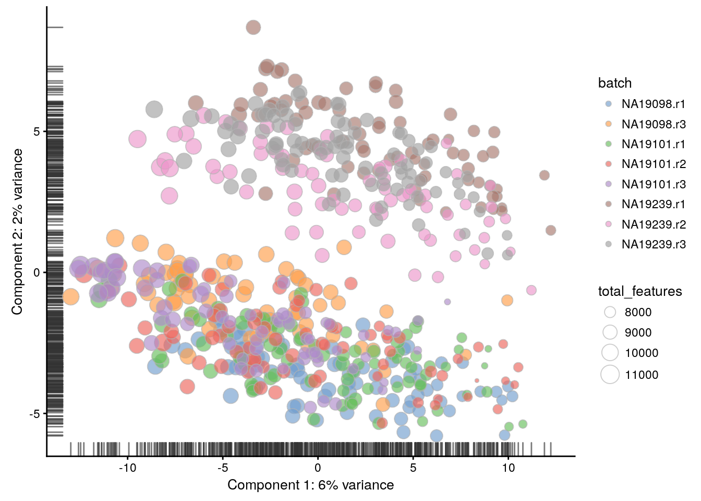

## Identifying confounding factors (Reads)


<div class="figure" style="text-align: center">

<p class="caption">(\#fig:confound-pca-reads)PCA plot of the tung data</p>
</div>

<div class="figure" style="text-align: center">

<p class="caption">(\#fig:confound-find-pcs-total-features-reads)PC correlation with the number of detected genes</p>
</div>

<div class="figure" style="text-align: center">

<p class="caption">(\#fig:confound-find-expl-vars-reads)Explanatory variables</p>
</div>


```
## R version 3.4.3 (2017-11-30)
## Platform: x86_64-pc-linux-gnu (64-bit)
## Running under: Debian GNU/Linux 9 (stretch)
## 
## Matrix products: default
## BLAS: /usr/lib/openblas-base/libblas.so.3
## LAPACK: /usr/lib/libopenblasp-r0.2.19.so
## 
## locale:
##  [1] LC_CTYPE=en_US.UTF-8       LC_NUMERIC=C              
##  [3] LC_TIME=en_US.UTF-8        LC_COLLATE=en_US.UTF-8    
##  [5] LC_MONETARY=en_US.UTF-8    LC_MESSAGES=C             
##  [7] LC_PAPER=en_US.UTF-8       LC_NAME=C                 
##  [9] LC_ADDRESS=C               LC_TELEPHONE=C            
## [11] LC_MEASUREMENT=en_US.UTF-8 LC_IDENTIFICATION=C       
## 
## attached base packages:
## [1] stats4    parallel  methods   stats     graphics  grDevices utils    
## [8] datasets  base     
## 
## other attached packages:
##  [1] knitr_1.20                 scater_1.6.3              
##  [3] SingleCellExperiment_1.0.0 SummarizedExperiment_1.8.1
##  [5] DelayedArray_0.4.1         matrixStats_0.53.1        
##  [7] GenomicRanges_1.30.3       GenomeInfoDb_1.14.0       
##  [9] IRanges_2.12.0             S4Vectors_0.16.0          
## [11] ggplot2_2.2.1              Biobase_2.38.0            
## [13] BiocGenerics_0.24.0       
## 
## loaded via a namespace (and not attached):
##  [1] viridis_0.5.0          httr_1.3.1             edgeR_3.20.9          
##  [4] bit64_0.9-7            viridisLite_0.3.0      shiny_1.0.5           
##  [7] assertthat_0.2.0       highr_0.6              blob_1.1.0            
## [10] vipor_0.4.5            GenomeInfoDbData_1.0.0 yaml_2.1.17           
## [13] progress_1.1.2         pillar_1.2.1           RSQLite_2.0           
## [16] backports_1.1.2        lattice_0.20-34        glue_1.2.0            
## [19] limma_3.34.9           digest_0.6.15          XVector_0.18.0        
## [22] colorspace_1.3-2       cowplot_0.9.2          htmltools_0.3.6       
## [25] httpuv_1.3.6.1         Matrix_1.2-7.1         plyr_1.8.4            
## [28] XML_3.98-1.10          pkgconfig_2.0.1        biomaRt_2.34.2        
## [31] bookdown_0.7           zlibbioc_1.24.0        xtable_1.8-2          
## [34] scales_0.5.0           tibble_1.4.2           lazyeval_0.2.1        
## [37] magrittr_1.5           mime_0.5               memoise_1.1.0         
## [40] evaluate_0.10.1        beeswarm_0.2.3         shinydashboard_0.6.1  
## [43] tools_3.4.3            data.table_1.10.4-3    prettyunits_1.0.2     
## [46] stringr_1.3.0          munsell_0.4.3          locfit_1.5-9.1        
## [49] AnnotationDbi_1.40.0   bindrcpp_0.2           compiler_3.4.3        
## [52] rlang_0.2.0            rhdf5_2.22.0           grid_3.4.3            
## [55] RCurl_1.95-4.10        tximport_1.6.0         rjson_0.2.15          
## [58] labeling_0.3           bitops_1.0-6           rmarkdown_1.8         
## [61] gtable_0.2.0           DBI_0.7                reshape2_1.4.3        
## [64] R6_2.2.2               gridExtra_2.3          dplyr_0.7.4           
## [67] bit_1.1-12             bindr_0.1              rprojroot_1.3-2       
## [70] ggbeeswarm_0.6.0       stringi_1.1.6          Rcpp_0.12.15          
## [73] xfun_0.1
```
