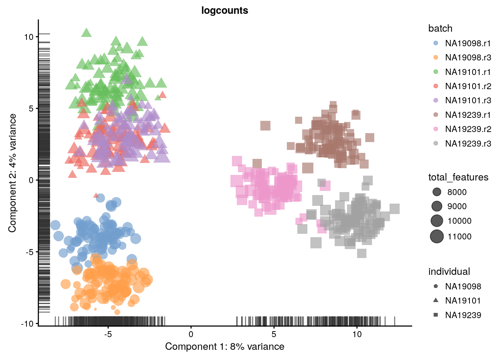
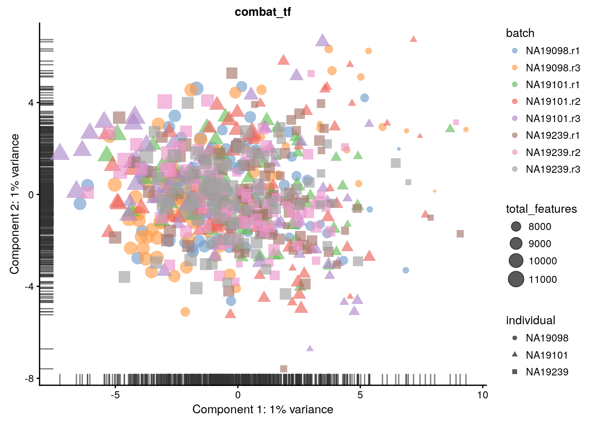
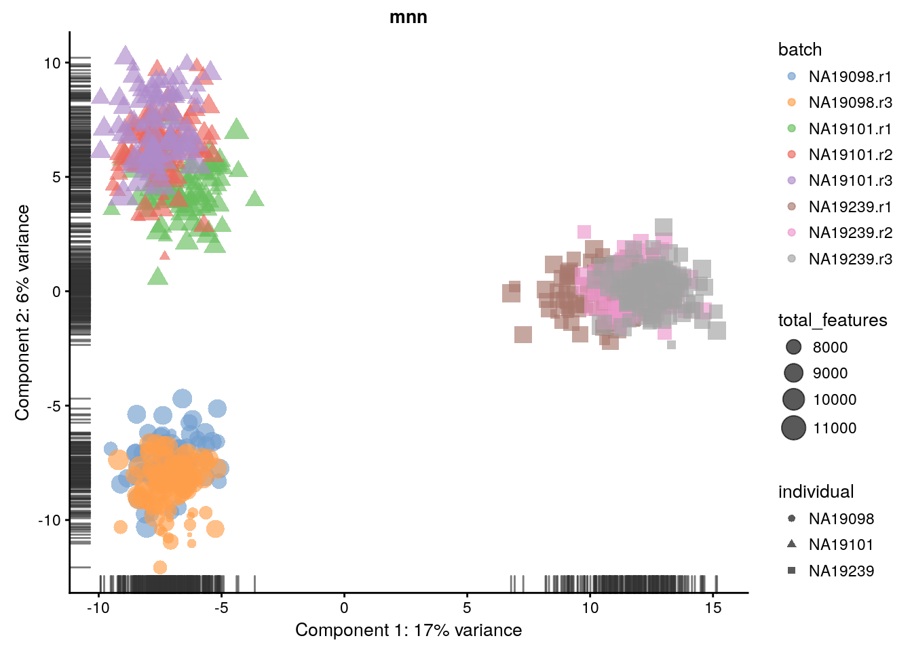
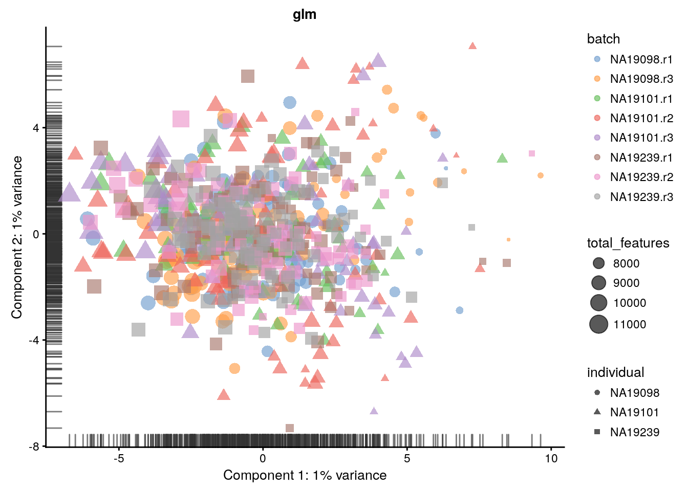
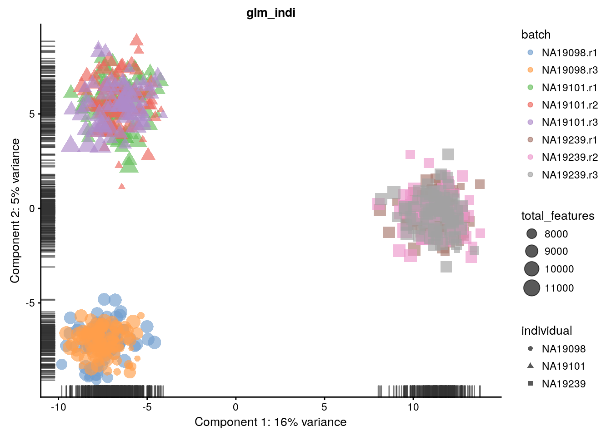
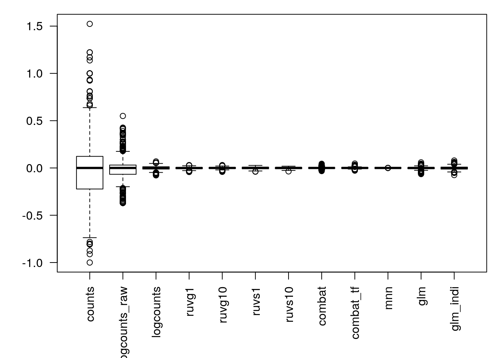
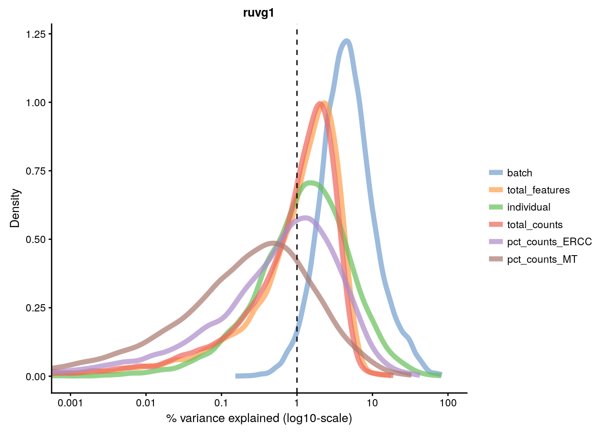
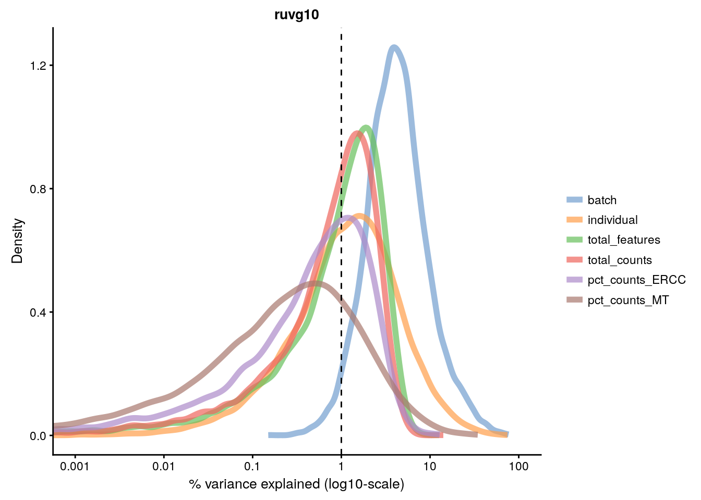
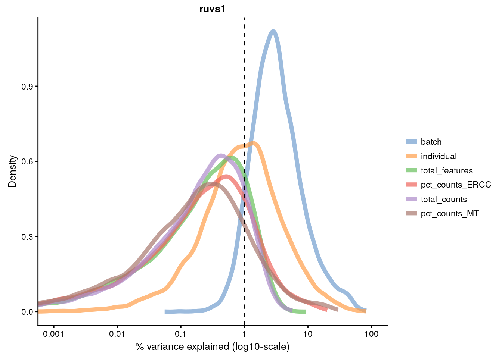
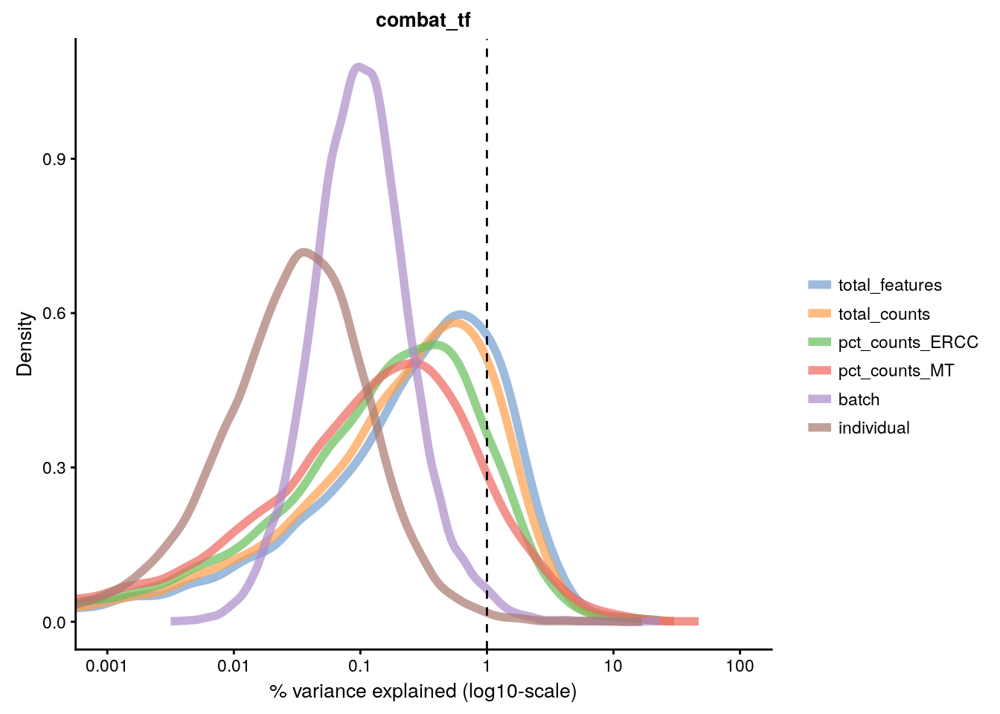

## Dealing with confounders

### Introduction

In the previous chapter we normalized for library size, effectively removing it as a confounder. Now we will consider removing other less well defined confounders from our data. Technical confounders (aka batch effects) can arise from difference in reagents, isolation methods, the lab/experimenter who performed the experiment, even which day/time the experiment was performed. Accounting for technical confounders, and batch effects particularly, is a large topic that also involves principles of experimental design. Here we address approaches that can be taken to account for confounders when the experimental design is appropriate.

Fundamentally, accounting for technical confounders involves identifying and, ideally, removing sources of variation in the expression data that are not related to (i.e. are confounding) the biological signal of interest. Various approaches exist, some of which use spike-in or housekeeping genes, and some of which use endogenous genes.

#### Advantages and disadvantages of using spike-ins to remove confounders

The use of spike-ins as control genes is appealing, since the same amount of ERCC (or other) spike-in was added to each cell in our experiment. In principle, all the variablity we observe for these genes is due to technical noise; whereas endogenous genes are affected by both technical noise and biological variability. Technical noise can be removed by fitting a model to the spike-ins and "substracting" this from the endogenous genes. There are several methods available based on this premise (eg. [BASiCS](https://github.com/catavallejos/BASiCS), [scLVM](https://github.com/PMBio/scLVM), [RUVg](http://bioconductor.org/packages/release/bioc/html/RUVSeq.html)); each using different noise models and different fitting procedures. Alternatively, one can identify genes which exhibit significant variation beyond technical noise (eg. Distance to median, [Highly variable genes](http://www.nature.com/nmeth/journal/v10/n11/full/nmeth.2645.html)). However, there are issues with the use of spike-ins for normalisation (particularly ERCCs, derived from bacterial sequences), including that their variability can, for various reasons, actually be *higher* than that of endogenous genes.

Given the issues with using spike-ins, better results can often be obtained by using endogenous genes instead. Where we have a large number of endogenous genes that, on average, do not vary systematically between cells and where we expect technical effects to affect a large number of genes (a very common and reasonable assumption), then such methods (for example, the RUVs method) can perform well. 

We explore both general approaches below.


```r
library(scRNA.seq.funcs)
library(RUVSeq)
library(scater)
library(SingleCellExperiment)
library(scran)
library(kBET)
library(sva) # Combat
library(edgeR)
set.seed(1234567)
options(stringsAsFactors = FALSE)
umi <- readRDS("tung/umi.rds")
umi.qc <- umi[rowData(umi)$use, colData(umi)$use]
endog_genes <- !rowData(umi.qc)$is_feature_control
erccs <- rowData(umi.qc)$is_feature_control

qclust <- quickCluster(umi.qc, min.size = 30)
umi.qc <- computeSumFactors(umi.qc, sizes = 15, clusters = qclust)
umi.qc <- normalize(umi.qc)
```

### Remove Unwanted Variation

Factors contributing to technical noise frequently appear as "batch
effects" where cells processed on different days or by different
technicians systematically vary from one another. Removing technical
noise and correcting for batch effects can frequently be performed
using the same tool or slight variants on it. We will be considering
the [Remove Unwanted Variation (RUVSeq)](http://bioconductor.org/packages/RUVSeq). Briefly, RUVSeq works as follows. For $n$ samples and $J$ genes, consider the following generalized linear model (GLM), where the RNA-Seq read counts are regressed on both the known covariates of interest and unknown factors of unwanted variation:
\[\log E[Y|W,X,O] = W\alpha + X\beta + O\]
Here, $Y$ is the $n \times J$ matrix of observed gene-level read counts, $W$ is an $n \times k$ matrix corresponding to the factors of “unwanted variation” and $O$ is an $n \times J$ matrix of offsets that can either be set to zero or estimated with some other normalization procedure (such as upper-quartile normalization). The simultaneous estimation of $W$, $\alpha$, $\beta$, and $k$ is infeasible. For a given $k$, instead the following three
approaches to estimate the factors of unwanted variation $W$ are used:

* _RUVg_ uses negative control genes (e.g. ERCCs), assumed to have constant expression across samples;
* _RUVs_ uses centered (technical) replicate/negative control samples for which the covariates of interest are
constant;
* _RUVr_ uses residuals, e.g., from a first-pass GLM regression of the counts on the covariates of interest.

We will concentrate on the first two approaches.

#### RUVg


```r
ruvg <- RUVg(counts(umi.qc), erccs, k = 1)
assay(umi.qc, "ruvg1") <- log2(
    t(t(ruvg$normalizedCounts) / colSums(ruvg$normalizedCounts) * 1e6) + 1
)
ruvg <- RUVg(counts(umi.qc), erccs, k = 10)
assay(umi.qc, "ruvg10") <- log2(
    t(t(ruvg$normalizedCounts) / colSums(ruvg$normalizedCounts) * 1e6) + 1
)
```

#### RUVs


```r
scIdx <- matrix(-1, ncol = max(table(umi.qc$individual)), nrow = 3)
tmp <- which(umi.qc$individual == "NA19098")
scIdx[1, 1:length(tmp)] <- tmp
tmp <- which(umi.qc$individual == "NA19101")
scIdx[2, 1:length(tmp)] <- tmp
tmp <- which(umi.qc$individual == "NA19239")
scIdx[3, 1:length(tmp)] <- tmp
cIdx <- rownames(umi.qc)
ruvs <- RUVs(counts(umi.qc), cIdx, k = 1, scIdx = scIdx, isLog = FALSE)
assay(umi.qc, "ruvs1") <- log2(
    t(t(ruvs$normalizedCounts) / colSums(ruvs$normalizedCounts) * 1e6) + 1
)
ruvs <- RUVs(counts(umi.qc), cIdx, k = 10, scIdx = scIdx, isLog = FALSE)
assay(umi.qc, "ruvs10") <- log2(
    t(t(ruvs$normalizedCounts) / colSums(ruvs$normalizedCounts) * 1e6) + 1
)
```

### Combat

If you have an experiment with a balanced design, `Combat` can be used to eliminate batch effects while preserving biological effects by specifying the biological effects using the `mod` parameter. However the `Tung` data contains multiple experimental replicates rather than a balanced design so using `mod1` to preserve biological variability will result in an error. 

```r
combat_data <- logcounts(umi.qc)
mod_data <- as.data.frame(t(combat_data))
# Basic batch removal
mod0 = model.matrix(~ 1, data = mod_data) 
# Preserve biological variability
mod1 = model.matrix(~ umi.qc$individual, data = mod_data) 
# adjust for total genes detected
mod2 = model.matrix(~ umi.qc$total_features, data = mod_data)
assay(umi.qc, "combat") <- ComBat(
    dat = t(mod_data), 
    batch = factor(umi.qc$batch), 
    mod = mod0,
    par.prior = TRUE,
    prior.plots = FALSE
)
```

```
## Standardizing Data across genes
```

__Exercise 1__

Perform `ComBat` correction accounting for total features as a co-variate. Store the corrected matrix in the `combat_tf` slot.


```
## Standardizing Data across genes
```

### mnnCorrect 
`mnnCorrect` [@Haghverdi2017-vh] assumes that each batch shares at least one biological condition with each other batch. Thus it works well for a variety of balanced experimental designs. However, the `Tung` data contains multiple replicates for each invidividual rather than balanced batches, thus we will normalized each individual separately. Note that this will remove batch effects between batches within the same individual but not the batch effects between batches in different individuals, due to the confounded experimental design. 

Thus we will merge a replicate from each individual to form three batches. 

```r
do_mnn <- function(data.qc) {
    batch1 <- logcounts(data.qc[, data.qc$replicate == "r1"])
    batch2 <- logcounts(data.qc[, data.qc$replicate == "r2"])
    batch3 <- logcounts(data.qc[, data.qc$replicate == "r3"])
    
    if (ncol(batch2) > 0) {
        x = mnnCorrect(
          batch1, batch2, batch3,  
          k = 20,
          sigma = 0.1,
          cos.norm.in = TRUE,
          svd.dim = 2
        )
        res1 <- x$corrected[[1]]
        res2 <- x$corrected[[2]]
        res3 <- x$corrected[[3]]
        dimnames(res1) <- dimnames(batch1)
        dimnames(res2) <- dimnames(batch2)
        dimnames(res3) <- dimnames(batch3)
        return(cbind(res1, res2, res3))
    } else {
        x = mnnCorrect(
          batch1, batch3,  
          k = 20,
          sigma = 0.1,
          cos.norm.in = TRUE,
          svd.dim = 2
        )
        res1 <- x$corrected[[1]]
        res3 <- x$corrected[[2]]
        dimnames(res1) <- dimnames(batch1)
        dimnames(res3) <- dimnames(batch3)
        return(cbind(res1, res3))
    }
}

indi1 <- do_mnn(umi.qc[, umi.qc$individual == "NA19098"])
indi2 <- do_mnn(umi.qc[, umi.qc$individual == "NA19101"])
indi3 <- do_mnn(umi.qc[, umi.qc$individual == "NA19239"])

assay(umi.qc, "mnn") <- cbind(indi1, indi2, indi3)

# For a balanced design: 
#assay(umi.qc, "mnn") <- mnnCorrect(
#    list(B1 = logcounts(batch1), B2 = logcounts(batch2), B3 = logcounts(batch3)),  
#    k = 20,
#    sigma = 0.1,
#    cos.norm = TRUE,
#    svd.dim = 2
#)
```

### GLM
A general linear model is a simpler version of `Combat`. It can correct for batches while preserving biological effects if you have a balanced design. In a confounded/replicate design biological effects will not be fit/preserved. Similar to `mnnCorrect` we could remove batch effects from each individual separately in order to preserve biological (and technical) variance between individuals. For demonstation purposes we will naively correct all cofounded batch effects: 


```r
glm_fun <- function(g, batch, indi) {
  model <- glm(g ~ batch + indi)
  model$coef[1] <- 0 # replace intercept with 0 to preserve reference batch.
  return(model$coef)
}
effects <- apply(
    logcounts(umi.qc), 
    1, 
    glm_fun, 
    batch = umi.qc$batch, 
    indi = umi.qc$individual
)
corrected <- logcounts(umi.qc) - t(effects[as.numeric(factor(umi.qc$batch)), ])
assay(umi.qc, "glm") <- corrected
```

__Exercise 2__

Perform GLM correction for each individual separately. Store the final corrected matrix in the `glm_indi` slot.


### How to evaluate and compare confounder removal strategies

A key question when considering the different methods for removing confounders is how to quantitatively determine which one is the most effective. The main reason why comparisons are challenging is because it is often difficult to know what corresponds to technical counfounders and what is interesting biological variability. Here, we consider three different metrics which are all reasonable based on our knowledge of the experimental design. Depending on the biological question that you wish to address, it is important to choose a metric that allows you to evaluate the confounders that are likely to be the biggest concern for the given situation.

#### Effectiveness 1

We evaluate the effectiveness of the normalization by inspecting the
PCA plot where colour corresponds the technical replicates and shape
corresponds to different biological samples (individuals). Separation of biological samples and
interspersed batches indicates that technical variation has been
removed. We always use log2-cpm normalized data to match the assumptions of PCA.


```r
for(n in assayNames(umi.qc)) {
    print(
        plotPCA(
            umi.qc[endog_genes, ],
            colour_by = "batch",
            size_by = "total_features",
            shape_by = "individual",
            exprs_values = n
        ) +
        ggtitle(n)
    )
}
```



__Exercise 3__

Consider different `ks` for RUV normalizations. Which gives the best results?

#### Effectiveness 2

We can also examine the effectiveness of correction using the relative log expression (RLE) across cells to confirm technical noise has been removed from the dataset. Note RLE only evaluates whether the number of genes higher and lower than average are equal for each cell - i.e. systemic technical effects. Random technical noise between batches may not be detected by RLE.


```r
res <- list()
for(n in assayNames(umi.qc)) {
	res[[n]] <- suppressWarnings(calc_cell_RLE(assay(umi.qc, n), erccs))
}
par(mar=c(6,4,1,1))
boxplot(res, las=2)
```



#### Effectiveness 3

We can repeat the analysis from Chapter 12 to check whether batch effects have been removed.

```r
for(n in assayNames(umi.qc)) {
    print(
        plotQC(
            umi.qc[endog_genes, ],
            type = "expl",
            exprs_values = n,
            variables = c(
                "total_features",
                "total_counts",
                "batch",
                "individual",
                "pct_counts_ERCC",
                "pct_counts_MT"
            )
        ) +
        ggtitle(n)
    )
}
```

<div class="figure" style="text-align: center">

<p class="caption">(\#fig:confound-cpm)Explanatory variables (mnn)</p>
</div><div class="figure" style="text-align: center">

<p class="caption">(\#fig:confound-cpm)Explanatory variables (mnn)</p>
</div><div class="figure" style="text-align: center">

<p class="caption">(\#fig:confound-cpm)Explanatory variables (mnn)</p>
</div><div class="figure" style="text-align: center">

<p class="caption">(\#fig:confound-cpm)Explanatory variables (mnn)</p>
</div><div class="figure" style="text-align: center">

<p class="caption">(\#fig:confound-cpm)Explanatory variables (mnn)</p>
</div><div class="figure" style="text-align: center">

<p class="caption">(\#fig:confound-cpm)Explanatory variables (mnn)</p>
</div><div class="figure" style="text-align: center">

<p class="caption">(\#fig:confound-cpm)Explanatory variables (mnn)</p>
</div><div class="figure" style="text-align: center">

<p class="caption">(\#fig:confound-cpm)Explanatory variables (mnn)</p>
</div><div class="figure" style="text-align: center">

<p class="caption">(\#fig:confound-cpm)Explanatory variables (mnn)</p>
</div><div class="figure" style="text-align: center">

<p class="caption">(\#fig:confound-cpm)Explanatory variables (mnn)</p>
</div><div class="figure" style="text-align: center">

<p class="caption">(\#fig:confound-cpm)Explanatory variables (mnn)</p>
</div><div class="figure" style="text-align: center">

<p class="caption">(\#fig:confound-cpm)Explanatory variables (mnn)</p>
</div>

__Exercise 4__

Perform the above analysis for each normalization/batch correction method. Which method(s) are most/least effective? Why is the variance accounted for by batch never lower than the variance accounted for by individual?

#### Effectiveness 4

Another method to check the efficacy of batch-effect correction is to consider the intermingling of points from different batches in local subsamples of the data. If there are no batch-effects then proportion of cells from each batch in any local region should be equal to the global proportion of cells in each batch. 

`kBET` [@Buttner2017-ds] takes `kNN` networks around random cells and tests the number of cells from each batch against a binomial distribution. The rejection rate of these tests indicates the severity of batch-effects still present in the data (high rejection rate = strong batch effects). `kBET` assumes each batch contains the same complement of biological groups, thus it can only be applied to the entire dataset if a perfectly balanced design has been used. However, `kBET` can also be applied to replicate-data if it is applied to each biological group separately. In the case of the Tung data, we will apply `kBET` to each individual independently to check for residual batch effects. However, this method will not identify residual batch-effects which are confounded with biological conditions. In addition, `kBET` does not determine if biological signal has been preserved. 


```r
compare_kBET_results <- function(sce){
    indiv <- unique(sce$individual)
    norms <- assayNames(sce) # Get all normalizations
    results <- list()
    for (i in indiv){ 
        for (j in norms){
            tmp <- kBET(
                df = t(assay(sce[,sce$individual== i], j)), 
                batch = sce$batch[sce$individual==i], 
                heuristic = TRUE, 
                verbose = FALSE, 
                addTest = FALSE, 
                plot = FALSE)
            results[[i]][[j]] <- tmp$summary$kBET.observed[1]
        }
    }
    return(as.data.frame(results))
}

eff_debatching <- compare_kBET_results(umi.qc)
```


```r
require("reshape2")
require("RColorBrewer")
# Plot results
dod <- melt(as.matrix(eff_debatching),  value.name = "kBET")
colnames(dod)[1:2] <- c("Normalisation", "Individual")

colorset <- c('gray', brewer.pal(n = 9, "RdYlBu"))

ggplot(dod, aes(Normalisation, Individual, fill=kBET)) +  
    geom_tile() +
    scale_fill_gradient2(
        na.value = "gray",
        low = colorset[2],
        mid=colorset[6],
        high = colorset[10],
        midpoint = 0.5, limit = c(0,1)) +
    scale_x_discrete(expand = c(0, 0)) +
    scale_y_discrete(expand = c(0, 0)) + 
    theme(
        axis.text.x = element_text(
            angle = 45, 
            vjust = 1, 
            size = 12, 
            hjust = 1
        )
    ) + 
    ggtitle("Effect of batch regression methods per individual")
```


__Exercise 5__

Why do the raw counts appear to have little batch effects?

### Big Exercise

Perform the same analysis with read counts of the `tung` data. Use `tung/reads.rds` file to load the reads `SCE` object. Once you have finished please compare your results to ours (next chapter). Additionally, experiment with other combinations of normalizations and compare the results.

### sessionInfo()


```
## R version 3.4.3 (2017-11-30)
## Platform: x86_64-pc-linux-gnu (64-bit)
## Running under: Debian GNU/Linux 9 (stretch)
## 
## Matrix products: default
## BLAS: /usr/lib/openblas-base/libblas.so.3
## LAPACK: /usr/lib/libopenblasp-r0.2.19.so
## 
## locale:
##  [1] LC_CTYPE=en_US.UTF-8       LC_NUMERIC=C              
##  [3] LC_TIME=en_US.UTF-8        LC_COLLATE=en_US.UTF-8    
##  [5] LC_MONETARY=en_US.UTF-8    LC_MESSAGES=C             
##  [7] LC_PAPER=en_US.UTF-8       LC_NAME=C                 
##  [9] LC_ADDRESS=C               LC_TELEPHONE=C            
## [11] LC_MEASUREMENT=en_US.UTF-8 LC_IDENTIFICATION=C       
## 
## attached base packages:
## [1] stats4    parallel  methods   stats     graphics  grDevices utils    
## [8] datasets  base     
## 
## other attached packages:
##  [1] RColorBrewer_1.1-2         reshape2_1.4.3            
##  [3] sva_3.26.0                 genefilter_1.60.0         
##  [5] mgcv_1.8-23                nlme_3.1-129              
##  [7] kBET_0.99.5                scran_1.6.8               
##  [9] scater_1.6.3               SingleCellExperiment_1.0.0
## [11] ggplot2_2.2.1              RUVSeq_1.12.0             
## [13] edgeR_3.20.9               limma_3.34.9              
## [15] EDASeq_2.12.0              ShortRead_1.36.1          
## [17] GenomicAlignments_1.14.1   SummarizedExperiment_1.8.1
## [19] DelayedArray_0.4.1         matrixStats_0.53.1        
## [21] Rsamtools_1.30.0           GenomicRanges_1.30.3      
## [23] GenomeInfoDb_1.14.0        Biostrings_2.46.0         
## [25] XVector_0.18.0             IRanges_2.12.0            
## [27] S4Vectors_0.16.0           BiocParallel_1.12.0       
## [29] Biobase_2.38.0             BiocGenerics_0.24.0       
## [31] scRNA.seq.funcs_0.1.0      knitr_1.20                
## 
## loaded via a namespace (and not attached):
##  [1] Rtsne_0.13             ggbeeswarm_0.6.0       colorspace_1.3-2      
##  [4] rjson_0.2.15           hwriter_1.3.2          dynamicTreeCut_1.63-1 
##  [7] rprojroot_1.3-2        DT_0.4                 bit64_0.9-7           
## [10] AnnotationDbi_1.40.0   splines_3.4.3          R.methodsS3_1.7.1     
## [13] tximport_1.6.0         DESeq_1.30.0           geneplotter_1.56.0    
## [16] annotate_1.56.1        cluster_2.0.6          R.oo_1.21.0           
## [19] shinydashboard_0.6.1   shiny_1.0.5            compiler_3.4.3        
## [22] httr_1.3.1             backports_1.1.2        assertthat_0.2.0      
## [25] Matrix_1.2-7.1         lazyeval_0.2.1         htmltools_0.3.6       
## [28] prettyunits_1.0.2      tools_3.4.3            igraph_1.1.2          
## [31] bindrcpp_0.2           gtable_0.2.0           glue_1.2.0            
## [34] GenomeInfoDbData_1.0.0 dplyr_0.7.4            Rcpp_0.12.15          
## [37] rtracklayer_1.38.3     xfun_0.1               stringr_1.3.0         
## [40] mime_0.5               hypergeo_1.2-13        statmod_1.4.30        
## [43] XML_3.98-1.10          zoo_1.8-1              zlibbioc_1.24.0       
## [46] MASS_7.3-45            scales_0.5.0           aroma.light_3.8.0     
## [49] rhdf5_2.22.0           yaml_2.1.17            memoise_1.1.0         
## [52] gridExtra_2.3          biomaRt_2.34.2         latticeExtra_0.6-28   
## [55] stringi_1.1.6          RSQLite_2.0            highr_0.6             
## [58] RMySQL_0.10.14         orthopolynom_1.0-5     GenomicFeatures_1.30.3
## [61] contfrac_1.1-11        rlang_0.2.0            pkgconfig_2.0.1       
## [64] moments_0.14           bitops_1.0-6           evaluate_0.10.1       
## [67] lattice_0.20-34        bindr_0.1              labeling_0.3          
## [70] htmlwidgets_1.0        cowplot_0.9.2          bit_1.1-12            
## [73] deSolve_1.20           plyr_1.8.4             magrittr_1.5          
## [76] bookdown_0.7           R6_2.2.2               DBI_0.7               
## [79] pillar_1.2.1           survival_2.40-1        RCurl_1.95-4.10       
## [82] tibble_1.4.2           rmarkdown_1.8          viridis_0.5.0         
## [85] progress_1.1.2         locfit_1.5-9.1         grid_3.4.3            
## [88] data.table_1.10.4-3    FNN_1.1                blob_1.1.0            
## [91] digest_0.6.15          xtable_1.8-2           httpuv_1.3.6.1        
## [94] elliptic_1.3-7         R.utils_2.6.0          munsell_0.4.3         
## [97] beeswarm_0.2.3         viridisLite_0.3.0      vipor_0.4.5
```

