## Dealing with confounders (Reads)


```r
library(scRNA.seq.funcs)
library(RUVSeq)
library(scater)
library(SingleCellExperiment)
library(scran)
library(kBET)
library(sva) # Combat
library(edgeR)
set.seed(1234567)
options(stringsAsFactors = FALSE)
reads <- readRDS("tung/reads.rds")
reads.qc <- reads[rowData(reads)$use, colData(reads)$use]
endog_genes <- !rowData(reads.qc)$is_feature_control
erccs <- rowData(reads.qc)$is_feature_control

qclust <- quickCluster(reads.qc, min.size = 30)
reads.qc <- computeSumFactors(reads.qc, sizes = 15, clusters = qclust)
reads.qc <- normalize(reads.qc)
```


```r
ruvg <- RUVg(counts(reads.qc), erccs, k = 1)
assay(reads.qc, "ruvg1") <- log2(
    t(t(ruvg$normalizedCounts) / colSums(ruvg$normalizedCounts) * 1e6) + 1
)
ruvg <- RUVg(counts(reads.qc), erccs, k = 10)
assay(reads.qc, "ruvg10") <- log2(
    t(t(ruvg$normalizedCounts) / colSums(ruvg$normalizedCounts) * 1e6) + 1
)
```


```r
scIdx <- matrix(-1, ncol = max(table(reads.qc$individual)), nrow = 3)
tmp <- which(reads.qc$individual == "NA19098")
scIdx[1, 1:length(tmp)] <- tmp
tmp <- which(reads.qc$individual == "NA19101")
scIdx[2, 1:length(tmp)] <- tmp
tmp <- which(reads.qc$individual == "NA19239")
scIdx[3, 1:length(tmp)] <- tmp
cIdx <- rownames(reads.qc)
ruvs <- RUVs(counts(reads.qc), cIdx, k = 1, scIdx = scIdx, isLog = FALSE)
assay(reads.qc, "ruvs1") <- log2(
    t(t(ruvs$normalizedCounts) / colSums(ruvs$normalizedCounts) * 1e6) + 1
)
ruvs <- RUVs(counts(reads.qc), cIdx, k = 10, scIdx = scIdx, isLog = FALSE)
assay(reads.qc, "ruvs10") <- log2(
    t(t(ruvs$normalizedCounts) / colSums(ruvs$normalizedCounts) * 1e6) + 1
)
```


```r
combat_data <- logcounts(reads.qc)
mod_data <- as.data.frame(t(combat_data))
# Basic batch removal
mod0 = model.matrix(~ 1, data = mod_data) 
# Preserve biological variability
mod1 = model.matrix(~ reads.qc$individual, data = mod_data) 
# adjust for total genes detected
mod2 = model.matrix(~ reads.qc$total_features, data = mod_data)
assay(reads.qc, "combat") <- ComBat(
    dat = t(mod_data), 
    batch = factor(reads.qc$batch), 
    mod = mod0,
    par.prior = TRUE,
    prior.plots = FALSE
)
```

```
## Standardizing Data across genes
```

__Exercise 1__


```
## Standardizing Data across genes
```


```r
do_mnn <- function(data.qc) {
    batch1 <- logcounts(data.qc[, data.qc$replicate == "r1"])
    batch2 <- logcounts(data.qc[, data.qc$replicate == "r2"])
    batch3 <- logcounts(data.qc[, data.qc$replicate == "r3"])
    
    if (ncol(batch2) > 0) {
        x = mnnCorrect(
          batch1, batch2, batch3,  
          k = 20,
          sigma = 0.1,
          cos.norm.in = TRUE,
          svd.dim = 2
        )
        res1 <- x$corrected[[1]]
        res2 <- x$corrected[[2]]
        res3 <- x$corrected[[3]]
        dimnames(res1) <- dimnames(batch1)
        dimnames(res2) <- dimnames(batch2)
        dimnames(res3) <- dimnames(batch3)
        return(cbind(res1, res2, res3))
    } else {
        x = mnnCorrect(
          batch1, batch3,  
          k = 20,
          sigma = 0.1,
          cos.norm.in = TRUE,
          svd.dim = 2
        )
        res1 <- x$corrected[[1]]
        res3 <- x$corrected[[2]]
        dimnames(res1) <- dimnames(batch1)
        dimnames(res3) <- dimnames(batch3)
        return(cbind(res1, res3))
    }
}

indi1 <- do_mnn(reads.qc[, reads.qc$individual == "NA19098"])
indi2 <- do_mnn(reads.qc[, reads.qc$individual == "NA19101"])
indi3 <- do_mnn(reads.qc[, reads.qc$individual == "NA19239"])

assay(reads.qc, "mnn") <- cbind(indi1, indi2, indi3)

# For a balanced design: 
#assay(reads.qc, "mnn") <- mnnCorrect(
#    list(B1 = logcounts(batch1), B2 = logcounts(batch2), B3 = logcounts(batch3)),  
#    k = 20,
#    sigma = 0.1,
#    cos.norm = TRUE,
#    svd.dim = 2
#)
```


```r
glm_fun <- function(g, batch, indi) {
  model <- glm(g ~ batch + indi)
  model$coef[1] <- 0 # replace intercept with 0 to preserve reference batch.
  return(model$coef)
}
effects <- apply(
    logcounts(reads.qc), 
    1, 
    glm_fun, 
    batch = reads.qc$batch, 
    indi = reads.qc$individual
)
corrected <- logcounts(reads.qc) - t(effects[as.numeric(factor(reads.qc$batch)), ])
assay(reads.qc, "glm") <- corrected
```

__Exercise 2__


```r
for(n in assayNames(reads.qc)) {
    print(
        plotPCA(
            reads.qc[endog_genes, ],
            colour_by = "batch",
            size_by = "total_features",
            shape_by = "individual",
            exprs_values = n
        ) +
        ggtitle(n)
    )
}
```

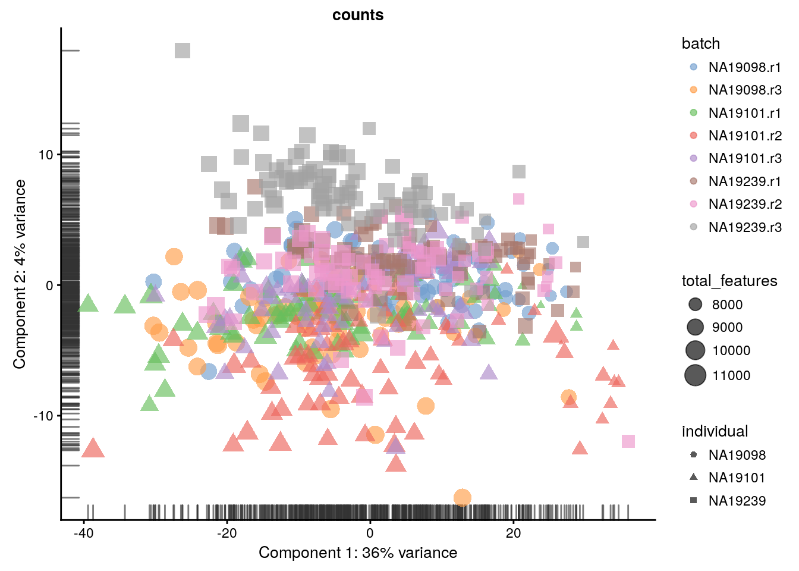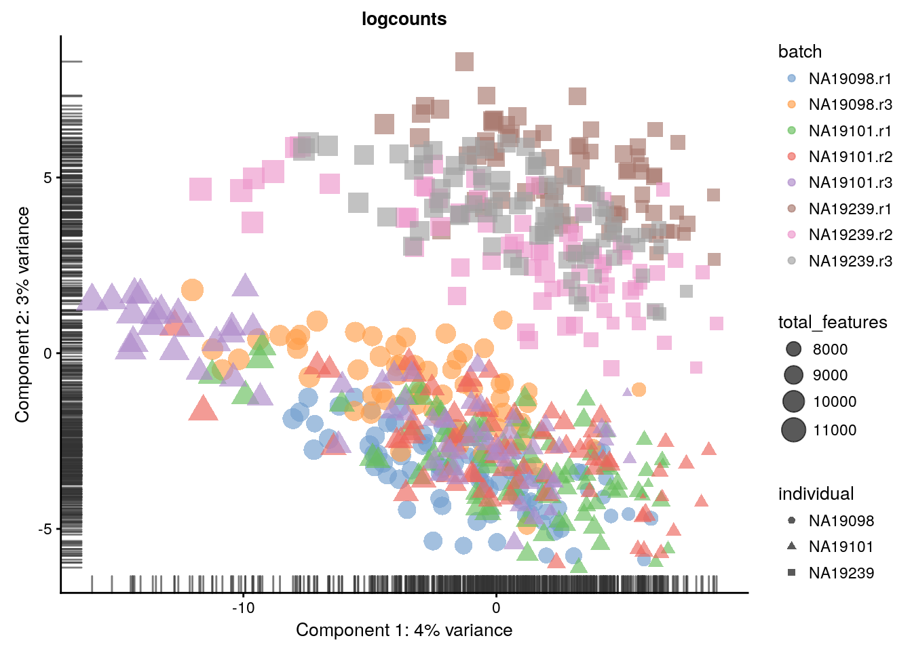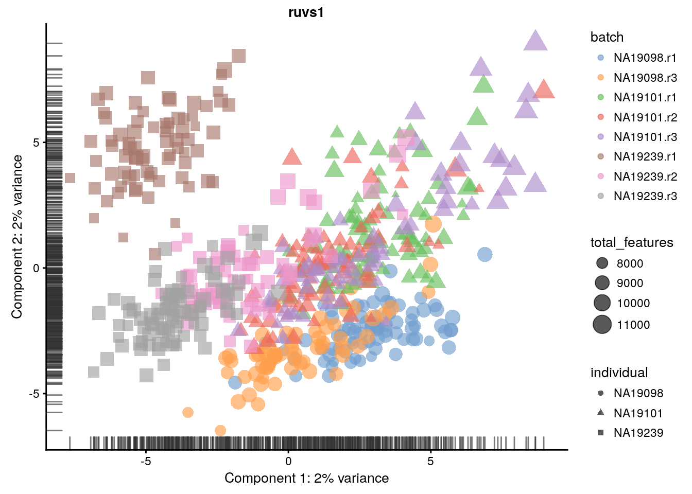


```r
res <- list()
for(n in assayNames(reads.qc)) {
	res[[n]] <- suppressWarnings(calc_cell_RLE(assay(reads.qc, n), erccs))
}
par(mar=c(6,4,1,1))
boxplot(res, las=2)
```

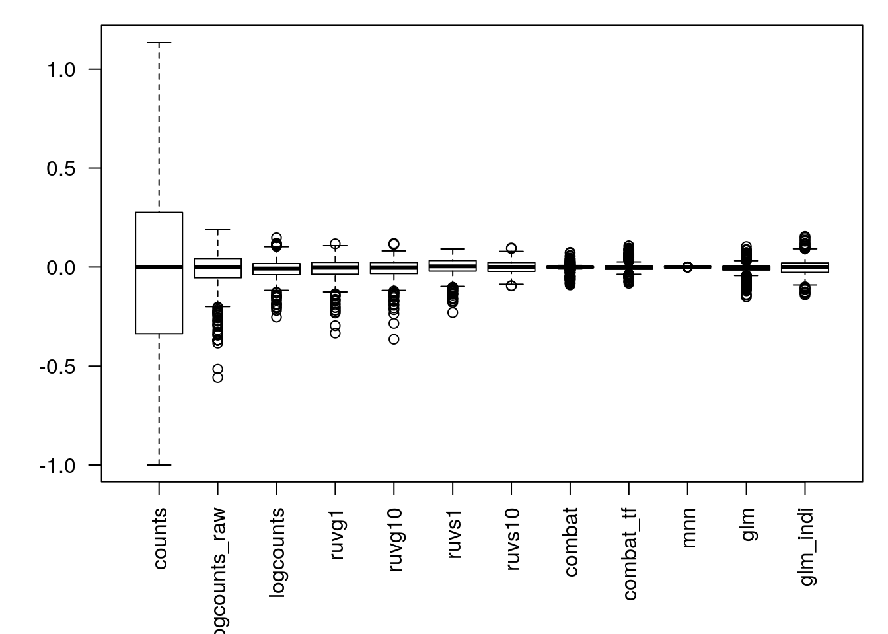


```r
for(n in assayNames(reads.qc)) {
    print(
        plotQC(
            reads.qc[endog_genes, ],
            type = "expl",
            exprs_values = n,
            variables = c(
                "total_features",
                "total_counts",
                "batch",
                "individual",
                "pct_counts_ERCC",
                "pct_counts_MT"
            )
        ) +
        ggtitle(n)
    )
}
```

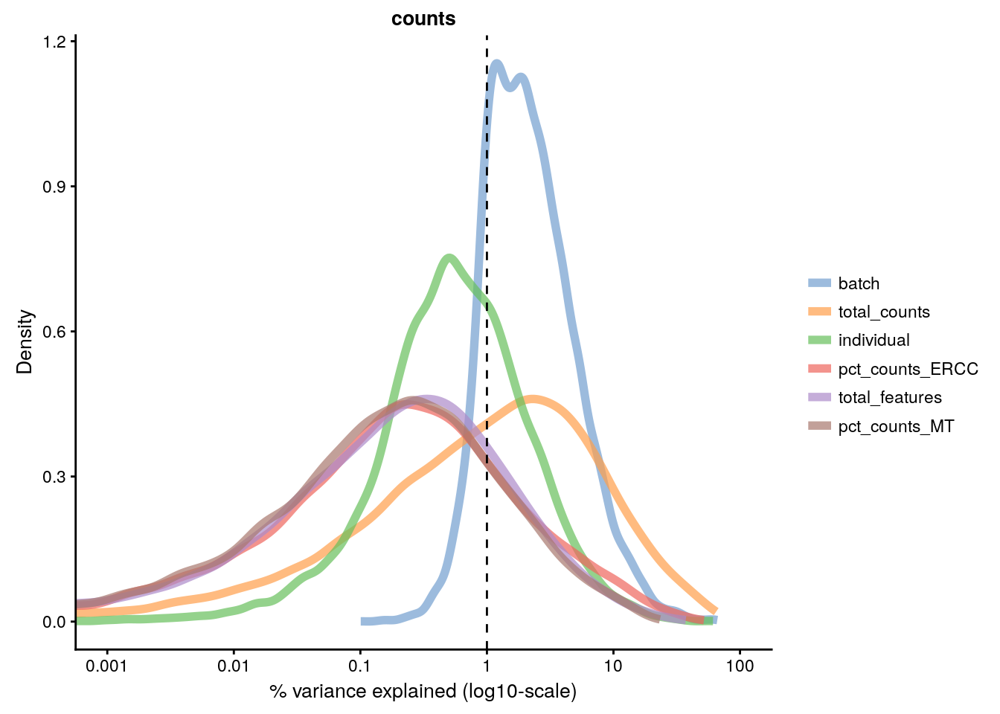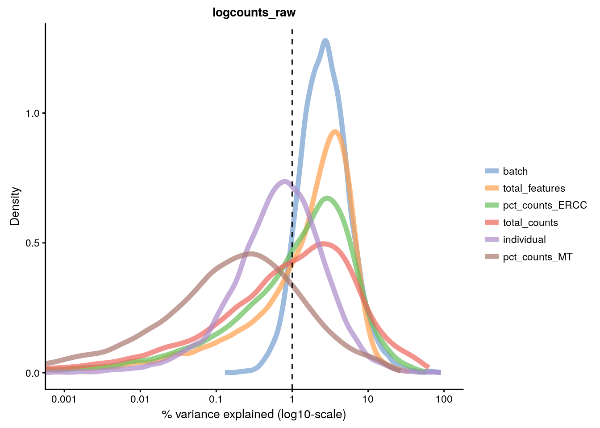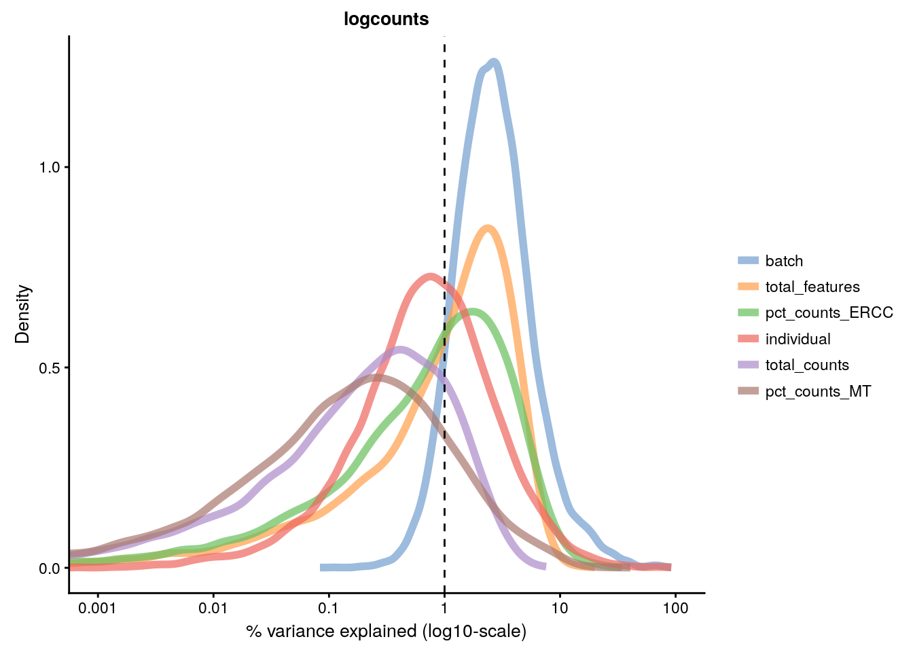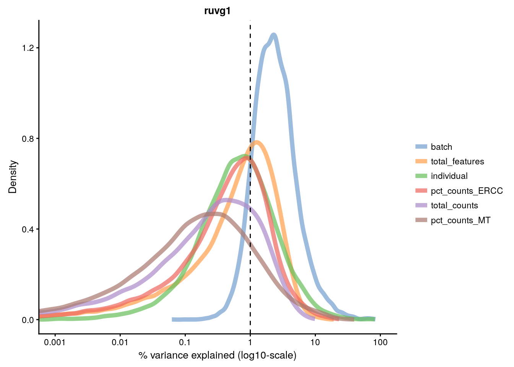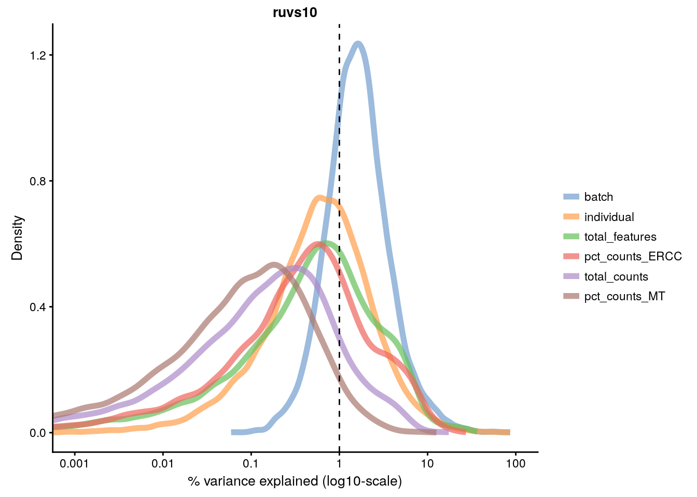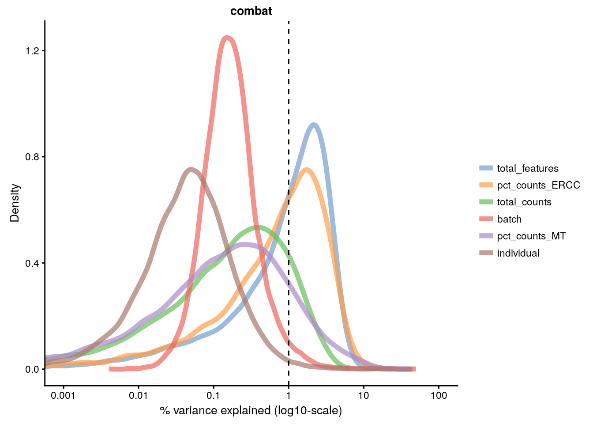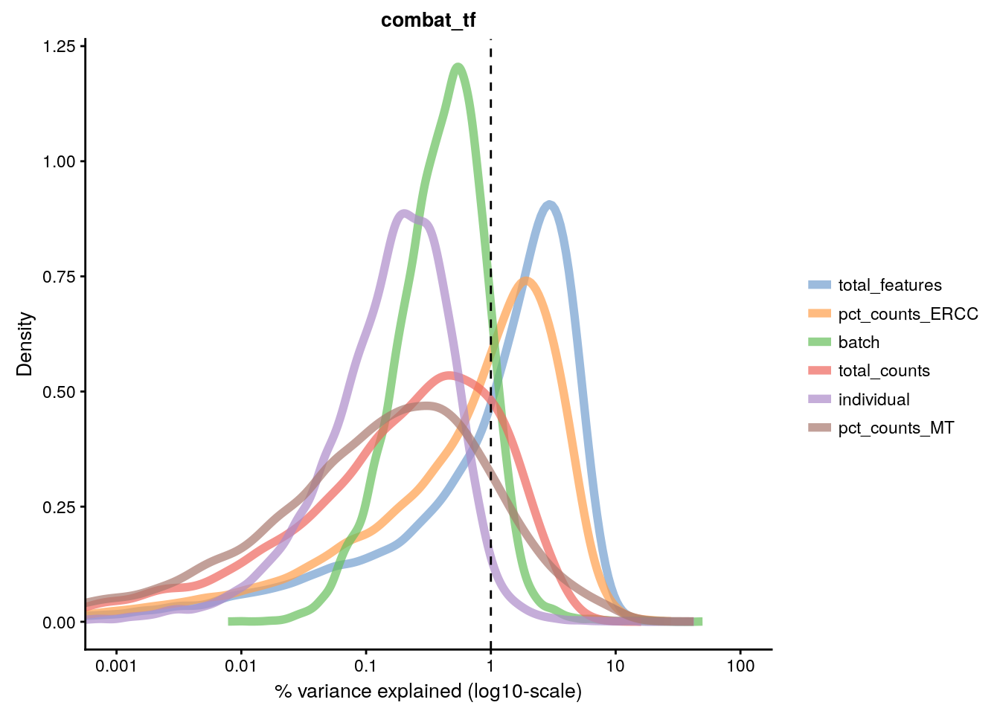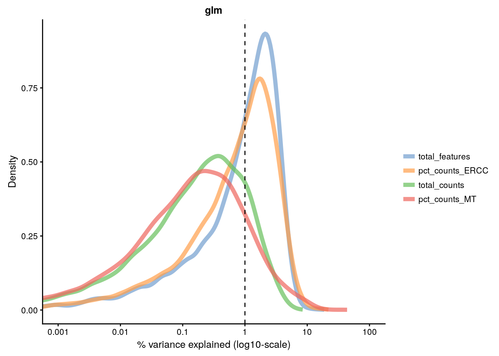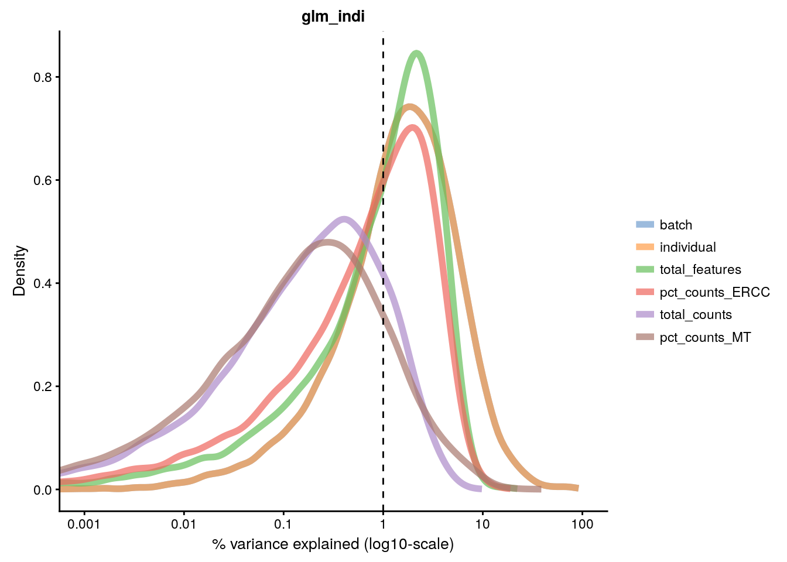


```r
compare_kBET_results <- function(sce){
    indiv <- unique(sce$individual)
    norms <- assayNames(sce) # Get all normalizations
    results <- list()
    for (i in indiv){ 
        for (j in norms){
            tmp <- kBET(
                df = t(assay(sce[,sce$individual== i], j)), 
                batch = sce$batch[sce$individual==i], 
                heuristic = TRUE, 
                verbose = FALSE, 
                addTest = FALSE, 
                plot = FALSE)
            results[[i]][[j]] <- tmp$summary$kBET.observed[1]
        }
    }
    return(as.data.frame(results))
}

eff_debatching <- compare_kBET_results(reads.qc)
```


```r
require("reshape2")
require("RColorBrewer")
# Plot results
dod <- melt(as.matrix(eff_debatching),  value.name = "kBET")
colnames(dod)[1:2] <- c("Normalisation", "Individual")

colorset <- c('gray', brewer.pal(n = 9, "RdYlBu"))

ggplot(dod, aes(Normalisation, Individual, fill=kBET)) +  
    geom_tile() +
    scale_fill_gradient2(
        na.value = "gray",
        low = colorset[2],
        mid=colorset[6],
        high = colorset[10],
        midpoint = 0.5, limit = c(0,1)) +
    scale_x_discrete(expand = c(0, 0)) +
    scale_y_discrete(expand = c(0, 0)) + 
    theme(
        axis.text.x = element_text(
            angle = 45, 
            vjust = 1, 
            size = 12, 
            hjust = 1
        )
    ) + 
    ggtitle("Effect of batch regression methods per individual")
```


```
## R version 3.4.3 (2017-11-30)
## Platform: x86_64-pc-linux-gnu (64-bit)
## Running under: Debian GNU/Linux 9 (stretch)
## 
## Matrix products: default
## BLAS: /usr/lib/openblas-base/libblas.so.3
## LAPACK: /usr/lib/libopenblasp-r0.2.19.so
## 
## locale:
##  [1] LC_CTYPE=en_US.UTF-8       LC_NUMERIC=C              
##  [3] LC_TIME=en_US.UTF-8        LC_COLLATE=en_US.UTF-8    
##  [5] LC_MONETARY=en_US.UTF-8    LC_MESSAGES=C             
##  [7] LC_PAPER=en_US.UTF-8       LC_NAME=C                 
##  [9] LC_ADDRESS=C               LC_TELEPHONE=C            
## [11] LC_MEASUREMENT=en_US.UTF-8 LC_IDENTIFICATION=C       
## 
## attached base packages:
## [1] stats4    parallel  methods   stats     graphics  grDevices utils    
## [8] datasets  base     
## 
## other attached packages:
##  [1] RColorBrewer_1.1-2         reshape2_1.4.3            
##  [3] sva_3.26.0                 genefilter_1.60.0         
##  [5] mgcv_1.8-23                nlme_3.1-129              
##  [7] kBET_0.99.5                scran_1.6.8               
##  [9] scater_1.6.3               SingleCellExperiment_1.0.0
## [11] ggplot2_2.2.1              RUVSeq_1.12.0             
## [13] edgeR_3.20.9               limma_3.34.9              
## [15] EDASeq_2.12.0              ShortRead_1.36.1          
## [17] GenomicAlignments_1.14.1   SummarizedExperiment_1.8.1
## [19] DelayedArray_0.4.1         matrixStats_0.53.1        
## [21] Rsamtools_1.30.0           GenomicRanges_1.30.3      
## [23] GenomeInfoDb_1.14.0        Biostrings_2.46.0         
## [25] XVector_0.18.0             IRanges_2.12.0            
## [27] S4Vectors_0.16.0           BiocParallel_1.12.0       
## [29] Biobase_2.38.0             BiocGenerics_0.24.0       
## [31] scRNA.seq.funcs_0.1.0      knitr_1.20                
## 
## loaded via a namespace (and not attached):
##  [1] Rtsne_0.13             ggbeeswarm_0.6.0       colorspace_1.3-2      
##  [4] rjson_0.2.15           hwriter_1.3.2          dynamicTreeCut_1.63-1 
##  [7] rprojroot_1.3-2        DT_0.4                 bit64_0.9-7           
## [10] AnnotationDbi_1.40.0   splines_3.4.3          R.methodsS3_1.7.1     
## [13] tximport_1.6.0         DESeq_1.30.0           geneplotter_1.56.0    
## [16] annotate_1.56.1        cluster_2.0.6          R.oo_1.21.0           
## [19] shinydashboard_0.6.1   shiny_1.0.5            compiler_3.4.3        
## [22] httr_1.3.1             backports_1.1.2        assertthat_0.2.0      
## [25] Matrix_1.2-7.1         lazyeval_0.2.1         htmltools_0.3.6       
## [28] prettyunits_1.0.2      tools_3.4.3            igraph_1.1.2          
## [31] bindrcpp_0.2           gtable_0.2.0           glue_1.2.0            
## [34] GenomeInfoDbData_1.0.0 dplyr_0.7.4            Rcpp_0.12.15          
## [37] rtracklayer_1.38.3     xfun_0.1               stringr_1.3.0         
## [40] mime_0.5               hypergeo_1.2-13        statmod_1.4.30        
## [43] XML_3.98-1.10          zoo_1.8-1              zlibbioc_1.24.0       
## [46] MASS_7.3-45            scales_0.5.0           aroma.light_3.8.0     
## [49] rhdf5_2.22.0           yaml_2.1.17            memoise_1.1.0         
## [52] gridExtra_2.3          biomaRt_2.34.2         latticeExtra_0.6-28   
## [55] stringi_1.1.6          RSQLite_2.0            RMySQL_0.10.14        
## [58] orthopolynom_1.0-5     GenomicFeatures_1.30.3 contfrac_1.1-11       
## [61] rlang_0.2.0            pkgconfig_2.0.1        moments_0.14          
## [64] bitops_1.0-6           evaluate_0.10.1        lattice_0.20-34       
## [67] bindr_0.1              labeling_0.3           htmlwidgets_1.0       
## [70] cowplot_0.9.2          bit_1.1-12             deSolve_1.20          
## [73] plyr_1.8.4             magrittr_1.5           bookdown_0.7          
## [76] R6_2.2.2               DBI_0.7                pillar_1.2.1          
## [79] survival_2.40-1        RCurl_1.95-4.10        tibble_1.4.2          
## [82] rmarkdown_1.8          viridis_0.5.0          progress_1.1.2        
## [85] locfit_1.5-9.1         grid_3.4.3             data.table_1.10.4-3   
## [88] FNN_1.1                blob_1.1.0             digest_0.6.15         
## [91] xtable_1.8-2           httpuv_1.3.6.1         elliptic_1.3-7        
## [94] R.utils_2.6.0          munsell_0.4.3          beeswarm_0.2.3        
## [97] viridisLite_0.3.0      vipor_0.4.5
```
